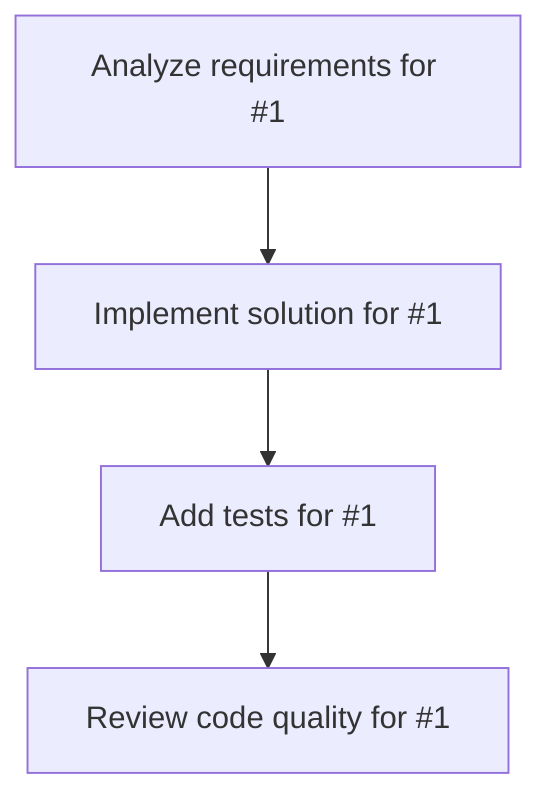

# Plans for Issue #1

**Title**: chore(deps): Bump @octokit/graphql from 7.1.1 to 9.0.2

**URL**: https://github.com/customer-cloud/miyabi-private/pull/1

---

## 📋 Summary

- **Total Tasks**: 4
- **Estimated Duration**: 60 minutes
- **Execution Levels**: 4
- **Has Cycles**: ✅ No

## 📝 Task Breakdown

### 1. Analyze requirements for #1

- **ID**: `task-1-analysis`
- **Type**: Docs
- **Assigned Agent**: IssueAgent
- **Priority**: 0
- **Estimated Duration**: 5 min

**Description**: Analyze issue requirements and create detailed specification

### 2. Implement solution for #1

- **ID**: `task-1-impl`
- **Type**: Feature
- **Assigned Agent**: CodeGenAgent
- **Priority**: 1
- **Estimated Duration**: 30 min
- **Dependencies**: task-1-analysis

**Description**: Bumps [@octokit/graphql](https://github.com/octokit/graphql.js) from 7.1.1 to 9.0.2.

Release notes

<em>Sourced from <a href="https://github.com/octokit/graphql.js/releases"><code>@​octokit/graphql</code>'s releases</a>.</em>

<blockquote>
<h2>v9.0.2</h2>
<h2><a href="https://github.com/octokit/graphql.js/compare/v9.0.1...v9.0.2">9.0.2</a> (2025-09-29)</h2>
<h3>Bug Fixes</h3>
<ul>
<li><strong>deps:</strong> update dependency <code>@​octokit/types</code> to v15 (<a href="https://redirect.github.com/octokit/graphql.js/issues/665">#665</a>) (<a href="https://github.com/octokit/graphql.js/commit/8ed325e28e9d17df17e751ef76248fe86de7b2ba">8ed325e</a>)</li>
</ul>
<h2>v9.0.1</h2>
<h2><a href="https://github.com/octokit/graphql.js/compare/v9.0.0...v9.0.1">9.0.1</a> (2025-05-20)</h2>
<h3>Bug Fixes</h3>
<ul>
<li><strong>deps:</strong> update dependency <code>@​octokit/request</code> to v10 (<a href="https://redirect.github.com/octokit/graphql.js/issues/659">#659</a>) (<a href="https://github.com/octokit/graphql.js/commit/737812f90af00345976b7cb666ad94f0d05da3aa">737812f</a>)</li>
</ul>
<h2>v9.0.0</h2>
<h1><a href="https://github.com/octokit/graphql.js/compare/v8.2.2...v9.0.0">9.0.0</a> (2025-05-20)</h1>
<h3>Continuous Integration</h3>
<ul>
<li>stop testing against NodeJS v18 (<a href="https://redirect.github.com/octokit/graphql.js/issues/657">#657</a>) (<a href="https://github.com/octokit/graphql.js/commit/d9856f5a7bdce51c5f9702abfc435a1f79a0c668">d9856f5</a>)</li>
</ul>
<h3>BREAKING CHANGES</h3>
<ul>
<li>

Drop support for NodeJS v18

</li>
<li>

build: set minimal node version in build script to v20

</li>
<li>

ci: stop testing against NodeJS v18

</li>
</ul>
<h2>v8.2.2</h2>
<h2><a href="https://github.com/octokit/graphql.js/compare/v8.2.1...v8.2.2">8.2.2</a> (2025-04-10)</h2>
<h3>Bug Fixes</h3>
<ul>
<li><strong>deps:</strong> update dependency <code>@​octokit/types</code> to v14 (<a href="https://redirect.github.com/octokit/graphql.js/issues/649">#649</a>) (<a href="https://github.com/octokit/graphql.js/commit/fceca0783ef2b27d90475f31ea46a935f5ba1ce9">fceca07</a>)</li>
</ul>
<h2>v8.2.1</h2>
<h2><a href="https://github.com/octokit/graphql.js/compare/v8.2.0...v8.2.1">8.2.1</a> (2025-02-14)</h2>
<h3>Bug Fixes</h3>
<ul>
<li><strong>deps:</strong> update dependency <code>@​octokit/request</code> to v9.2.2 [security] (<a href="https://redirect.github.com/octokit/graphql.js/issues/636">#636</a>) (<a href="https://github.com/octokit/graphql.js/commit/0e582cab3a32b3999dd643b214f78408a53b155d">0e582ca</a>)</li>
</ul>
<!-- raw HTML omitted -->
</blockquote>

... (truncated)

Commits

<ul>
<li><a href="https://github.com/octokit/graphql.js/commit/ea07437f9f9507dcb4d78a800e3b00a00712d2d8"><code>ea07437</code></a> ci(action): update actions/checkout action to v5 (<a href="https://redirect.github.com/octokit/graphql.js/issues/662">#662</a>)</li>
<li><a href="https://github.com/octokit/graphql.js/commit/8ed325e28e9d17df17e751ef76248fe86de7b2ba"><code>8ed325e</code></a> fix(deps): update dependency <code>@​octokit/types</code> to v15 (<a href="https://redirect.github.com/octokit/graphql.js/issues/665">#665</a>)</li>
<li><a href="https://github.com/octokit/graphql.js/commit/28848b0b74b59d3dab436d69944a26d3c67d9ab2"><code>28848b0</code></a> build(deps): lock file maintenance (<a href="https://redirect.github.com/octokit/graphql.js/issues/660">#660</a>)</li>
<li><a href="https://github.com/octokit/graphql.js/commit/737812f90af00345976b7cb666ad94f0d05da3aa"><code>737812f</code></a> fix(deps): update dependency <code>@​octokit/request</code> to v10 (<a href="https://redirect.github.com/octokit/graphql.js/issues/659">#659</a>)</li>
<li><a href="https://github.com/octokit/graphql.js/commit/d9856f5a7bdce51c5f9702abfc435a1f79a0c668"><code>d9856f5</code></a> ci: stop testing against NodeJS v18 (<a href="https://redirect.github.com/octokit/graphql.js/issues/657">#657</a>)</li>
<li><a href="https://github.com/octokit/graphql.js/commit/972ad649b74309b8e2291daf15070d6beb48a188"><code>972ad64</code></a> build(deps): lock file maintenance (<a href="https://redirect.github.com/octokit/graphql.js/issues/658">#658</a>)</li>
<li><a href="https://github.com/octokit/graphql.js/commit/6b98c29d7c2672e7d32be5e0bc261d22638c431f"><code>6b98c29</code></a> build(deps): bump vite from 6.3.2 to 6.3.5 (<a href="https://redirect.github.com/octokit/graphql.js/issues/656">#656</a>)</li>
<li><a href="https://github.com/octokit/graphql.js/commit/22c0e6567e322ccfd940ad283df0c3fe24d57e45"><code>22c0e65</code></a> build(deps): lock file maintenance (<a href="https://redirect.github.com/octokit/graphql.js/issues/653">#653</a>)</li>
<li><a href="https://github.com/octokit/graphql.js/commit/e4a3c302922958de967e080b796e03605a98192d"><code>e4a3c30</code></a> build(deps): lock file maintenance (<a href="https://redirect.github.com/octokit/graphql.js/issues/652">#652</a>)</li>
<li><a href="https://github.com/octokit/graphql.js/commit/f4e5f02ced7972626760fe3c06d43a9c82409490"><code>f4e5f02</code></a> ci: replace <code>OCTOKITBOT_PROJECT_ACTION_TOKEN</code> and <code>OCTOKITBOT_PAT</code> with a tok...</li>
<li>Additional commits viewable in <a href="https://github.com/octokit/graphql.js/compare/v7.1.1...v9.0.2">compare view</a></li>
</ul>

 

Dependabot will resolve any conflicts with this PR as long as you don't alter it yourself. You can also trigger a rebase manually by commenting `@dependabot rebase`.

[//]: # (dependabot-automerge-start)
[//]: # (dependabot-automerge-end)

---

Dependabot commands and options

 

You can trigger Dependabot actions by commenting on this PR:
- `@dependabot rebase` will rebase this PR
- `@dependabot recreate` will recreate this PR, overwriting any edits that have been made to it
- `@dependabot merge` will merge this PR after your CI passes on it
- `@dependabot squash and merge` will squash and merge this PR after your CI passes on it
- `@dependabot cancel merge` will cancel a previously requested merge and block automerging
- `@dependabot reopen` will reopen this PR if it is closed
- `@dependabot close` will close this PR and stop Dependabot recreating it. You can achieve the same result by closing it manually
- `@dependabot show <dependency name> ignore conditions` will show all of the ignore conditions of the specified dependency
- `@dependabot ignore this major version` will close this PR and stop Dependabot creating any more for this major version (unless you reopen the PR or upgrade to it yourself)
- `@dependabot ignore this minor version` will close this PR and stop Dependabot creating any more for this minor version (unless you reopen the PR or upgrade to it yourself)
- `@dependabot ignore this dependency` will close this PR and stop Dependabot creating any more for this dependency (unless you reopen the PR or upgrade to it yourself)

### 3. Add tests for #1

- **ID**: `task-1-test`
- **Type**: Test
- **Assigned Agent**: CodeGenAgent
- **Priority**: 2
- **Estimated Duration**: 15 min
- **Dependencies**: task-1-impl

**Description**: Create comprehensive test coverage

### 4. Review code quality for #1

- **ID**: `task-1-review`
- **Type**: Refactor
- **Assigned Agent**: ReviewAgent
- **Priority**: 3
- **Estimated Duration**: 10 min
- **Dependencies**: task-1-test

**Description**: Run quality checks and code review

## 🔄 Execution Plan (DAG Levels)

Tasks can be executed in parallel within each level:

### Level 0 (Parallel Execution)

- `task-1-analysis` - Analyze requirements for #1

### Level 1 (Parallel Execution)

- `task-1-impl` - Implement solution for #1

### Level 2 (Parallel Execution)

- `task-1-test` - Add tests for #1

### Level 3 (Parallel Execution)

- `task-1-review` - Review code quality for #1

## 📊 Dependency Graph

## ⏱️ Timeline Estimation

- **Sequential Execution**: 60 minutes (1.0 hours)
- **Parallel Execution (Critical Path)**: 10 minutes (0.2 hours)
- **Estimated Speedup**: 6.0x

---

*Generated by CoordinatorAgent on 2025-11-02 08:10:58 UTC*
