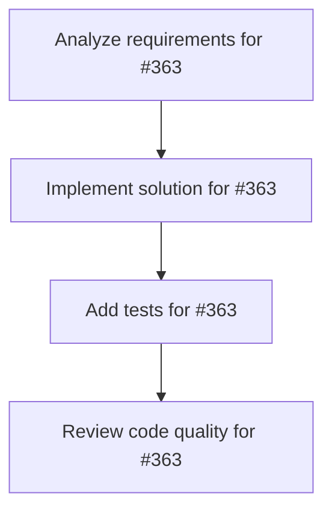

# Plans for Issue #363

**Title**: 🖼️ Phase 2: 画像素材準備 - BytePlus Landing Page用画像8種類作成

**URL**: https://github.com/customer-cloud/miyabi-private/issues/363

---

## 📋 Summary

- **Total Tasks**: 4
- **Estimated Duration**: 60 minutes
- **Execution Levels**: 4
- **Has Cycles**: ✅ No

## 📝 Task Breakdown

### 1. Analyze requirements for #363

- **ID**: `task-363-analysis`
- **Type**: Docs
- **Assigned Agent**: IssueAgent
- **Priority**: 0
- **Estimated Duration**: 5 min

**Description**: Analyze issue requirements and create detailed specification

### 2. Implement solution for #363

- **ID**: `task-363-impl`
- **Type**: Feature
- **Assigned Agent**: CodeGenAgent
- **Priority**: 1
- **Estimated Duration**: 30 min
- **Dependencies**: task-363-analysis

**Description**: ## 📋 概要

BytePlus Video API Bootcampランディングページ用の画像素材を作成し、最適化します。

**親Issue**: #361
**マイルストーン**: Milestone 32 - BytePlus Video API Bootcamp
**依存**: #362 (Phase 1完了後)

---

## 🎯 目標

8種類の画像を作成し、WebP形式で最適化する

---

## ✅ 必要な画像

| ファイル名 | サイズ推奨 | 説明 | 優先度 |
|-----------|----------|------|-------|
| `byteplus-partner-logo.svg` | - | BytePlus公式パートナーロゴ | 🔥 P0 |
| `hero-demo.png` | 1200x800px | ヒーローセクションのデモ画像 | 🔥 P0 |
| `instructor.jpg` | 400x400px | 講師写真 | ⚠️ P1 |
| `testimonial-1.jpg` | 200x200px | 参加者1の写真 | ⚠️ P1 |
| `testimonial-2.jpg` | 200x200px | 参加者2の写真 | ⚠️ P1 |
| `testimonial-3.jpg` | 200x200px | 参加者3の写真 | ⚠️ P1 |
| `og-image.png` | 1200x630px | OGP画像（SNSシェア用） | 🔥 P0 |
| `favicon.png` | 32x32px | ファビコン | 📝 P2 |

---

## 🛠️ 画像最適化

### WebP変換

```bash
# ImageMagickを使用
convert hero-demo.png -quality 85 -define webp:lossless=false hero-demo.webp

# または cwebp を使用
cwebp -q 85 hero-demo.png -o hero-demo.webp
```

### 最適化目標

- **サイズ削減**: 50%以上削減
- **品質維持**: 視覚的な劣化なし
- **WebP対応**: 全画像でWebP提供

---

## 📦 成果物

- [ ] `docs/landing-pages/byteplus-bootcamp/images/byteplus-partner-logo.svg`
- [ ] `docs/landing-pages/byteplus-bootcamp/images/hero-demo.webp`
- [ ] `docs/landing-pages/byteplus-bootcamp/images/instructor.webp`
- [ ] `docs/landing-pages/byteplus-bootcamp/images/testimonial-1.webp`
- [ ] `docs/landing-pages/byteplus-bootcamp/images/testimonial-2.webp`
- [ ] `docs/landing-pages/byteplus-bootcamp/images/testimonial-3.webp`
- [ ] `docs/landing-pages/byteplus-bootcamp/images/og-image.webp`
- [ ] `docs/landing-pages/byteplus-bootcamp/images/favicon.png`

---

## ⏱️ 推定工数

**4時間** - 画像作成 + 最適化

---

## 🔗 関連リンク

- **親Issue**: #361
- **依存Issue**: #362

---

🤖 Generated with [Claude Code](https://claude.com/claude-code)

### 3. Add tests for #363

- **ID**: `task-363-test`
- **Type**: Test
- **Assigned Agent**: CodeGenAgent
- **Priority**: 2
- **Estimated Duration**: 15 min
- **Dependencies**: task-363-impl

**Description**: Create comprehensive test coverage

### 4. Review code quality for #363

- **ID**: `task-363-review`
- **Type**: Refactor
- **Assigned Agent**: ReviewAgent
- **Priority**: 3
- **Estimated Duration**: 10 min
- **Dependencies**: task-363-test

**Description**: Run quality checks and code review

## 🔄 Execution Plan (DAG Levels)

Tasks can be executed in parallel within each level:

### Level 0 (Parallel Execution)

- `task-363-analysis` - Analyze requirements for #363

### Level 1 (Parallel Execution)

- `task-363-impl` - Implement solution for #363

### Level 2 (Parallel Execution)

- `task-363-test` - Add tests for #363

### Level 3 (Parallel Execution)

- `task-363-review` - Review code quality for #363

## 📊 Dependency Graph



## ⏱️ Timeline Estimation

- **Sequential Execution**: 60 minutes (1.0 hours)
- **Parallel Execution (Critical Path)**: 10 minutes (0.2 hours)
- **Estimated Speedup**: 6.0x

---

*Generated by CoordinatorAgent on 2025-10-30 17:46:59 UTC*
