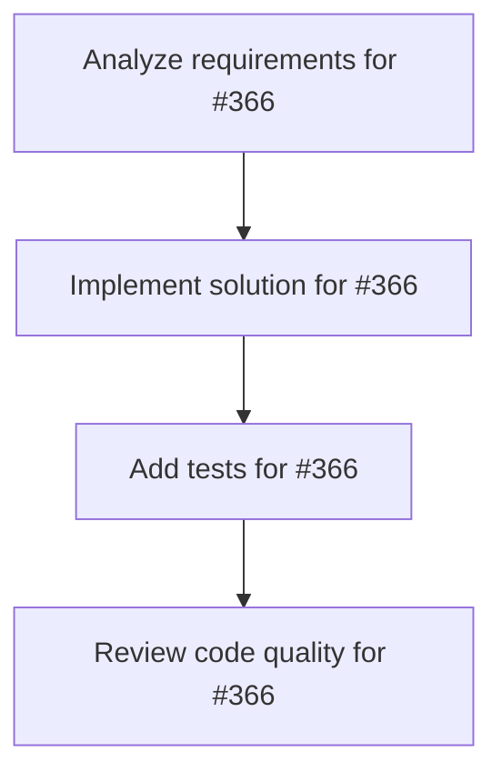

# Plans for Issue #366

**Title**: ⚡ Phase 5: パフォーマンス最適化 - Lighthouse 90+達成 & Core Web Vitals改善

**URL**: https://github.com/customer-cloud/miyabi-private/issues/366

---

## 📋 Summary

- **Total Tasks**: 4
- **Estimated Duration**: 60 minutes
- **Execution Levels**: 4
- **Has Cycles**: ✅ No

## 📝 Task Breakdown

### 1. Analyze requirements for #366

- **ID**: `task-366-analysis`
- **Type**: Docs
- **Assigned Agent**: IssueAgent
- **Priority**: 0
- **Estimated Duration**: 5 min

**Description**: Analyze issue requirements and create detailed specification

### 2. Implement solution for #366

- **ID**: `task-366-impl`
- **Type**: Feature
- **Assigned Agent**: CodeGenAgent
- **Priority**: 1
- **Estimated Duration**: 30 min
- **Dependencies**: task-366-analysis

**Description**: ## 📋 概要

BytePlus Video API BootcampランディングページのCore Web Vitalsを最適化し、Lighthouse スコア 90+ を達成します。

**親Issue**: #361
**マイルストーン**: Milestone 32
**依存**: #362

---

## 🎯 目標

### Core Web Vitals目標値

- **LCP (Largest Contentful Paint)**: < 2.5秒
- **FID (First Input Delay)**: < 100ms
- **CLS (Cumulative Layout Shift)**: < 0.1

### Lighthouse目標値

- **Performance**: 90+
- **Accessibility**: 95+
- **Best Practices**: 100
- **SEO**: 100

---

## ✅ タスク

### Task 5.1: Critical CSS インライン化

```html
<style>
/* Above-the-fold CSS */
.hero { ... }
.header { ... }
</style>
```

### Task 5.2: 画像最適化

- [ ] WebP形式対応
- [ ] Lazy loading実装済み確認
- [ ] 適切なサイズ指定

### Task 5.3: Service Worker実装（PWA対応）

```javascript
// sw.js
self.addEventListener('install', (event) => {
    event.waitUntil(
        caches.open('byteplus-v1').then((cache) => {
            return cache.addAll([
                '/',
                '/style.css',
                '/script.js'
            ]);
        })
    );
});
```

### Task 5.4: CDN配信（Cloudflare）

- [ ] Cloudflare設定
- [ ] キャッシュ戦略設定

---

## 📦 成果物

- [ ] Lighthouse Performance 90+
- [ ] PageSpeed Insights「Good」評価
- [ ] Service Worker実装
- [ ] CDN配信設定

---

## ⏱️ 推定工数

**8時間** - 最適化 + テスト

---

🤖 Generated with [Claude Code](https://claude.com/claude-code)

### 3. Add tests for #366

- **ID**: `task-366-test`
- **Type**: Test
- **Assigned Agent**: CodeGenAgent
- **Priority**: 2
- **Estimated Duration**: 15 min
- **Dependencies**: task-366-impl

**Description**: Create comprehensive test coverage

### 4. Review code quality for #366

- **ID**: `task-366-review`
- **Type**: Refactor
- **Assigned Agent**: ReviewAgent
- **Priority**: 3
- **Estimated Duration**: 10 min
- **Dependencies**: task-366-test

**Description**: Run quality checks and code review

## 🔄 Execution Plan (DAG Levels)

Tasks can be executed in parallel within each level:

### Level 0 (Parallel Execution)

- `task-366-analysis` - Analyze requirements for #366

### Level 1 (Parallel Execution)

- `task-366-impl` - Implement solution for #366

### Level 2 (Parallel Execution)

- `task-366-test` - Add tests for #366

### Level 3 (Parallel Execution)

- `task-366-review` - Review code quality for #366

## 📊 Dependency Graph



## ⏱️ Timeline Estimation

- **Sequential Execution**: 60 minutes (1.0 hours)
- **Parallel Execution (Critical Path)**: 10 minutes (0.2 hours)
- **Estimated Speedup**: 6.0x

---

*Generated by CoordinatorAgent on 2025-10-30 17:47:01 UTC*
