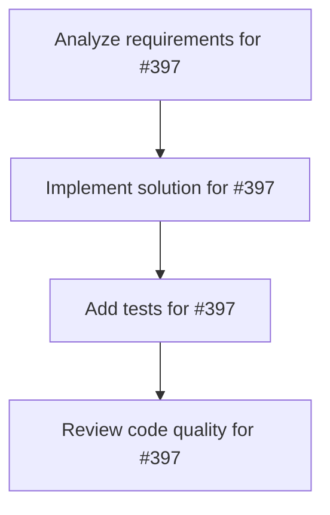

# Plans for Issue #397

**Title**: 🤖 エージェントベンチマーク評価実装 - AgentBench/HAL/Galileoでの包括的評価

**URL**: https://github.com/customer-cloud/miyabi-private/issues/397

---

## 📋 Summary

- **Total Tasks**: 4
- **Estimated Duration**: 60 minutes
- **Execution Levels**: 4
- **Has Cycles**: ✅ No

## 📝 Task Breakdown

### 1. Analyze requirements for #397

- **ID**: `task-397-analysis`
- **Type**: Docs
- **Assigned Agent**: IssueAgent
- **Priority**: 0
- **Estimated Duration**: 5 min

**Description**: Analyze issue requirements and create detailed specification

### 2. Implement solution for #397

- **ID**: `task-397-impl`
- **Type**: Feature
- **Assigned Agent**: CodeGenAgent
- **Priority**: 1
- **Estimated Duration**: 30 min
- **Dependencies**: task-397-analysis

**Description**: ## 🎯 目的

**Miyabi自律開発フレームワークのエージェント能力を世界標準ベンチマークで評価し、汎用エージェント性能を測定する**

### 評価対象ベンチマーク
1. **AgentBench** (THUDM) - 8つの環境での汎用エージェント評価
2. **HAL** (Princeton) - 9つのベンチマークでのコスト効率評価
3. **Galileo Agent Leaderboard v2** - エンタープライズグレード評価

**関連Issue**: 
- Issue #396: SWE-bench Pro評価（コーディング性能）
- 本Issue: エージェント性能の包括的評価

---

## 🌐 3つの世界標準ベンチマーク

### 1. AgentBench (THUDM)

**概要**: LLMをエージェントとして評価する包括的ベンチマーク（ICLR 2024採択）

**公式リソース**:
- GitHubリポジトリ: https://github.com/THUDM/AgentBench
- 論文: https://arxiv.org/abs/2308.03688
- リーダーボード: https://llmbench.ai/agent

**8つの評価環境**:

| 環境 | 説明 | タスク数 |
|------|------|---------|
| **Operating System (OS)** | Linux環境でのコマンド実行 | 新規作成 |
| **Database (DB)** | SQLクエリとデータベース操作 | 新規作成 |
| **Knowledge Graph (KG)** | グラフデータベースクエリ | 新規作成 |
| **Digital Card Game (DCG)** | ゲームAI | 新規作成 |
| **Lateral Thinking Puzzles (LTP)** | 論理パズル解決 | 新規作成 |
| **House-Holding** | 家庭環境タスク | ALFWorldから再編成 |
| **Web Shopping** | ECサイトでの購買 | WebShopから再編成 |
| **Web Browsing** | Webナビゲーション | Mind2Webから再編成 |

**データセット規模**:
- Dev（開発用）: 約4,000回の生成
- Test（テスト用）: 約13,000回の生成

**評価メトリクス**:
- 各環境での成功率（Success Rate）
- マルチターンインタラクション成功率
- 総合スコア（8環境の平均）

**提出方法**:
- Email: agentbench_fc@googlegroups.com
- 結果ファイル提出

**Miyabi評価手順**:
```bash
# 1. 環境セットアップ
git clone https://github.com/THUDM/AgentBench.git
cd AgentBench

# 2. Miyabiエージェント統合
python -m src.start_task -a

# 3. テスト実行
python -m src.assigner

# 4. 結果提出
# results/*.jsonをagentbench_fc@googlegroups.comに送信
```

---

### 2. HAL (Holistic Agent Leaderboard) - Princeton

**概要**: コスト考慮型の第三者エージェントリーダーボード

**公式リソース**:
- Webサイト: https://hal.cs.princeton.edu/
- GitHubリポジトリ: https://github.com/princeton-pli/hal-harness
- ドキュメント: https://hal.cs.princeton.edu/docs

**9つのベンチマーク**:

| ベンチマーク | カテゴリ | 現在のトップ | スコア | コスト |
|------------|---------|------------|-------|-------|
| **AssistantBench** | Webアシスタンス | Browser-Use (o3 Medium) | 38.8% | $15.15 |
| **Online Mind2Web** | Webインタラクション | Browser-Use (o3 Medium) | 22.5% | $48.21 |
| **CORE-Bench Hard** | 科学プログラミング | CORE-Agent (Claude Opus 4.1) | 51.1% | $412.42 |
| **Scicode** | 科学計算 | CORE-Agent (Claude Opus 4.1) | 66.0% | $137.83 |
| **SWE-bench Verified Mini** | ソフトウェアエンジニアリング | OpenHands (Claude Sonnet 4.5) | 44.4% | $57.92 |
| **TAU-bench Airline** | カスタマーサービス | HAL Generalist Agent (Claude Sonnet 4.5) | 82.2% | $20.76 |
| **USACO** | プログラミングコンテスト | USACO Episodic + Semantic (GPT-5 Medium) | 69.7% | $64.13 |
| **GAIA** | 汎用AI能力 | HAL Generalist Agent (Claude Sonnet 4.5) | 74.5% | $187.37 |

**特徴**:
- **Cost-Performance Trade-off**: コストと性能のパレート効率性を可視化
- **Comprehensive Logging**: W&B Weaveによる自動トレース
- **Encrypted Distribution**: ベンチマーク汚染防止

**評価メトリクス**:
- タスク成功率（各ベンチマーク固有）
- コスト効率（$/タスク）
- パレート効率性（コスト vs 性能）

**提出方法**:
- GitHubリポジトリ: https://github.com/princeton-pli/hal-harness
- プルリクエスト経由でエージェント追加

**Miyabi評価手順**:
```bash
# 1. HAL Harnessクローン
git clone https://github.com/princeton-pli/hal-harness.git
cd hal-harness

# 2. Miyabiエージェント統合
# agents/miyabi_agent.py を作成

# 3. 評価実行
python run_evaluation.py --agent miyabi --benchmark all

# 4. 結果提出
# プルリクエスト作成
```

---

### 3. Galileo Agent Leaderboard v2

**概要**: エンタープライズグレードのAIエージェント評価（2025年7月リリース）

**公式リソース**:
- Webサイト: https://galileo.ai/blog/agent-leaderboard-v2
- リーダーボード: https://galileo.ai/leaderboard

**5つの業界**:

| 業界 | シナリオ数 | 評価指標 |
|------|----------|---------|
| **Banking** | 100 | Action Completion |
| **Healthcare** | 100 | Action Completion |
| **Investment** | 100 | Action Completion |
| **Telecom** | 100 | Action Completion |
| **Insurance** | 100 | Action Completion |

**現在のトップモデル（2025年7月時点）**:
- **GPT-4.1**: 平均62% Action Completion

**評価メトリクス**:
- **Action Completion**: タスク完了率
- **Accuracy**: 回答精度
- **Latency**: 応答時間
- **Cost**: 実行コスト

**特徴**:
- エンタープライズシナリオに特化
- 実世界のサポート業務を模倣
- 100件の合成シナリオ/業界

**提出方法**:
- Galileo AIプラットフォーム経由
- API統合が必要

---

## 🗺️ 実装計画

### Phase 1: AgentBench評価（4週間）

**目標**: 8つの環境でMiyabiを評価し、総合スコアを取得

**タスク**:
- [ ] AgentBench環境構築
  ```bash
  git clone https://github.com/THUDM/AgentBench.git
  pip install -r requirements.txt
  ```
- [ ] Miyabiエージェント統合
  ```rust
  // crates/miyabi-benchmark/src/agentbench.rs
  pub struct AgentBenchEvaluator {
      coordinator: CoordinatorAgent,
  }
  
  impl AgentBenchEvaluator {
      pub async fn evaluate_task(&self, env: Environment, task: Task) -> Result<Score> {
          // 1. タスク分析
          // 2. マルチターンインタラクション
          // 3. スコア計算
      }
  }
  ```
- [ ] 8環境の個別実装
  - OS環境: Bashコマンド実行
  - DB環境: SQLクエリ生成
  - KG環境: グラフクエリ実行
  - DCG環境: ゲームAI戦略
  - LTP環境: 論理推論
  - House-Holding: タスクプランニング
  - Web Shopping: ECサイトナビゲーション
  - Web Browsing: Webインタラクション
- [ ] Dev split評価（約4,000回生成）
- [ ] Test split評価（約13,000回生成）
- [ ] 結果提出（agentbench_fc@googlegroups.com）

**計算リソース**:
- **時間**: 約17,000回の生成 × 平均5分 = **約1,400時間（58日間）**
- 並列度10で約6日間
- **メモリ**: WebShop環境で最大15GB必要

**成果物**:
- `crates/miyabi-benchmark/src/agentbench/`
- `results/agentbench/*.json`
- `docs/AGENTBENCH_EVALUATION_REPORT.md`

---

### Phase 2: HAL評価（6週間）

**目標**: 9つのベンチマークでMiyabiを評価し、コスト効率を測定

**タスク**:
- [ ] HAL Harness環境構築
  ```bash
  git clone https://github.com/princeton-pli/hal-harness.git
  cd hal-harness
  pip install -e .
  ```
- [ ] Miyabiエージェント統合
  ```python
  # agents/miyabi_agent.py
  from hal_harness import BaseAgent
  
  class MiyabiAgent(BaseAgent):
      def __init__(self):
          # Miyabi Rustバイナリ呼び出し
          
      async def act(self, observation):
          # Coordinatorで判断
          # 適切なAgentに委譲
  ```
- [ ] 9ベンチマークの評価
  - [ ] AssistantBench
  - [ ] Online Mind2Web
  - [ ] CORE-Bench Hard
  - [ ] Scicode
  - [ ] SWE-bench Verified Mini（Issue #396と連携）
  - [ ] TAU-bench Airline
  - [ ] USACO
  - [ ] GAIA
- [ ] コストトラッキング実装
  ```rust
  pub struct CostTracker {
      pub claude_code_time: Duration,
      pub worktree_overhead: Duration,
      pub total_cost: f64,  // $0（ローカル実行）
  }
  ```
- [ ] パレート効率性分析
- [ ] プルリクエスト作成

**成果物**:
- `agents/miyabi_agent.py`（HAL Harness統合）
- `results/hal/*.json`
- `docs/HAL_EVALUATION_REPORT.md`
- GitHub PR: https://github.com/princeton-pli/hal-harness

---

### Phase 3: Galileo Agent Leaderboard v2評価（4週間）

**目標**: エンタープライズシナリオでMiyabiを評価

**タスク**:
- [ ] Galileo AIプラットフォーム統合
- [ ] 5業界のシナリオ実装
  - Banking: 口座操作、送金、残高照会
  - Healthcare: 予約管理、診療記録照会
  - Investment: ポートフォリオ管理、取引実行
  - Telecom: 契約変更、トラブルシューティング
  - Insurance: 請求処理、補償範囲照会
- [ ] 500シナリオ評価（5業界 × 100シナリオ）
- [ ] Action Completion率の測定
- [ ] レイテンシー・コスト測定
- [ ] リーダーボード提出

**成果物**:
- `crates/miyabi-benchmark/src/galileo/`
- `results/galileo/*.json`
- `docs/GALILEO_EVALUATION_REPORT.md`

---

### Phase 4: 統合分析とレポート作成（2週間）

**目標**: 3つのベンチマーク結果を統合分析し、包括的なレポートを作成

**タスク**:
- [ ] 統合ベンチマークレポート作成
  ```markdown
  # docs/COMPREHENSIVE_BENCHMARK_RESULTS.md
  
  ## 総合評価
  
  | ベンチマーク | スコア | ランキング | 備考 |
  |------------|-------|----------|------|
  | SWE-bench Pro | XX% | #XX | コーディング性能 |
  | AgentBench | XX% | #XX | 汎用エージェント性能 |
  | HAL | XX% | #XX | コスト効率 |
  | Galileo v2 | XX% | #XX | エンタープライズ性能 |
  
  ## Miyabiの強み
  - ...
  
  ## 改善点
  - ...
  ```
- [ ] 競合比較表
  - Claude 4.5 Sonnet
  - GPT-5
  - その他トップモデル
- [ ] ランディングページ更新
- [ ] プレスリリース準備
- [ ] arXiv論文執筆（オプション）

**成果物**:
- `docs/COMPREHENSIVE_BENCHMARK_RESULTS.md`
- `docs/COMPETITIVE_ANALYSIS.md`
- プレスリリース
- arXiv論文（オプション）

---

## 📊 期待される成果

### AgentBench
- **目標スコア**: 総合30%以上（8環境平均）
- **強み**: OS/DB環境（構造化タスク）
- **課題**: ゲームAI/パズル（非構造化タスク）

### HAL
- **目標**: 9ベンチマーク中5つで上位25%
- **強み**: コスト効率（$0/タスク）
- **課題**: 複雑なWebインタラクション

### Galileo v2
- **目標**: Action Completion 50%以上
- **強み**: 構造化されたエンタープライズタスク
- **課題**: 複雑なマルチステップタスク

---

## 🎯 成功基準

### 最低基準（必達）
- [ ] **AgentBench**: 総合スコア20%以上
- [ ] **HAL**: 3つ以上のベンチマークで評価完了
- [ ] **Galileo v2**: Action Completion 40%以上

### 目標基準（推奨）
- [ ] **AgentBench**: 総合スコア30%以上
- [ ] **HAL**: 9つすべてのベンチマークで評価完了
- [ ] **Galileo v2**: Action Completion 50%以上
- [ ] **少なくとも1つのリーダーボード掲載**

### 理想基準（挑戦）
- [ ] **AgentBench**: トップ10入り
- [ ] **HAL**: パレート効率性でトップ5
- [ ] **Galileo v2**: Action Completion 60%以上
- [ ] **すべてのリーダーボード掲載**

---

## ⏱️ タイムライン

| Phase | 期間 | 期限目安 |
|-------|------|---------|
| Phase 1: AgentBench | 4週間 | 2026-01-28 |
| Phase 2: HAL | 6週間 | 2026-03-11 |
| Phase 3: Galileo v2 | 4週間 | 2026-04-08 |
| Phase 4: 統合分析 | 2週間 | 2026-04-22 |

**合計期間**: 約16週間（4ヶ月）

**並行実行**:
- Issue #396（SWE-bench Pro）と並行可能
- AgentBench Phase 1とSWE-bench Pro Phase 2-3を並行実行

---

## 📚 関連リソース

### AgentBench
- GitHub: https://github.com/THUDM/AgentBench
- 論文: https://arxiv.org/abs/2308.03688
- リーダーボード: https://llmbench.ai/agent

### HAL
- Website: https://hal.cs.princeton.edu/
- GitHub: https://github.com/princeton-pli/hal-harness
- ドキュメント: https://hal.cs.princeton.edu/docs

### Galileo Agent Leaderboard v2
- Blog: https://galileo.ai/blog/agent-leaderboard-v2
- リーダーボード: https://galileo.ai/leaderboard

### その他参考リソース
- Evidentlyai: 10 AI Agent Benchmarks: https://www.evidentlyai.com/blog/ai-agent-benchmarks
- O-mega: Best AI Agent Evaluation Benchmarks 2025: https://o-mega.ai/articles/the-best-ai-agent-evals-and-benchmarks-full-2025-guide

---

## 🏷️ Label

- `✨ type:feature`
- `🎯 phase:planning`
- `🤖 agent:coordinator`
- `⚠️ priority:P1-High`

---

## 👥 関連Issue

- **Issue #396**: SWE-bench Pro評価（コーディング性能）
- **本Issue**: エージェント性能の包括的評価

---

**このIssueは、Miyabiのエージェント能力を世界標準で測定し、汎用エージェントとしての信頼性を確立するための重要なプロジェクトです。**

### 3. Add tests for #397

- **ID**: `task-397-test`
- **Type**: Test
- **Assigned Agent**: CodeGenAgent
- **Priority**: 2
- **Estimated Duration**: 15 min
- **Dependencies**: task-397-impl

**Description**: Create comprehensive test coverage

### 4. Review code quality for #397

- **ID**: `task-397-review`
- **Type**: Refactor
- **Assigned Agent**: ReviewAgent
- **Priority**: 3
- **Estimated Duration**: 10 min
- **Dependencies**: task-397-test

**Description**: Run quality checks and code review

## 🔄 Execution Plan (DAG Levels)

Tasks can be executed in parallel within each level:

### Level 0 (Parallel Execution)

- `task-397-analysis` - Analyze requirements for #397

### Level 1 (Parallel Execution)

- `task-397-impl` - Implement solution for #397

### Level 2 (Parallel Execution)

- `task-397-test` - Add tests for #397

### Level 3 (Parallel Execution)

- `task-397-review` - Review code quality for #397

## 📊 Dependency Graph



## ⏱️ Timeline Estimation

- **Sequential Execution**: 60 minutes (1.0 hours)
- **Parallel Execution (Critical Path)**: 10 minutes (0.2 hours)
- **Estimated Speedup**: 6.0x

---

*Generated by CoordinatorAgent on 2025-11-01 11:03:38 UTC*
