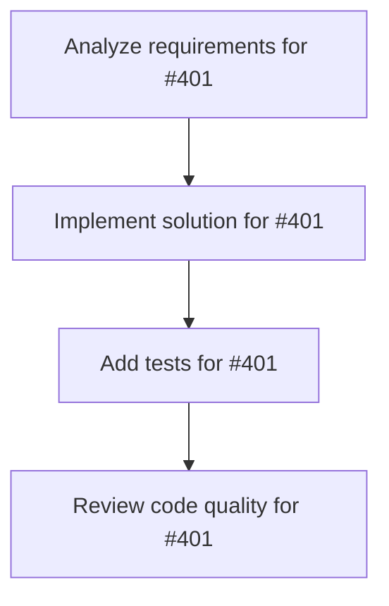

# Plans for Issue #401

**Title**: 📄 [Sub-Issue #396] Phase 4: パイロット評価（10インスタンス）

**URL**: https://github.com/customer-cloud/miyabi-private/issues/401

---

## 📋 Summary

- **Total Tasks**: 4
- **Estimated Duration**: 60 minutes
- **Execution Levels**: 4
- **Has Cycles**: ✅ No

## 📝 Task Breakdown

### 1. Analyze requirements for #401

- **ID**: `task-401-analysis`
- **Type**: Docs
- **Assigned Agent**: IssueAgent
- **Priority**: 0
- **Estimated Duration**: 5 min

**Description**: Analyze issue requirements and create detailed specification

### 2. Implement solution for #401

- **ID**: `task-401-impl`
- **Type**: Feature
- **Assigned Agent**: CodeGenAgent
- **Priority**: 1
- **Estimated Duration**: 30 min
- **Dependencies**: task-401-analysis

**Description**: ## 🎯 目的

**10インスタンスで評価を実行し、公式評価スクリプトで検証してシステム全体を確認**

**親Issue**: #396 - SWE-bench Pro評価実装
**依存**: #400 (Phase 3) - 評価ラッパー実装完了後に実施

---

## 📋 タスク

### 1. サンプルインスタンス選定

**言語バランス考慮**:
- Python: 5インスタンス
- Go: 3インスタンス
- JavaScript/TypeScript: 2インスタンス

**難易度バランス**:
- 簡単（1ファイル、数行変更）: 3インスタンス
- 中程度（2-3ファイル、数十行変更）: 5インスタンス
- 難しい（4+ファイル、100行以上変更）: 2インスタンス

```python
# scripts/select_pilot_instances.py
from datasets import load_dataset

swebench = load_dataset('ScaleAI/SWE-bench_Pro', split='test')

# 言語別フィルタリング
python_instances = [inst for inst in swebench if inst['repo_language'] == 'python'][:5]
go_instances = [inst for inst in swebench if inst['repo_language'] == 'go'][:3]
js_instances = [inst for inst in swebench if inst['repo_language'] == 'javascript'][:2]

pilot_instances = python_instances + go_instances + js_instances

# instance_idリスト出力
print([inst['instance_id'] for inst in pilot_instances])
```

**検証項目**:
- [ ] 10インスタンス選定完了
- [ ] 言語バランスが適切
- [ ] 難易度バランスが適切

---

### 2. Miyabi評価実行

```bash
# パイロット評価実行
cargo run --release --bin miyabi -- benchmark run \
  --dataset swebench_pro \
  --instances 10 \
  --output results/pilot_patches.json \
  --concurrency 2 \
  --timeout 1800

# 期待される出力:
# [1/10] Evaluating instance: repo__issue-123...
# [2/10] Evaluating instance: repo__issue-456...
# ...
# [10/10] Evaluating instance: repo__issue-999...
# ✅ Evaluation complete: 10/10 instances
# 📝 Output: results/pilot_patches.json
```

**検証項目**:
- [ ] 10インスタンスすべてが評価完了
- [ ] パッチファイルが生成される
- [ ] エラーが発生した場合、ログに記録される
- [ ] 実行時間が記録される

---

### 3. 公式評価スクリプト実行

```bash
# Docker + Modal環境で公式評価
cd SWE-bench_Pro-os

python swe_bench_pro_eval.py \
  --raw_sample_path=external_hf_v2.csv \
  --patch_path=../results/pilot_patches.json \
  --output_dir=../results/pilot/ \
  --num_workers=10 \
  --dockerhub_username=jefzda

# 期待される出力:
# Evaluating 10 instances...
# [1/10] Testing repo__issue-123... RESOLVED
# [2/10] Testing repo__issue-456... FAILED (fail-to-pass: 0/2)
# ...
# [10/10] Testing repo__issue-999... RESOLVED
# ✅ Evaluation complete
# 📊 Resolve Rate: X/10 (XX%)
```

**検証項目**:
- [ ] 公式スクリプトがエラーなく実行
- [ ] `results/pilot/evaluation_results.json`が生成される
- [ ] Resolve Rateが計算される
- [ ] 各インスタンスの詳細結果が記録される

---

### 4. 結果検証

```bash
# 結果分析スクリプト
cargo run --bin miyabi -- benchmark analyze \
  --results results/pilot/evaluation_results.json
```

**分析項目**:
- [ ] **Resolve Rate**: X/10 (XX%)
- [ ] **fail-to-pass成功率**: X/10
- [ ] **pass-to-pass成功率**: X/10
- [ ] **言語別パフォーマンス**:
  - Python: X/5 (XX%)
  - Go: X/3 (XX%)
  - JS/TS: X/2 (XX%)
- [ ] **実行時間統計**:
  - 平均: XX分
  - 最小: XX分
  - 最大: XX分

**失敗パターンの分類**:
- [ ] コンパイルエラー
- [ ] テスト失敗
- [ ] タイムアウト
- [ ] その他エラー

---

### 5. 問題点の特定と修正

**チェック項目**:
- [ ] パッチフォーマットの問題
  - unified diff形式に準拠しているか
  - 文字エンコーディングは正しいか
- [ ] Worktree管理の問題
  - base_commitでのcheckoutは成功しているか
  - git状態は正しいか
- [ ] Agent実行の問題
  - タイムアウトは適切か
  - エラーハンドリングは適切か

**修正実施**:
- [ ] 特定された問題を修正
- [ ] 再評価を実施
- [ ] 結果を確認

---

## 📦 成果物

- [ ] `results/pilot_patches.json` - Miyabi生成パッチ（10件）
- [ ] `results/pilot/evaluation_results.json` - 公式評価結果
- [ ] `docs/PILOT_EVALUATION_REPORT.md` - パイロット評価レポート
- [ ] `scripts/select_pilot_instances.py` - サンプル選定スクリプト
- [ ] `scripts/analyze_pilot_results.py` - 結果分析スクリプト

---

## 📊 パイロット評価レポート例

```markdown
# docs/PILOT_EVALUATION_REPORT.md

## 評価結果サマリー

- **総インスタンス数**: 10
- **Resolve Rate**: X/10 (XX%)
- **平均実行時間**: XX分

## 言語別パフォーマンス

| 言語 | インスタンス数 | 成功数 | 成功率 |
|------|--------------|--------|--------|
| Python | 5 | X | XX% |
| Go | 3 | X | XX% |
| JS/TS | 2 | X | XX% |

## 失敗分析

### 失敗パターン
1. **コンパイルエラー** (X件): ...
2. **テスト失敗** (X件): ...
3. **タイムアウト** (X件): ...

### 改善提案
1. ...
2. ...
```

---

## ✅ 成功基準

### 必達
- [ ] 10インスタンスすべてが評価完了
- [ ] 公式スクリプトでエラー0件
- [ ] **Resolve Rate > 5%**（最低1インスタンス成功）
- [ ] 評価レポート作成完了

### 推奨
- [ ] **Resolve Rate 10-20%**（1-2インスタンス成功）
- [ ] 失敗パターンの明確な分類
- [ ] 改善提案の具体化

### 理想
- [ ] **Resolve Rate 30%以上**（3インスタンス以上成功）
- [ ] すべてのエラーが解析済み
- [ ] Phase 5への明確な改善点

---

## ⏱️ 期間

**期間**: 1週間
**期限**: 2025-11-26

---

## 🏷️ Label

- `✨ type:feature`
- `🧪 type:test`
- `🤖 agent:review`
- `📊 priority:P2-Medium`

---

## 📚 関連リソース

- **公式評価スクリプト**: https://github.com/scaleapi/SWE-bench_Pro-os
- **HuggingFaceデータセット**: https://huggingface.co/datasets/ScaleAI/SWE-bench_Pro

---

**親Issue**: #396 - SWE-bench Pro評価実装
**依存**: #400 (Phase 3)

### 3. Add tests for #401

- **ID**: `task-401-test`
- **Type**: Test
- **Assigned Agent**: CodeGenAgent
- **Priority**: 2
- **Estimated Duration**: 15 min
- **Dependencies**: task-401-impl

**Description**: Create comprehensive test coverage

### 4. Review code quality for #401

- **ID**: `task-401-review`
- **Type**: Refactor
- **Assigned Agent**: ReviewAgent
- **Priority**: 3
- **Estimated Duration**: 10 min
- **Dependencies**: task-401-test

**Description**: Run quality checks and code review

## 🔄 Execution Plan (DAG Levels)

Tasks can be executed in parallel within each level:

### Level 0 (Parallel Execution)

- `task-401-analysis` - Analyze requirements for #401

### Level 1 (Parallel Execution)

- `task-401-impl` - Implement solution for #401

### Level 2 (Parallel Execution)

- `task-401-test` - Add tests for #401

### Level 3 (Parallel Execution)

- `task-401-review` - Review code quality for #401

## 📊 Dependency Graph



## ⏱️ Timeline Estimation

- **Sequential Execution**: 60 minutes (1.0 hours)
- **Parallel Execution (Critical Path)**: 10 minutes (0.2 hours)
- **Estimated Speedup**: 6.0x

---

*Generated by CoordinatorAgent on 2025-10-30 17:47:21 UTC*
