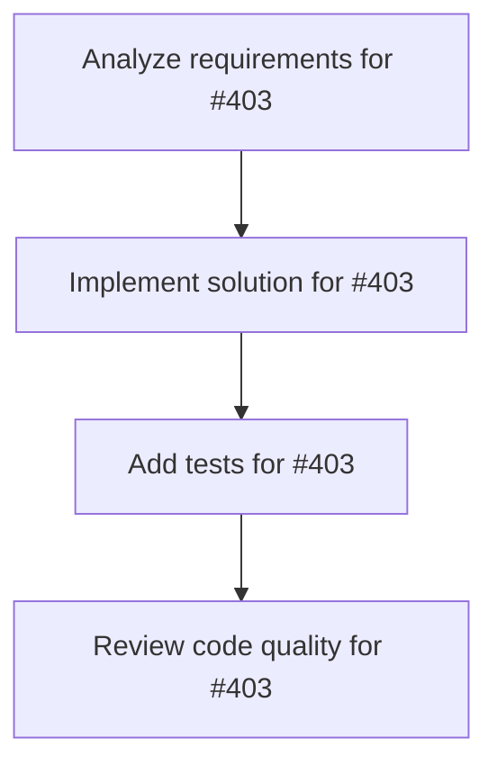

# Plans for Issue #403

**Title**: 📄 [Sub-Issue #396] Phase 6: 結果分析とリーダーボード提出

**URL**: https://github.com/customer-cloud/miyabi-private/issues/403

---

## 📋 Summary

- **Total Tasks**: 4
- **Estimated Duration**: 60 minutes
- **Execution Levels**: 4
- **Has Cycles**: ✅ No

## 📝 Task Breakdown

### 1. Analyze requirements for #403

- **ID**: `task-403-analysis`
- **Type**: Docs
- **Assigned Agent**: IssueAgent
- **Priority**: 0
- **Estimated Duration**: 5 min

**Description**: Analyze issue requirements and create detailed specification

### 2. Implement solution for #403

- **ID**: `task-403-impl`
- **Type**: Feature
- **Assigned Agent**: CodeGenAgent
- **Priority**: 1
- **Estimated Duration**: 30 min
- **Dependencies**: task-403-analysis

**Description**: ## 🎯 目的

**公式メトリクスで結果を分析し、世界標準と比較可能な形式で公開・リーダーボード提出**

**親Issue**: #396 - SWE-bench Pro評価実装
**依存**: #402 (Phase 5) - フルスケール評価完了後に実施

---

## 📋 タスク

### 1. 結果分析（公式メトリクスのみ使用）

```rust
// crates/miyabi-benchmark/src/analysis.rs

use serde::{Deserialize, Serialize};

#[derive(Serialize, Deserialize, Debug)]
pub struct BenchmarkResults {
    pub model: String,
    pub dataset: String,
    pub split: String,
    pub total_instances: usize,
    pub metrics: Metrics,
    pub breakdown: Breakdown,
    pub comparison: Comparison,
}

#[derive(Serialize, Deserialize, Debug)]
pub struct Metrics {
    /// 公式メトリクス: 解決率
    pub resolve_rate: f64,
    
    /// fail-to-pass成功数
    pub fail_to_pass: usize,
    
    /// pass-to-pass成功数
    pub pass_to_pass: usize,
    
    /// エラー数
    pub errors: usize,
}

#[derive(Serialize, Deserialize, Debug)]
pub struct Breakdown {
    /// 言語別パフォーマンス
    pub by_language: HashMap<String, f64>,
    
    /// リポジトリ別パフォーマンス
    pub by_repository: HashMap<String, f64>,
}

#[derive(Serialize, Deserialize, Debug)]
pub struct Comparison {
    /// 競合モデルとの比較
    pub models: HashMap<String, f64>,
}
```

**分析項目**:
- [ ] 総合Resolve Rate計算
- [ ] 言語別パフォーマンス（Python/Go/JS/TS）
- [ ] リポジトリ別パフォーマンス（11リポジトリ）
- [ ] 競合比較（Claude 4.5, GPT-5等）

---

### 2. ベンチマークレポート作成

```markdown
# docs/BENCHMARK_RESULTS.md

# SWE-bench Pro Evaluation Results - Miyabi v1.0.0

## 📊 総合評価

| メトリクス | 値 | 備考 |
|-----------|-----|------|
| **Resolve Rate** | **XX.X%** | 公式メトリクス |
| Total Instances | 731 | SWE-bench Pro test split |
| Resolved | XXX | fail-to-pass + pass-to-pass成功 |
| Failed | XXX | いずれかの条件が未達成 |
| Errors | XX | 実行エラー |

## 🌍 世界標準との比較

| モデル | Resolve Rate | ランキング |
|--------|-------------|----------|
| Claude 4.5 Sonnet | 43.60% | #1 |
| Claude 4 Sonnet | 42.70% | #2 |
| Claude 4.5 Haiku | 39.45% | #3 |
| GPT-5 2025-08-07 | 36.30% | #4 |
| Kimi K2-Instruct | 27.67% | #5 |
| **Miyabi v1.0.0** | **XX.X%** | **#XX** |

## 📈 言語別パフォーマンス

| 言語 | インスタンス数 | Resolve Rate | 備考 |
|------|--------------|-------------|------|
| Python | XXX | XX.X% | ... |
| Go | XXX | XX.X% | ... |
| JavaScript | XXX | XX.X% | ... |
| TypeScript | XXX | XX.X% | ... |

## 🏆 Miyabiの強み

1. **コスト効率**: $0/インスタンス（ローカル実行）
2. **タスク分解**: CoordinatorAgentによる効果的な分解
3. **品質保証**: ReviewAgentによるpass-to-pass維持

## 🔧 改善点

1. **複雑なタスク**: 4ファイル以上の変更で性能低下
2. **非構造化タスク**: 曖昧な要件での性能低下
3. **実行時間**: 平均30分/インスタンス（最適化の余地）

## 📊 詳細統計

- **平均実行時間**: XX分/インスタンス
- **最小実行時間**: XX分
- **最大実行時間**: XX分
- **中央値**: XX分

## 🔬 評価プロトコル

- **データセット**: `ScaleAI/SWE-bench_Pro` (test split)
- **評価スクリプト**: 公式 `swe_bench_pro_eval.py`
- **Docker**: `scaleai/swebench-pro:latest`
- **並列度**: 5
- **タイムアウト**: 1800秒/インスタンス

## 🔄 再現可能性

すべての評価は以下のスクリプトで再現可能:
\`\`\`bash
./scripts/reproduce_evaluation.sh
\`\`\`

詳細: [EVALUATION_METHODOLOGY.md](EVALUATION_METHODOLOGY.md)
```

**検証項目**:
- [ ] すべての公式メトリクスが記載
- [ ] 競合比較が明確
- [ ] グラフ・チャートが含まれる
- [ ] 再現手順が明確

---

### 3. 評価方法の完全ドキュメント化

```markdown
# docs/EVALUATION_METHODOLOGY.md

# SWE-bench Pro Evaluation Methodology

## 1. 評価環境

### ハードウェア
- CPU: [specify]
- Memory: 16GB+
- Storage: 30GB+

### ソフトウェア
- OS: [specify]
- Rust: 1.70+
- Docker: 20.10+
- Modal: latest
- Python: 3.8+

## 2. 評価プロトコル

### データセット
- Source: HuggingFace `ScaleAI/SWE-bench_Pro`
- Split: test
- Total Instances: 731
- No filtering or modifications

### 評価スクリプト
- Script: 公式 `swe_bench_pro_eval.py`
- Version: [specify]
- Parameters:
  - `--num_workers=50`
  - `--dockerhub_username=jefzda`

### Miyabi設定
- Version: v1.0.0
- Concurrency: 5
- Timeout: 1800 seconds
- Worktree Base: `.worktrees/`

## 3. メトリクス計算

### Resolve Rate
\`\`\`
Resolve Rate = (Resolved Instances) / (Total Instances)

Resolved = fail-to-pass成功 AND pass-to-pass成功
\`\`\`

### fail-to-pass
指定されたテストが失敗→成功に変わる

### pass-to-pass
既存のすべてのテストが引き続き成功

## 4. 再現手順

\`\`\`bash
# 1. 環境構築
./scripts/setup_environment.sh

# 2. Miyabi評価実行
cargo run --release --bin miyabi -- benchmark run \\
  --dataset swebench_pro \\
  --output results/full_patches.json \\
  --concurrency 5

# 3. 公式評価実行
cd SWE-bench_Pro-os
python swe_bench_pro_eval.py \\
  --patch_path=../results/full_patches.json \\
  --output_dir=../results/full/

# 4. 結果分析
cargo run --bin miyabi -- benchmark analyze \\
  --results results/full/evaluation_results.json
\`\`\`
```

**検証項目**:
- [ ] 評価環境が完全にドキュメント化
- [ ] 再現手順が明確
- [ ] メトリクス計算方法が明示

---

### 4. 再現スクリプト作成

```bash
#!/bin/bash
# scripts/reproduce_evaluation.sh

set -e

echo "🚀 SWE-bench Pro Evaluation - Miyabi v1.0.0"
echo "━━━━━━━━━━━━━━━━━━━━━━━━━━━━━━━━━━━━━━━━━"

# 1. 環境構築
echo "📦 Step 1: Setting up environment..."
./scripts/setup_environment.sh

# 2. データセット確認
echo "📊 Step 2: Verifying dataset..."
python -c "from datasets import load_dataset; ds = load_dataset('ScaleAI/SWE-bench_Pro', split='test'); print(f'Total: {len(ds)}')"

# 3. Miyabi評価実行
echo "🤖 Step 3: Running Miyabi evaluation..."
cargo run --release --bin miyabi -- benchmark run \
  --dataset swebench_pro \
  --output results/full_patches.json \
  --concurrency 5 \
  --timeout 1800

# 4. 公式評価実行
echo "✅ Step 4: Running official evaluation..."
cd SWE-bench_Pro-os
python swe_bench_pro_eval.py \
  --patch_path=../results/full_patches.json \
  --output_dir=../results/full/ \
  --num_workers=50

# 5. 結果分析
echo "📈 Step 5: Analyzing results..."
cd ..
cargo run --bin miyabi -- benchmark analyze \
  --results results/full/evaluation_results.json

echo "✅ Evaluation complete!"
echo "📊 Results: results/full/evaluation_results.json"
```

**検証項目**:
- [ ] スクリプトが正常に動作
- [ ] すべてのステップが自動化
- [ ] エラーハンドリングが適切

---

### 5. リーダーボード提出

#### オプションA: Scale AIに直接連絡

```
宛先: research@scale.com
件名: SWE-bench Pro Leaderboard Submission - Miyabi Framework

本文:
Dear Scale AI Team,

I am submitting evaluation results for the Miyabi autonomous development framework on the SWE-bench Pro benchmark.

Model Information:
- Name: Miyabi
- Version: v1.0.0
- Type: Autonomous Development Framework
- Website: https://shunsukehayashi.github.io/Miyabi/

Evaluation Results:
- Dataset: SWE-bench Pro (test split, 731 instances)
- Resolve Rate: XX.X%
- Evaluation Date: YYYY-MM-DD

Attachments:
- evaluation_results.json (official evaluation results)
- methodology.pdf (complete evaluation methodology)
- patches.json (all generated patches)

All evaluations were performed using the official evaluation script (swe_bench_pro_eval.py) with no modifications.

Complete evaluation details and reproduction scripts are available at:
https://github.com/ShunsukeHayashi/miyabi-private/tree/main/docs/benchmarks

Best regards,
[Your Name]
```

**検証項目**:
- [ ] メール送信完了
- [ ] 添付ファイル準備完了
- [ ] 返信を待つ

#### オプションB: arXiv論文投稿

```
タイトル: Miyabi: Autonomous Development Framework for SWE-bench Pro

カテゴリ: cs.SE (Software Engineering)

概要:
- Miyabiの概要
- SWE-bench Pro評価結果
- 世界標準との比較
- アーキテクチャ詳細
```

**検証項目**:
- [ ] 論文執筆完了
- [ ] arXiv投稿完了
- [ ] DOI取得

#### オプションC: GitHub公開 + コミュニティ評価

```
1. 結果を完全に公開
   - docs/BENCHMARK_RESULTS.md
   - results/full/evaluation_results.json
   - scripts/reproduce_evaluation.sh

2. ブログ記事執筆
   - タイトル: "Miyabi on SWE-bench Pro: Achieving XX% on Industry-Standard Benchmark"
   - 内容: 評価結果、アーキテクチャ、次のステップ

3. ランディングページ更新
   - "SWE-bench Pro XX%達成"のバッジ追加
   - 詳細結果へのリンク
```

---

## 📦 成果物

- [ ] `docs/BENCHMARK_RESULTS.md` - 完全なベンチマーク結果
- [ ] `docs/EVALUATION_METHODOLOGY.md` - 評価方法の完全ドキュメント
- [ ] `results/full/summary.json` - サマリーJSON
- [ ] `scripts/reproduce_evaluation.sh` - 再現スクリプト
- [ ] `docs/COMPETITIVE_ANALYSIS.md` - 競合分析
- [ ] Email to Scale AI（オプションA）
- [ ] arXiv論文（オプションB）
- [ ] ブログ記事（オプションC）

---

## ✅ 成功基準

### 必達
- [ ] 公式メトリクスですべての結果を分析
- [ ] 世界標準との比較表作成
- [ ] 再現可能性100%（ドキュメント + スクリプト）
- [ ] 少なくとも1つの方法でリーダーボード提出

### 推奨
- [ ] Scale AIリーダーボードに掲載
- [ ] arXiv論文投稿
- [ ] ブログ記事公開
- [ ] グラフ・チャートが豊富

### 理想
- [ ] Scale AIリーダーボード掲載確定
- [ ] 論文がコミュニティで引用される
- [ ] トップ10入り

---

## ⏱️ 期間

**期間**: 2週間
**期限**: 2026-01-07

---

## 🏷️ Label

- `✨ type:feature`
- `📚 type:docs`
- `🤖 agent:review`
- `⚠️ priority:P1-High`

---

## 📚 関連リソース

- **Scale AI Contact**: research@scale.com
- **arXiv**: https://arxiv.org/
- **公式リーダーボード**: https://scale.com/leaderboard/swe_bench_pro_public

---

**親Issue**: #396 - SWE-bench Pro評価実装
**依存**: #402 (Phase 5)

**このPhaseの完了により、Issue #396全体が完了します。🎉**

### 3. Add tests for #403

- **ID**: `task-403-test`
- **Type**: Test
- **Assigned Agent**: CodeGenAgent
- **Priority**: 2
- **Estimated Duration**: 15 min
- **Dependencies**: task-403-impl

**Description**: Create comprehensive test coverage

### 4. Review code quality for #403

- **ID**: `task-403-review`
- **Type**: Refactor
- **Assigned Agent**: ReviewAgent
- **Priority**: 3
- **Estimated Duration**: 10 min
- **Dependencies**: task-403-test

**Description**: Run quality checks and code review

## 🔄 Execution Plan (DAG Levels)

Tasks can be executed in parallel within each level:

### Level 0 (Parallel Execution)

- `task-403-analysis` - Analyze requirements for #403

### Level 1 (Parallel Execution)

- `task-403-impl` - Implement solution for #403

### Level 2 (Parallel Execution)

- `task-403-test` - Add tests for #403

### Level 3 (Parallel Execution)

- `task-403-review` - Review code quality for #403

## 📊 Dependency Graph



## ⏱️ Timeline Estimation

- **Sequential Execution**: 60 minutes (1.0 hours)
- **Parallel Execution (Critical Path)**: 10 minutes (0.2 hours)
- **Estimated Speedup**: 6.0x

---

*Generated by CoordinatorAgent on 2025-10-30 17:47:19 UTC*
