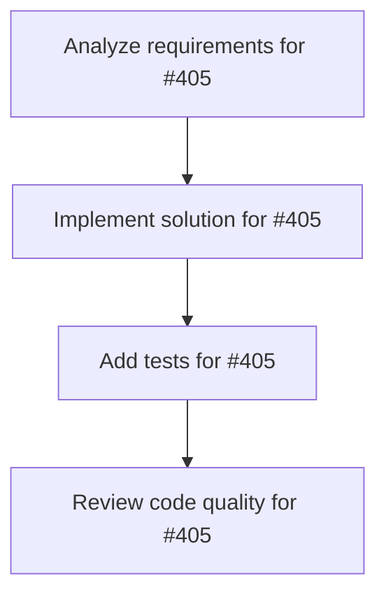

# Plans for Issue #405

**Title**: 📄 [Sub-Issue #397] Phase 2: HAL評価（9ベンチマーク + コスト効率）

**URL**: https://github.com/customer-cloud/miyabi-private/issues/405

---

## 📋 Summary

- **Total Tasks**: 4
- **Estimated Duration**: 60 minutes
- **Execution Levels**: 4
- **Has Cycles**: ✅ No

## 📝 Task Breakdown

### 1. Analyze requirements for #405

- **ID**: `task-405-analysis`
- **Type**: Docs
- **Assigned Agent**: IssueAgent
- **Priority**: 0
- **Estimated Duration**: 5 min

**Description**: Analyze issue requirements and create detailed specification

### 2. Implement solution for #405

- **ID**: `task-405-impl`
- **Type**: Feature
- **Assigned Agent**: CodeGenAgent
- **Priority**: 1
- **Estimated Duration**: 30 min
- **Dependencies**: task-405-analysis

**Description**: ## 🎯 目的

**HAL（Princeton）の9つのベンチマークでMiyabiを評価し、コスト効率性を測定**

**親Issue**: #397 - エージェントベンチマーク評価実装
**依存**: #404 (Phase 1) - AgentBench評価完了後に実施

---

## 📊 HAL概要

**公式リソース**:
- Website: https://hal.cs.princeton.edu/
- GitHub: https://github.com/princeton-pli/hal-harness
- ドキュメント: https://hal.cs.princeton.edu/docs

**9つのベンチマーク**:

| ベンチマーク | カテゴリ | 現在のトップ | スコア | コスト |
|------------|---------|------------|-------|-------|
| **AssistantBench** | Webアシスタンス | Browser-Use (o3 Medium) | 38.8% | $15.15 |
| **Online Mind2Web** | Webインタラクション | Browser-Use (o3 Medium) | 22.5% | $48.21 |
| **CORE-Bench Hard** | 科学プログラミング | CORE-Agent (Claude Opus 4.1) | 51.1% | $412.42 |
| **Scicode** | 科学計算 | CORE-Agent (Claude Opus 4.1) | 66.0% | $137.83 |
| **SWE-bench Verified Mini** | ソフトウェアエンジニアリング | OpenHands (Claude Sonnet 4.5) | 44.4% | $57.92 |
| **TAU-bench Airline** | カスタマーサービス | HAL Generalist Agent (Claude Sonnet 4.5) | 82.2% | $20.76 |
| **USACO** | プログラミングコンテスト | USACO Episodic + Semantic (GPT-5 Medium) | 69.7% | $64.13 |
| **GAIA** | 汎用AI能力 | HAL Generalist Agent (Claude Sonnet 4.5) | 74.5% | $187.37 |

**特徴**:
- **Cost-Performance Trade-off**: コストと性能のパレート効率性
- **Comprehensive Logging**: W&B Weaveによる自動トレース
- **Encrypted Distribution**: ベンチマーク汚染防止

---

## 📋 タスク

### 1. HAL Harness環境構築

```bash
# リポジトリクローン
git clone https://github.com/princeton-pli/hal-harness.git
cd hal-harness

# Python依存関係インストール
pip install -e .

# Weights & Biases設定（ロギング用）
wandb login
```

**検証項目**:
- [ ] HAL Harnessが正常にインストール
- [ ] W&B認証が完了
- [ ] サンプルエージェントで動作確認

---

### 2. Miyabiエージェント統合（Python wrapper）

```python
# agents/miyabi_agent.py

from hal_harness import BaseAgent
import subprocess
import json

class MiyabiAgent(BaseAgent):
    """Miyabi Rustバイナリを呼び出すPython wrapper"""
    
    def __init__(self):
        super().__init__()
        self.miyabi_bin = "miyabi"  # Rustバイナリパス
        
    async def act(self, observation: dict) -> dict:
        """
        観測を受け取り、次のアクションを決定
        
        Args:
            observation: 環境からの観測情報
            
        Returns:
            action: 次のアクション
        """
        # Miyabi Rustバイナリを呼び出し
        result = subprocess.run(
            [self.miyabi_bin, "agent", "act", json.dumps(observation)],
            capture_output=True,
            text=True,
        )
        
        action = json.loads(result.stdout)
        return action
    
    async def reset(self):
        """エピソード開始時の初期化"""
        subprocess.run([self.miyabi_bin, "agent", "reset"])
```

**検証項目**:
- [ ] Python wrapperが正常に動作
- [ ] Miyabi Rustバイナリとの通信が成功
- [ ] BaseAgentインターフェースに準拠

---

### 3. Rust側のAgent実装

```rust
// crates/miyabi-cli/src/commands/agent.rs

use clap::{Args, Subcommand};
use serde::{Deserialize, Serialize};

#[derive(Args)]
pub struct AgentArgs {
    #[command(subcommand)]
    pub command: AgentCommand,
}

#[derive(Subcommand)]
pub enum AgentCommand {
    /// 観測を受け取りアクションを決定
    Act {
        #[arg(long)]
        observation: String,  // JSON形式
    },
    
    /// エピソードリセット
    Reset,
}

#[derive(Serialize, Deserialize)]
pub struct Observation {
    pub state: String,
    pub history: Vec<String>,
    // ... 環境固有のフィールド
}

#[derive(Serialize, Deserialize)]
pub struct Action {
    pub action_type: String,
    pub parameters: serde_json::Value,
}

pub async fn handle_act(observation_json: &str) -> Result<Action> {
    let obs: Observation = serde_json::from_str(observation_json)?;
    
    // Coordinatorでアクション決定
    let coordinator = CoordinatorAgent::new()?;
    let action = coordinator.decide_action(&obs).await?;
    
    Ok(action)
}
```

**検証項目**:
- [ ] JSON形式での入出力
- [ ] Coordinatorとの統合
- [ ] 各ベンチマーク固有の処理

---

### 4. 9ベンチマークの評価

#### 4.1 AssistantBench

```bash
python run_evaluation.py \
  --agent miyabi \
  --benchmark assistantbench \
  --output results/hal/assistantbench.json
```

#### 4.2 Online Mind2Web

```bash
python run_evaluation.py \
  --agent miyabi \
  --benchmark mind2web \
  --output results/hal/mind2web.json
```

#### 4.3 CORE-Bench Hard

```bash
python run_evaluation.py \
  --agent miyabi \
  --benchmark core_bench_hard \
  --output results/hal/core_bench_hard.json
```

#### 4.4 Scicode

```bash
python run_evaluation.py \
  --agent miyabi \
  --benchmark scicode \
  --output results/hal/scicode.json
```

#### 4.5 SWE-bench Verified Mini

**注意**: Issue #396（SWE-bench Pro）と連携

```bash
# SWE-bench Pro評価結果を使用
cp ../results/swe_bench_verified_mini.json results/hal/
```

#### 4.6 TAU-bench Airline

```bash
python run_evaluation.py \
  --agent miyabi \
  --benchmark tau_bench_airline \
  --output results/hal/tau_bench_airline.json
```

#### 4.7 USACO

```bash
python run_evaluation.py \
  --agent miyabi \
  --benchmark usaco \
  --output results/hal/usaco.json
```

#### 4.8 GAIA

```bash
python run_evaluation.py \
  --agent miyabi \
  --benchmark gaia \
  --output results/hal/gaia.json
```

---

### 5. コストトラッキング実装

```rust
// crates/miyabi-benchmark/src/cost.rs

use std::time::{Duration, Instant};

pub struct CostTracker {
    /// Claude Code実行時間
    pub claude_code_time: Duration,
    
    /// Worktreeオーバーヘッド
    pub worktree_overhead: Duration,
    
    /// 総コスト（$0: ローカル実行）
    pub total_cost: f64,
    
    start_time: Instant,
}

impl CostTracker {
    pub fn new() -> Self {
        Self {
            claude_code_time: Duration::ZERO,
            worktree_overhead: Duration::ZERO,
            total_cost: 0.0,
            start_time: Instant::now(),
        }
    }
    
    pub fn elapsed(&self) -> Duration {
        self.start_time.elapsed()
    }
    
    /// 他のモデルとのコスト比較
    pub fn cost_comparison(&self) -> CostComparison {
        CostComparison {
            miyabi: self.total_cost,
            claude_sonnet_4_5: 187.37,  // GAIAでの平均
            gpt_5: 64.13,  // USACOでの平均
            // ... 他のモデル
        }
    }
}
```

**検証項目**:
- [ ] 実行時間が正確に計測される
- [ ] コストが$0として記録される
- [ ] 他モデルとの比較が可能

---

### 6. パレート効率性分析

```python
# scripts/analyze_pareto_efficiency.py

import matplotlib.pyplot as plt
import pandas as pd

# Miyabi結果
miyabi_results = {
    'AssistantBench': {'score': 0.XX, 'cost': 0.0},
    'Mind2Web': {'score': 0.XX, 'cost': 0.0},
    # ... 他のベンチマーク
}

# 競合モデル結果
competitor_results = {
    'Claude Sonnet 4.5': {
        'AssistantBench': {'score': 0.388, 'cost': 15.15},
        # ...
    },
    # ...
}

# パレート効率性プロット
plt.figure(figsize=(12, 8))
for model, results in competitor_results.items():
    scores = [r['score'] for r in results.values()]
    costs = [r['cost'] for r in results.values()]
    plt.scatter(costs, scores, label=model)

# Miyabiプロット
miyabi_scores = [r['score'] for r in miyabi_results.values()]
miyabi_costs = [r['cost'] for r in miyabi_results.values()]
plt.scatter(miyabi_costs, miyabi_scores, label='Miyabi', s=200, marker='*')

plt.xlabel('Cost ($)')
plt.ylabel('Score')
plt.title('Cost-Performance Trade-off')
plt.legend()
plt.savefig('results/hal/pareto_efficiency.png')
```

**検証項目**:
- [ ] パレート効率性が可視化される
- [ ] Miyabiの位置が明確
- [ ] グラフが美しい

---

### 7. プルリクエスト作成

```bash
# GitHubリポジトリをフォーク
gh repo fork princeton-pli/hal-harness

# 新しいブランチ作成
git checkout -b add-miyabi-agent

# ファイル追加
git add agents/miyabi_agent.py
git add results/miyabi/*.json

# コミット
git commit -m "feat: Add Miyabi agent evaluation results"

# プッシュ
git push origin add-miyabi-agent

# プルリクエスト作成
gh pr create \
  --title "Add Miyabi agent evaluation results" \
  --body "Evaluation results for Miyabi autonomous development framework across 9 HAL benchmarks."
```

**検証項目**:
- [ ] PR作成完了
- [ ] CI/CDが成功
- [ ] レビュー待ち

---

## 📦 成果物

- [ ] `agents/miyabi_agent.py` - HAL Harness統合
- [ ] `crates/miyabi-cli/src/commands/agent.rs` - Rust Agent実装
- [ ] `results/hal/*.json` - 9ベンチマーク結果
- [ ] `results/hal/pareto_efficiency.png` - パレート効率性グラフ
- [ ] `docs/HAL_EVALUATION_REPORT.md` - 評価レポート
- [ ] GitHub PR: https://github.com/princeton-pli/hal-harness

---

## ✅ 成功基準

### 必達
- [ ] **3つ以上のベンチマークで評価完了**
- [ ] コストトラッキングが正常に動作
- [ ] パレート効率性が分析される
- [ ] GitHub PR作成完了

### 推奨
- [ ] **9つすべてのベンチマークで評価完了**
- [ ] 少なくとも1つのベンチマークで上位25%
- [ ] コスト効率が最高（$0/タスク）

### 理想
- [ ] **5つ以上のベンチマークで上位25%**
- [ ] パレート効率性でトップ5
- [ ] PRがマージされリーダーボード掲載

---

## 📊 計算リソース

### 時間
- **各ベンチマーク**: 1-3日間
- **合計**: 約**6週間**（並列実行可能）

### メモリ
- **各ベンチマーク**: 4-8GB
- **ピーク**: 約**16GB**

### ストレージ
- ログ: 約10GB
- **合計**: 約**15GB**

---

## ⏱️ 期間

**期間**: 6週間
**期限**: 2026-03-11

---

## 🏷️ Label

- `✨ type:feature`
- `🏗️ phase:implementation`
- `🤖 agent:coordinator`
- `📊 priority:P2-Medium`

---

## 📚 関連リソース

- **Website**: https://hal.cs.princeton.edu/
- **GitHub**: https://github.com/princeton-pli/hal-harness
- **ドキュメント**: https://hal.cs.princeton.edu/docs

---

**親Issue**: #397 - エージェントベンチマーク評価実装
**依存**: #404 (Phase 1)
**関連**: #396 (SWE-bench Pro) - SWE-bench Verified Mini連携

### 3. Add tests for #405

- **ID**: `task-405-test`
- **Type**: Test
- **Assigned Agent**: CodeGenAgent
- **Priority**: 2
- **Estimated Duration**: 15 min
- **Dependencies**: task-405-impl

**Description**: Create comprehensive test coverage

### 4. Review code quality for #405

- **ID**: `task-405-review`
- **Type**: Refactor
- **Assigned Agent**: ReviewAgent
- **Priority**: 3
- **Estimated Duration**: 10 min
- **Dependencies**: task-405-test

**Description**: Run quality checks and code review

## 🔄 Execution Plan (DAG Levels)

Tasks can be executed in parallel within each level:

### Level 0 (Parallel Execution)

- `task-405-analysis` - Analyze requirements for #405

### Level 1 (Parallel Execution)

- `task-405-impl` - Implement solution for #405

### Level 2 (Parallel Execution)

- `task-405-test` - Add tests for #405

### Level 3 (Parallel Execution)

- `task-405-review` - Review code quality for #405

## 📊 Dependency Graph



## ⏱️ Timeline Estimation

- **Sequential Execution**: 60 minutes (1.0 hours)
- **Parallel Execution (Critical Path)**: 10 minutes (0.2 hours)
- **Estimated Speedup**: 6.0x

---

*Generated by CoordinatorAgent on 2025-10-30 17:47:21 UTC*
