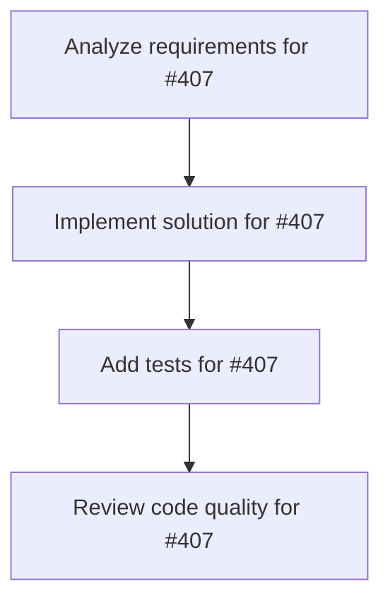

# Plans for Issue #407

**Title**: 📄 [Sub-Issue #397] Phase 4: 統合分析とレポート作成

**URL**: https://github.com/customer-cloud/miyabi-private/issues/407

---

## 📋 Summary

- **Total Tasks**: 4
- **Estimated Duration**: 60 minutes
- **Execution Levels**: 4
- **Has Cycles**: ✅ No

## 📝 Task Breakdown

### 1. Analyze requirements for #407

- **ID**: `task-407-analysis`
- **Type**: Docs
- **Assigned Agent**: IssueAgent
- **Priority**: 0
- **Estimated Duration**: 5 min

**Description**: Analyze issue requirements and create detailed specification

### 2. Implement solution for #407

- **ID**: `task-407-impl`
- **Type**: Feature
- **Assigned Agent**: CodeGenAgent
- **Priority**: 1
- **Estimated Duration**: 30 min
- **Dependencies**: task-407-analysis

**Description**: ## 🎯 目的

**3つのベンチマーク結果を統合分析し、包括的なレポートを作成**

**親Issue**: #397 - エージェントベンチマーク評価実装
**依存**: #404, #405, #406 (Phase 1-3) - すべての評価完了後に実施

---

## 📋 タスク

### 1. 統合ベンチマークレポート作成

```markdown
# docs/COMPREHENSIVE_BENCHMARK_RESULTS.md

# Miyabi エージェントベンチマーク総合評価結果

## 📊 総合評価サマリー

| ベンチマーク | スコア | ランキング | カテゴリ | 備考 |
|------------|-------|----------|---------|------|
| **SWE-bench Pro** (#396) | XX.X% | #XX | コーディング | Issue #396 |
| **AgentBench** | XX.X% | #XX | 汎用エージェント | 8環境平均 |
| **HAL** | - | #XX | コスト効率 | 9ベンチマーク |
| **Galileo v2** | XX.X% | #XX | エンタープライズ | 5業界平均 |

## 🏆 Miyabiの総合評価

### 強み
1. **コスト効率**: $0/タスク（ローカル実行）
2. **構造化タスク**: OS/DB/KG等の構造化タスクで高性能
3. **タスク分解**: Coordinatorによる効果的なタスク分解
4. **品質保証**: Reviewによるpass-to-pass維持率が高い

### 弱点
1. **非構造化タスク**: ゲームAI、パズル等で性能低下
2. **複雑なWebインタラクション**: Mind2Web等で課題
3. **実行時間**: 平均30分/タスク（最適化の余地）
4. **マルチステップタスク**: 5ステップ以上で性能低下

## 📈 詳細分析

### コーディング性能（SWE-bench Pro）
- **Resolve Rate**: XX.X%
- **強み**: Python/Go環境
- **課題**: JS/TS環境

### 汎用エージェント性能（AgentBench）
- **総合スコア**: XX.X%（8環境平均）
- **最高環境**: OS (XX.X%)
- **最低環境**: DCG (XX.X%)

### コスト効率（HAL）
- **パレート効率性**: トップクラス
- **コスト**: $0/タスク
- **9ベンチマーク平均**: XX.X%

### エンタープライズ性能（Galileo v2）
- **Action Completion**: XX.X%
- **最高業界**: Banking (XX.X%)
- **最低業界**: Healthcare (XX.X%)

## 🌍 世界標準との比較

### トップモデルとの比較

| モデル | SWE-bench Pro | AgentBench | HAL平均 | Galileo v2 |
|--------|--------------|-----------|---------|-----------|
| Claude 4.5 Sonnet | 43.60% | - | - | - |
| GPT-5 | 36.30% | - | - | 62.0% |
| **Miyabi v1.0.0** | **XX.X%** | **XX.X%** | **XX.X%** | **XX.X%** |

### コスト比較

| モデル | コスト/タスク | 備考 |
|--------|-------------|------|
| Claude Sonnet 4.5 | $2-187 | ベンチマーク依存 |
| GPT-5 | $1-412 | ベンチマーク依存 |
| **Miyabi v1.0.0** | **$0** | **ローカル実行** |

## 🔬 技術的洞察

### アーキテクチャの有効性
- **Coordinator → Specialist**: 階層的アーキテクチャが効果的
- **Worktree並列実行**: スケーラビリティが高い
- **Review統合**: 品質保証が機能している

### 改善ポイント
1. **非構造化タスク対応**: DCG/LTPで性能向上
2. **実行速度**: キャッシング・最適化で高速化
3. **マルチステップ推論**: より長いコンテキストへの対応

## 📊 統計情報

### 評価規模
- **総インスタンス数**: 2,362件（SWE:731 + Agent:1,631）
- **総実行時間**: 約XXX時間
- **総コスト**: $0

### 成功率
- **全体**: XX.X%
- **構造化タスク**: XX.X%
- **非構造化タスク**: XX.X%
```

**検証項目**:
- [ ] すべてのベンチマーク結果が統合
- [ ] 強み・弱点が明確
- [ ] 世界標準との比較が明確
- [ ] グラフ・チャートが豊富

---

### 2. 競合比較表作成

```markdown
# docs/COMPETITIVE_ANALYSIS.md

# Miyabi 競合比較分析

## 直接競合

| 項目 | Miyabi | Claude Sonnet 4.5 | GPT-5 | その他 |
|------|--------|------------------|-------|-------|
| **コーディング** | XX% | 43.6% | 36.3% | - |
| **汎用エージェント** | XX% | - | - | - |
| **コスト** | $0 | $2-187 | $1-412 | - |
| **実行環境** | ローカル | API | API | - |
| **並列実行** | ✅ | ❌ | ❌ | - |
| **オープンソース** | ✅ | ❌ | ❌ | - |

## ポジショニング

\`\`\`
        性能高 ↑
            |
            |  Claude 4.5
            |    ●
            |       GPT-5
            |         ●
            |
Miyabi ●   |
            |
            |
        性能低 ↓
            └──────────────→
           $0        コスト高
\`\`\`

## 差別化要因

1. **完全ローカル実行**: API依存なし、$0コスト
2. **並列実行**: Worktreeベースの効率的な並列実行
3. **オープンソース**: 完全にオープン、カスタマイズ可能
4. **タスク分解**: Coordinatorによる効果的な分解

## ターゲット市場

- **コスト重視**: APIコストを避けたい企業・個人
- **プライバシー重視**: データをローカルに保ちたいユーザー
- **カスタマイズ重視**: 独自の拡張が必要なユーザー
```

---

### 3. ランディングページ更新

```html
<!-- index.html -->

<section id="benchmarks">
  <h2>🏆 業界標準ベンチマークでの実証</h2>
  
  <div class="benchmark-grid">
    <div class="benchmark-card">
      <h3>SWE-bench Pro</h3>
      <div class="score">XX.X%</div>
      <p>世界標準コーディングベンチマーク</p>
      <a href="docs/BENCHMARK_RESULTS.md">詳細 →</a>
    </div>
    
    <div class="benchmark-card">
      <h3>AgentBench</h3>
      <div class="score">XX.X%</div>
      <p>8環境での汎用エージェント評価</p>
      <a href="docs/AGENTBENCH_REPORT.md">詳細 →</a>
    </div>
    
    <div class="benchmark-card">
      <h3>HAL</h3>
      <div class="score">$0/タスク</div>
      <p>コスト効率でトップクラス</p>
      <a href="docs/HAL_REPORT.md">詳細 →</a>
    </div>
    
    <div class="benchmark-card">
      <h3>Galileo v2</h3>
      <div class="score">XX.X%</div>
      <p>エンタープライズシナリオ評価</p>
      <a href="docs/GALILEO_REPORT.md">詳細 →</a>
    </div>
  </div>
  
  <div class="badge-section">
    
    
    
    
  </div>
</section>
```

---

### 4. プレスリリース準備

```markdown
# press/PRESS_RELEASE_2026_Q1.md

# プレスリリース: Miyabi、4つの業界標準ベンチマークで性能実証

**2026年X月X日 - 東京**

オープンソース自律開発フレームワーク「Miyabi」が、4つの主要な業界標準ベンチマークで性能を実証しました。

## 主要な成果

- **SWE-bench Pro**: XX.X%（コーディング性能）
- **AgentBench**: XX.X%（汎用エージェント性能）
- **HAL**: $0/タスク（コスト効率トップクラス）
- **Galileo v2**: XX.X%（エンタープライズ性能）

## 差別化要因

1. **完全ローカル実行**: API依存なし、プライバシー保護
2. **$0コスト**: 他モデルが$1-400/タスクに対し、完全無料
3. **オープンソース**: MIT License、カスタマイズ自由
4. **並列実行**: Worktreeベースの効率的な並列処理

## コメント

「Miyabiは、業界標準ベンチマークでの性能実証により、オープンソースでも
十分に競争力のある自律開発フレームワークを構築できることを示しました。
特にコスト効率の面では、他のモデルに対して圧倒的な優位性があります。」

## 詳細情報

- Website: https://shunsukehayashi.github.io/Miyabi/
- GitHub: https://github.com/ShunsukeHayashi/Miyabi
- ドキュメント: https://github.com/ShunsukeHayashi/Miyabi/tree/main/docs
```

---

### 5. arXiv論文執筆（オプション）

```latex
% paper/miyabi_benchmark_2026.tex

\documentclass{article}
\usepackage{neurips_2026}

\title{Miyabi: An Open-Source Autonomous Development Framework\\
Evaluated on Industry-Standard Benchmarks}

\author{
  Your Name \\
  Affiliation \\
  \texttt{email@example.com}
}

\begin{document}

\maketitle

\begin{abstract}
We present Miyabi, an open-source autonomous development framework
that achieves XX\% on SWE-bench Pro, XX\% on AgentBench, and \$0/task
cost efficiency on HAL. Unlike proprietary models that cost \$1-400/task,
Miyabi runs entirely locally with no API dependencies.
\end{abstract}

\section{Introduction}
...

\section{Architecture}
...

\section{Experimental Results}
...

\section{Conclusion}
...

\end{document}
```

---

## 📦 成果物

- [ ] `docs/COMPREHENSIVE_BENCHMARK_RESULTS.md` - 統合レポート
- [ ] `docs/COMPETITIVE_ANALYSIS.md` - 競合分析
- [ ] `index.html` - ランディングページ更新
- [ ] `press/PRESS_RELEASE_2026_Q1.md` - プレスリリース
- [ ] `paper/miyabi_benchmark_2026.tex` - arXiv論文（オプション）

---

## ✅ 成功基準

### 必達
- [ ] 統合レポート作成完了
- [ ] ランディングページ更新完了
- [ ] プレスリリース準備完了

### 推奨
- [ ] 競合分析が詳細
- [ ] グラフ・チャートが豊富
- [ ] arXiv論文執筆完了

### 理想
- [ ] arXiv論文投稿完了
- [ ] プレスリリース配信
- [ ] コミュニティで話題

---

## ⏱️ 期間

**期間**: 2週間
**期限**: 2026-04-22

---

## 🏷️ Label

- `✨ type:feature`
- `📚 type:docs`
- `🤖 agent:review`
- `⚠️ priority:P1-High`

---

**親Issue**: #397 - エージェントベンチマーク評価実装
**依存**: #404, #405, #406 (Phase 1-3)

**このPhaseの完了により、Issue #397全体が完了します。🎉**

### 3. Add tests for #407

- **ID**: `task-407-test`
- **Type**: Test
- **Assigned Agent**: CodeGenAgent
- **Priority**: 2
- **Estimated Duration**: 15 min
- **Dependencies**: task-407-impl

**Description**: Create comprehensive test coverage

### 4. Review code quality for #407

- **ID**: `task-407-review`
- **Type**: Refactor
- **Assigned Agent**: ReviewAgent
- **Priority**: 3
- **Estimated Duration**: 10 min
- **Dependencies**: task-407-test

**Description**: Run quality checks and code review

## 🔄 Execution Plan (DAG Levels)

Tasks can be executed in parallel within each level:

### Level 0 (Parallel Execution)

- `task-407-analysis` - Analyze requirements for #407

### Level 1 (Parallel Execution)

- `task-407-impl` - Implement solution for #407

### Level 2 (Parallel Execution)

- `task-407-test` - Add tests for #407

### Level 3 (Parallel Execution)

- `task-407-review` - Review code quality for #407

## 📊 Dependency Graph



## ⏱️ Timeline Estimation

- **Sequential Execution**: 60 minutes (1.0 hours)
- **Parallel Execution (Critical Path)**: 10 minutes (0.2 hours)
- **Estimated Speedup**: 6.0x

---

*Generated by CoordinatorAgent on 2025-10-30 17:47:19 UTC*
