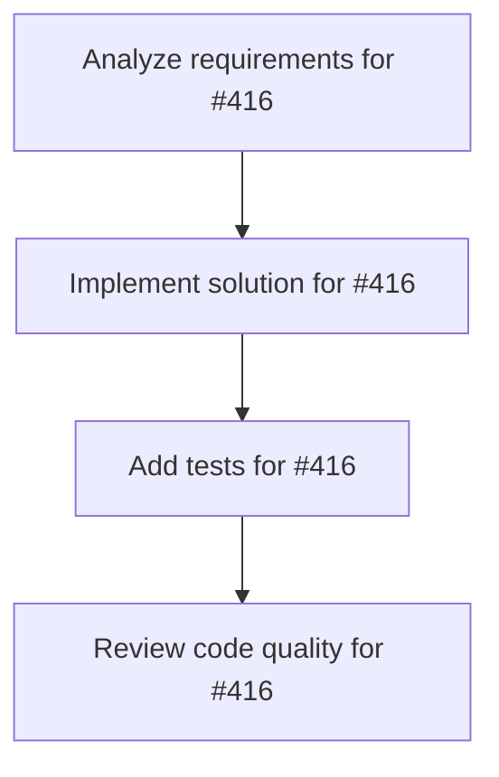

# Plans for Issue #416

**Title**: 🔧 refactor: Migrate remaining code from miyabi-agents to specialized crates

**URL**: https://github.com/customer-cloud/miyabi-private/issues/416

---

## 📋 Summary

- **Total Tasks**: 4
- **Estimated Duration**: 60 minutes
- **Execution Levels**: 4
- **Has Cycles**: ✅ No

## 📝 Task Breakdown

### 1. Analyze requirements for #416

- **ID**: `task-416-analysis`
- **Type**: Docs
- **Assigned Agent**: IssueAgent
- **Priority**: 0
- **Estimated Duration**: 5 min

**Description**: Analyze issue requirements and create detailed specification

### 2. Implement solution for #416

- **ID**: `task-416-impl`
- **Type**: Feature
- **Assigned Agent**: CodeGenAgent
- **Priority**: 1
- **Estimated Duration**: 30 min
- **Dependencies**: task-416-analysis

**Description**: ## 📊 背景
統合状態の可視化により、\`miyabi-agents\` クレートが旧実装を含んでおり、各Agent専用クレートへの移行が必要であることが判明しました。

**現状**:
- \`miyabi-agents\`: 5,477行、110テスト（Legacy実装含む）
- 各Agent専用クレート: 既に存在するが完全移行していない

**問題点**:
- ❌ 複雑な依存関係
- ❌ テストの重複
- ❌ 保守性の低下
- ❌ 型定義の不一致

## 🎯 目標
\`miyabi-agents\`を完全に廃止し、以下の専用クレートに移行：
- \`miyabi-agent-coordinator\`
- \`miyabi-agent-codegen\`
- \`miyabi-agent-review\`
- \`miyabi-agent-workflow\`
- \`miyabi-agent-business\`

## ✅ 実施内容

### Phase 1: 移行マッピング（1週間）
- [ ] 各Agentの実装コードを専用クレートにマッピング
- [ ] テストケースの重複確認
- [ ] 型定義の統一（\`miyabi-types\`への移行）
- [ ] 依存関係の整理

### Phase 2: コード移行（2週間）
- [ ] CoordinatorAgent完全移行
- [ ] CodeGenAgent完全移行
- [ ] ReviewAgent完全移行
- [ ] WorkflowAgent完全移行
- [ ] テストの統合・重複削除

### Phase 3: 検証・廃止（1週間）
- [ ] すべてのテストがパス（347テスト維持）
- [ ] ビルド時間の改善確認
- [ ] \`miyabi-agents\`の削除
- [ ] Cargo.tomlの依存関係更新

## 📈 成功基準
- ✅ \`miyabi-agents\`クレートの完全削除
- ✅ すべてのテストがパス（347テスト以上）
- ✅ ビルド時間が8分以下（目標: 6分）
- ✅ コンパイル警告0件
- ✅ 循環依存なし

## 📅 Timeline
- **Priority**: 🔥 P1-High
- **開始**: 2025-10-23
- **完了予定**: 2025-11-13（3週間）

## 📚 関連ドキュメント
- [INTEGRATION_VISUALIZATION.md](crates/INTEGRATION_VISUALIZATION.md)
- [IMPROVEMENT_ISSUES.md](crates/IMPROVEMENT_ISSUES.md)

### 3. Add tests for #416

- **ID**: `task-416-test`
- **Type**: Test
- **Assigned Agent**: CodeGenAgent
- **Priority**: 2
- **Estimated Duration**: 15 min
- **Dependencies**: task-416-impl

**Description**: Create comprehensive test coverage

### 4. Review code quality for #416

- **ID**: `task-416-review`
- **Type**: Refactor
- **Assigned Agent**: ReviewAgent
- **Priority**: 3
- **Estimated Duration**: 10 min
- **Dependencies**: task-416-test

**Description**: Run quality checks and code review

## 🔄 Execution Plan (DAG Levels)

Tasks can be executed in parallel within each level:

### Level 0 (Parallel Execution)

- `task-416-analysis` - Analyze requirements for #416

### Level 1 (Parallel Execution)

- `task-416-impl` - Implement solution for #416

### Level 2 (Parallel Execution)

- `task-416-test` - Add tests for #416

### Level 3 (Parallel Execution)

- `task-416-review` - Review code quality for #416

## 📊 Dependency Graph

## ⏱️ Timeline Estimation

- **Sequential Execution**: 60 minutes (1.0 hours)
- **Parallel Execution (Critical Path)**: 10 minutes (0.2 hours)
- **Estimated Speedup**: 6.0x

---

*Generated by CoordinatorAgent on 2025-11-01 11:17:45 UTC*
