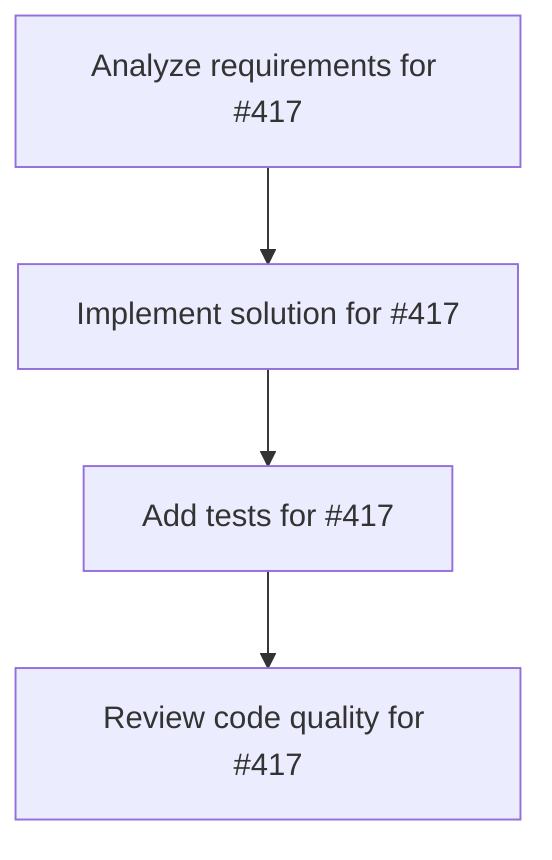

# Plans for Issue #417

**Title**: ✨ feat: Implement 13 remaining Business Agents

**URL**: https://github.com/customer-cloud/miyabi-private/issues/417

---

## 📋 Summary

- **Total Tasks**: 4
- **Estimated Duration**: 60 minutes
- **Execution Levels**: 4
- **Has Cycles**: ✅ No

## 📝 Task Breakdown

### 1. Analyze requirements for #417

- **ID**: `task-417-analysis`
- **Type**: Docs
- **Assigned Agent**: IssueAgent
- **Priority**: 0
- **Estimated Duration**: 5 min

**Description**: Analyze issue requirements and create detailed specification

### 2. Implement solution for #417

- **ID**: `task-417-impl`
- **Type**: Feature
- **Assigned Agent**: CodeGenAgent
- **Priority**: 1
- **Estimated Duration**: 30 min
- **Dependencies**: task-417-analysis

**Description**: ## 📊 背景
Business Agentsは14個計画されており、現在\`AIEntrepreneurAgent\`のみ実装済みです。残り13個を実装する必要があります。

**実装済み（1個）**:
- ✅ AIEntrepreneurAgent（8-Phase business planning）

**未実装（13個）**:
1. ProductConceptAgent
2. ProductDesignAgent
3. PersonaAgent
4. SelfAnalysisAgent
5. MarketResearchAgent
6. MarketingAgent
7. ContentCreationAgent
8. SNSStrategyAgent
9. YouTubeAgent
10. SalesAgent
11. CRMAgent
12. AnalyticsAgent
13. FunnelDesignAgent

## 🎯 目標
全14個のBusiness Agentsを実装し、ビジネス戦略の自動化を完成させる。

## ✅ 実施内容

### Phase 1: 基盤強化（1週間）
- [ ] \`BusinessAgent\` trait の拡張
- [ ] 共通バリデーションフレームワーク
- [ ] 品質スコアリングシステム（100点満点）
- [ ] テンプレートエンジンの統合

### Phase 2: 戦略・企画系Agent実装（3週間）
- [ ] ProductConceptAgent（USP、収益モデル）
- [ ] ProductDesignAgent（技術スタック、MVP定義）
- [ ] PersonaAgent（3-5人の詳細ペルソナ）
- [ ] SelfAnalysisAgent（キャリア・スキル分析）
- [ ] FunnelDesignAgent（顧客導線最適化）

### Phase 3: マーケティング系Agent実装（3週間）
- [ ] MarketResearchAgent（競合20社以上分析）
- [ ] MarketingAgent（広告・SEO・SNS戦略）
- [ ] ContentCreationAgent（動画・記事・教材制作）
- [ ] SNSStrategyAgent（Twitter/Instagram/LinkedIn）
- [ ] YouTubeAgent（チャンネル最適化13ワークフロー）

### Phase 4: 営業・顧客管理系Agent実装（2週間）
- [ ] SalesAgent（リード→顧客転換率最大化）
- [ ] CRMAgent（顧客満足度向上・LTV最大化）
- [ ] AnalyticsAgent（データ分析・PDCA実行）

### Phase 5: 統合テスト（1週間）
- [ ] 全14 Agentの統合テスト
- [ ] E2Eシナリオテスト（起業→成長→収益化）
- [ ] パフォーマンステスト

## 📈 成功基準
- ✅ 14個すべてのBusiness Agents実装
- ✅ 各Agentのテストカバレッジ80%以上
- ✅ E2Eシナリオテスト10個以上
- ✅ ドキュメント完備（Rustdoc + README）
- ✅ 品質スコア90点以上

## 📅 Timeline
- **Priority**: ⭐ P2-Medium
- **開始**: 2025-10-23
- **完了予定**: 2025-12-18（8週間）

## 📚 関連ドキュメント
- \`.claude/agents/specs/business/*.md\`（14ファイル）
- [BUSINESS_AGENTS_USER_GUIDE.md](docs/BUSINESS_AGENTS_USER_GUIDE.md)
- [INTEGRATION_VISUALIZATION.md](crates/INTEGRATION_VISUALIZATION.md)

### 3. Add tests for #417

- **ID**: `task-417-test`
- **Type**: Test
- **Assigned Agent**: CodeGenAgent
- **Priority**: 2
- **Estimated Duration**: 15 min
- **Dependencies**: task-417-impl

**Description**: Create comprehensive test coverage

### 4. Review code quality for #417

- **ID**: `task-417-review`
- **Type**: Refactor
- **Assigned Agent**: ReviewAgent
- **Priority**: 3
- **Estimated Duration**: 10 min
- **Dependencies**: task-417-test

**Description**: Run quality checks and code review

## 🔄 Execution Plan (DAG Levels)

Tasks can be executed in parallel within each level:

### Level 0 (Parallel Execution)

- `task-417-analysis` - Analyze requirements for #417

### Level 1 (Parallel Execution)

- `task-417-impl` - Implement solution for #417

### Level 2 (Parallel Execution)

- `task-417-test` - Add tests for #417

### Level 3 (Parallel Execution)

- `task-417-review` - Review code quality for #417

## 📊 Dependency Graph

## ⏱️ Timeline Estimation

- **Sequential Execution**: 60 minutes (1.0 hours)
- **Parallel Execution (Critical Path)**: 10 minutes (0.2 hours)
- **Estimated Speedup**: 6.0x

---

*Generated by CoordinatorAgent on 2025-11-01 11:17:45 UTC*
