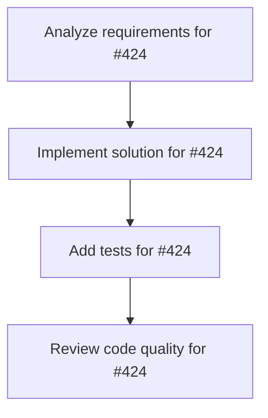

# Plans for Issue #424

**Title**: 【Testing】miyabi-knowledge: 統合テスト実装 - Docker Compose + E2Eテスト

**URL**: https://github.com/customer-cloud/miyabi-private/issues/424

---

## 📋 Summary

- **Total Tasks**: 4
- **Estimated Duration**: 60 minutes
- **Execution Levels**: 4
- **Has Cycles**: ✅ No

## 📝 Task Breakdown

### 1. Analyze requirements for #424

- **ID**: `task-424-analysis`
- **Type**: Docs
- **Assigned Agent**: IssueAgent
- **Priority**: 0
- **Estimated Duration**: 5 min

**Description**: Analyze issue requirements and create detailed specification

### 2. Implement solution for #424

- **ID**: `task-424-impl`
- **Type**: Test
- **Assigned Agent**: CodeGenAgent
- **Priority**: 1
- **Estimated Duration**: 30 min
- **Dependencies**: task-424-analysis

**Description**: ## 📋 概要

実際のQdrantインスタンスを使用したE2E統合テストを実装します。
Docker Composeでテスト環境を自動起動し、CI/CDで全フローを検証することで、本番環境での不具合を未然に防ぎます。

**親Issue**: #421 (Phase 6)

## 🎯 目的

- **実環境テスト**: モックではなく実際のQdrant + Ollamaでテスト
- **CI/CD統合**: GitHub Actionsで自動テスト実行
- **カバレッジ向上**: 80%以上のコードカバレッジを達成
- **回帰防止**: 新機能追加時の既存機能破壊を防止

## 🔧 実装内容

### 1. Docker Compose テスト環境

**ファイル**: `crates/miyabi-knowledge/docker-compose.test.yml`

```yaml
version: '3.8'

services:
  qdrant:
    image: qdrant/qdrant:v1.15.0
    ports:
      - "6333:6333"
      - "6334:6334"
    environment:
      - QDRANT__SERVICE__HTTP_PORT=6333
      - QDRANT__SERVICE__GRPC_PORT=6334
    healthcheck:
      test: ["CMD", "curl", "-f", "http://localhost:6333/healthz"]
      interval: 5s
      timeout: 3s
      retries: 10

  ollama:
    image: ollama/ollama:latest
    ports:
      - "11434:11434"
    volumes:
      - ollama_data:/root/.ollama
    environment:
      - OLLAMA_HOST=0.0.0.0:11434
    command: serve
    healthcheck:
      test: ["CMD", "curl", "-f", "http://localhost:11434/api/tags"]
      interval: 5s
      timeout: 3s
      retries: 10

volumes:
  ollama_data:
```

**起動スクリプト**: `crates/miyabi-knowledge/scripts/test-env.sh`

```bash
#!/bin/bash
set -e

echo "🚀 Starting test environment..."

# Docker Compose起動
docker-compose -f docker-compose.test.yml up -d

# ヘルスチェック待機
echo "⏳ Waiting for services to be healthy..."
timeout 60s bash -c 'until docker-compose -f docker-compose.test.yml ps | grep -q "(healthy)"; do sleep 2; done'

# Ollamaモデルダウンロード
echo "📥 Downloading Ollama model..."
docker-compose -f docker-compose.test.yml exec -T ollama ollama pull all-MiniLM-L6-v2

echo "✅ Test environment ready!"
```

**停止スクリプト**: `crates/miyabi-knowledge/scripts/teardown-env.sh`

```bash
#!/bin/bash
docker-compose -f docker-compose.test.yml down -v
```

### 2. 統合テスト実装

**ファイル**: `crates/miyabi-knowledge/tests/integration_tests.rs`

```rust
use miyabi_knowledge::{
    KnowledgeManager, KnowledgeConfig,
    searcher::{QdrantSearcher, SearchFilter},
};
use std::time::Duration;
use tokio::time::sleep;

// テスト用設定
fn test_config() -> KnowledgeConfig {
    let mut config = KnowledgeConfig::default();
    config.vector_db.host = "localhost".to_string();
    config.vector_db.port = 6333;
    config.vector_db.collection = "test-knowledge".to_string();
    config.embeddings.endpoint = "http://localhost:11434".to_string();
    config
}

#[tokio::test]
#[ignore] // `cargo test --features integration-tests` で実行
async fn test_full_workflow() {
    // 1. Manager初期化
    let config = test_config();
    let manager = KnowledgeManager::new(config.clone()).await.unwrap();

    // 2. サンプルログ作成
    create_sample_logs().await;

    // 3. インデックス化
    let stats = manager.index_workspace("test-workspace").await.unwrap();
    assert!(stats.success > 0, "No entries indexed");

    // 4. 検索
    let searcher = QdrantSearcher::new(config.clone()).await.unwrap();
    let results = searcher
        .search("error handling in Rust", 10)
        .await
        .unwrap();
    
    assert!(!results.is_empty(), "No search results");
    assert!(results[0].score > 0.7, "Low relevance score");

    // 5. フィルタ検索
    let filter = SearchFilter::new()
        .with_agent("CodeGenAgent")
        .with_outcome("success");
    
    let filtered = searcher
        .search_filtered("agent execution", filter)
        .await
        .unwrap();
    
    assert!(!filtered.is_empty(), "No filtered results");
    
    // 6. 統計取得
    let stats = searcher.get_statistics().await.unwrap();
    assert!(stats.total_entries > 0);

    // クリーンアップ
    cleanup_test_data().await;
}

#[tokio::test]
#[ignore]
async fn test_concurrent_indexing() {
    let config = test_config();
    
    // 10個のWorkerを並列起動
    let mut handles = vec![];
    
    for i in 0..10 {
        let config_clone = config.clone();
        handles.push(tokio::spawn(async move {
            let manager = KnowledgeManager::new(config_clone).await.unwrap();
            let workspace = format!("test-workspace-{}", i);
            manager.index_workspace(&workspace).await.unwrap();
        }));
    }
    
    // 全Worker完了待機
    for handle in handles {
        handle.await.unwrap();
    }
    
    // 統計確認
    let searcher = QdrantSearcher::new(config).await.unwrap();
    let stats = searcher.get_statistics().await.unwrap();
    assert!(stats.total_entries >= 10);
}

#[tokio::test]
#[ignore]
async fn test_incremental_indexing() {
    let config = test_config();
    let manager = KnowledgeManager::new(config.clone()).await.unwrap();

    // 初回インデックス化
    create_sample_logs().await;
    let stats1 = manager.index_workspace("test-workspace").await.unwrap();
    let initial_count = stats1.success;

    // 2回目（変更なし）
    let stats2 = manager.index_workspace("test-workspace").await.unwrap();
    assert_eq!(stats2.success, 0, "Should skip unchanged logs");

    // 新規ログ追加
    add_new_log().await;
    let stats3 = manager.index_workspace("test-workspace").await.unwrap();
    assert_eq!(stats3.success, 1, "Should index only new log");

    // 統計確認
    let searcher = QdrantSearcher::new(config).await.unwrap();
    let stats = searcher.get_statistics().await.unwrap();
    assert_eq!(stats.total_entries, initial_count + 1);
}

#[tokio::test]
#[ignore]
async fn test_error_recovery() {
    let config = test_config();

    // Qdrant停止
    stop_qdrant().await;

    // Manager初期化失敗を確認
    let result = KnowledgeManager::new(config.clone()).await;
    assert!(result.is_err(), "Should fail when Qdrant is down");

    // Qdrant再起動
    start_qdrant().await;
    sleep(Duration::from_secs(5)).await;

    // 再接続成功を確認
    let result = KnowledgeManager::new(config).await;
    assert!(result.is_ok(), "Should reconnect after Qdrant restart");
}

// ヘルパー関数
async fn create_sample_logs() {
    let log_dir = std::path::Path::new(".ai/logs");
    tokio::fs::create_dir_all(log_dir).await.unwrap();
    
    let log_content = r#"
# Agent Execution Log

**Agent**: CodeGenAgent
**Issue**: #270
**Task**: Implement error handling
**Outcome**: success

## Summary
Implemented comprehensive error handling using Result types.
    "#;
    
    tokio::fs::write(
        log_dir.join("2025-10-22-codegen.md"),
        log_content
    ).await.unwrap();
}

async fn add_new_log() {
    // 新規ログ追加実装
}

async fn cleanup_test_data() {
    // テストデータ削除
}

async fn stop_qdrant() {
    // Qdrantコンテナ停止
}

async fn start_qdrant() {
    // Qdrantコンテナ起動
}
```

### 3. GitHub Actions CI/CD

**ファイル**: `.github/workflows/knowledge-tests.yml`

```yaml
name: Knowledge Integration Tests

on:
  push:
    paths:
      - 'crates/miyabi-knowledge/**'
      - '.github/workflows/knowledge-tests.yml'
  pull_request:
    paths:
      - 'crates/miyabi-knowledge/**'

jobs:
  integration-tests:
    runs-on: ubuntu-latest
    
    steps:
      - uses: actions/checkout@v4
      
      - name: Install Rust
        uses: dtolnay/rust-toolchain@stable
      
      - name: Start Docker Compose
        run: |
          cd crates/miyabi-knowledge
          docker-compose -f docker-compose.test.yml up -d
          
      - name: Wait for services
        run: |
          timeout 60s bash -c 'until curl -f http://localhost:6333/healthz; do sleep 2; done'
          timeout 60s bash -c 'until curl -f http://localhost:11434/api/tags; do sleep 2; done'
          
      - name: Download Ollama model
        run: |
          docker exec $(docker ps -qf "name=ollama") ollama pull all-MiniLM-L6-v2
          
      - name: Run integration tests
        run: |
          cd crates/miyabi-knowledge
          cargo test --features integration-tests -- --ignored --test-threads=1
          
      - name: Stop Docker Compose
        if: always()
        run: |
          cd crates/miyabi-knowledge
          docker-compose -f docker-compose.test.yml down -v
      
      - name: Upload test logs
        if: failure()
        uses: actions/upload-artifact@v3
        with:
          name: test-logs
          path: crates/miyabi-knowledge/tests/logs/
```

### 4. Cargo.toml feature flag

**ファイル**: `crates/miyabi-knowledge/Cargo.toml`

```toml
[features]
default = []
integration-tests = []

[dev-dependencies]
tokio-test = "0.4"
tempfile = "3.8"
wiremock = "0.6"  # API mocking
```

### 5. カバレッジ測定

**ファイル**: `.github/workflows/coverage.yml`

```yaml
name: Code Coverage

on:
  push:
    branches: [main]
  pull_request:

jobs:
  coverage:
    runs-on: ubuntu-latest
    steps:
      - uses: actions/checkout@v4
      
      - name: Install Rust
        uses: dtolnay/rust-toolchain@stable
        with:
          components: llvm-tools-preview
          
      - name: Install cargo-llvm-cov
        run: cargo install cargo-llvm-cov
        
      - name: Generate coverage
        run: |
          cd crates/miyabi-knowledge
          cargo llvm-cov --all-features --workspace --lcov --output-path lcov.info
          
      - name: Upload to Codecov
        uses: codecov/codecov-action@v3
        with:
          files: crates/miyabi-knowledge/lcov.info
          flags: miyabi-knowledge
```

## ✅ 成功基準

- [ ] CI/CDで統合テストが自動実行される（GitHub Actions）
- [ ] 全統合テストが60秒以内に完了（タイムアウト設定）
- [ ] コードカバレッジ80%以上（Codecov統合）
- [ ] 並列実行テストが正常動作（10 Workers）
- [ ] エラー回復テストが正常動作（Qdrant再起動）
- [ ] `cargo test --features integration-tests` でローカル実行可能

## 🧪 テストカテゴリ

### 1. 機能テスト
- [ ] 全フロー（index → search → cleanup）
- [ ] フィルタ検索（Agent, Issue#, Outcome）
- [ ] 統計取得
- [ ] 増分インデックス化

### 2. 並行性テスト
- [ ] 10 Agents並列インデックス化
- [ ] 100クライアント並列検索
- [ ] 同時Read/Write操作

### 3. エラーハンドリングテスト
- [ ] Qdrant停止時の動作
- [ ] Ollama停止時の動作
- [ ] ネットワークタイムアウト
- [ ] 不正なログフォーマット

### 4. パフォーマンステスト
- [ ] 10,000エントリインデックス化時間（< 5分）
- [ ] 検索レスポンスタイム（< 1秒）
- [ ] メモリ使用量（< 512MB）

## 📊 推定工数

- **Docker環境構築**: 1日
- **統合テスト実装**: 2日
- **CI/CD統合**: 1日
- **カバレッジ設定**: 0.5日
- **ドキュメント**: 0.5日

**合計**: 5日

## 🔗 関連ファイル

- `crates/miyabi-knowledge/docker-compose.test.yml` - Docker環境 (新規)
- `crates/miyabi-knowledge/tests/integration_tests.rs` - 統合テスト (新規)
- `.github/workflows/knowledge-tests.yml` - CI/CD (新規)
- `.github/workflows/coverage.yml` - カバレッジ (新規)

## 📝 注意事項

1. **並列実行**: `--test-threads=1` で1テストずつ実行（Qdrantコレクション競合回避）
2. **タイムアウト**: 各テスト60秒タイムアウト（CI/CD高速化）
3. **クリーンアップ**: 各テスト後に `docker-compose down -v`（ボリューム削除）

---

**Parent Issue**: #421
**Phase**: Phase 6 - 統合テスト
**Priority**: 📝 P2-Medium
**Estimated**: 5日

### 3. Add tests for #424

- **ID**: `task-424-test`
- **Type**: Test
- **Assigned Agent**: CodeGenAgent
- **Priority**: 2
- **Estimated Duration**: 15 min
- **Dependencies**: task-424-impl

**Description**: Create comprehensive test coverage

### 4. Review code quality for #424

- **ID**: `task-424-review`
- **Type**: Refactor
- **Assigned Agent**: ReviewAgent
- **Priority**: 3
- **Estimated Duration**: 10 min
- **Dependencies**: task-424-test

**Description**: Run quality checks and code review

## 🔄 Execution Plan (DAG Levels)

Tasks can be executed in parallel within each level:

### Level 0 (Parallel Execution)

- `task-424-analysis` - Analyze requirements for #424

### Level 1 (Parallel Execution)

- `task-424-impl` - Implement solution for #424

### Level 2 (Parallel Execution)

- `task-424-test` - Add tests for #424

### Level 3 (Parallel Execution)

- `task-424-review` - Review code quality for #424

## 📊 Dependency Graph



## ⏱️ Timeline Estimation

- **Sequential Execution**: 60 minutes (1.0 hours)
- **Parallel Execution (Critical Path)**: 10 minutes (0.2 hours)
- **Estimated Speedup**: 6.0x

---

*Generated by CoordinatorAgent on 2025-11-01 11:17:46 UTC*
