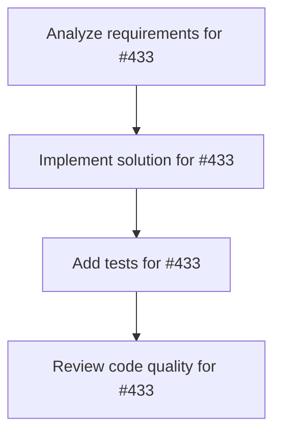

# Plans for Issue #433

**Title**: feat(dashboard): Add hover tooltips to Vector Space Universe TaskStars

**URL**: https://github.com/customer-cloud/miyabi-private/issues/433

---

## 📋 Summary

- **Total Tasks**: 4
- **Estimated Duration**: 60 minutes
- **Execution Levels**: 4
- **Has Cycles**: ✅ No

## 📝 Task Breakdown

### 1. Analyze requirements for #433

- **ID**: `task-433-analysis`
- **Type**: Docs
- **Assigned Agent**: IssueAgent
- **Priority**: 0
- **Estimated Duration**: 5 min

**Description**: Analyze issue requirements and create detailed specification

### 2. Implement solution for #433

- **ID**: `task-433-impl`
- **Type**: Feature
- **Assigned Agent**: CodeGenAgent
- **Priority**: 1
- **Estimated Duration**: 30 min
- **Dependencies**: task-433-analysis

**Description**: ## 🎯 Objective
Add interactive hover tooltips that display task information when user hovers over TaskStar spheres in the 3D Vector Space Universe.

## 📋 Requirements
- [ ] Add `onPointerOver` event handler to TaskStar mesh
- [ ] Display tooltip with task title, status, priority, estimated time
- [ ] Position tooltip near cursor (2D overlay)
- [ ] Add smooth fade in/out transition
- [ ] Show module and layer information
- [ ] Display semantic similarity links count

## 🎨 Design
```tsx
<mesh
  onPointerOver={(e) => {
    e.stopPropagation();
    setHoveredTask(task);
  }}
  onPointerOut={() => setHoveredTask(null)}
>
  {/* ... */}
</mesh>

{hoveredTask && (
  <Html position={[x, y, z]}>
    <div className="tooltip">
      <h3>{hoveredTask.title}</h3>
      <p>Status: {hoveredTask.status}</p>
      {/* ... */}
    </div>
  </Html>
)}
```

## 📁 Files
- `crates/miyabi-a2a/dashboard/src/components/vector-space-universe.tsx`

## 🔗 Related
- Part of Vector Space Universe Infinity Mode
- Requires `@react-three/drei` Html component

## ✅ Acceptance Criteria
- Tooltip appears on hover within 100ms
- Tooltip disappears on pointer out
- Tooltip does not block camera controls
- All task information displayed correctly

### 3. Add tests for #433

- **ID**: `task-433-test`
- **Type**: Test
- **Assigned Agent**: CodeGenAgent
- **Priority**: 2
- **Estimated Duration**: 15 min
- **Dependencies**: task-433-impl

**Description**: Create comprehensive test coverage

### 4. Review code quality for #433

- **ID**: `task-433-review`
- **Type**: Refactor
- **Assigned Agent**: ReviewAgent
- **Priority**: 3
- **Estimated Duration**: 10 min
- **Dependencies**: task-433-test

**Description**: Run quality checks and code review

## 🔄 Execution Plan (DAG Levels)

Tasks can be executed in parallel within each level:

### Level 0 (Parallel Execution)

- `task-433-analysis` - Analyze requirements for #433

### Level 1 (Parallel Execution)

- `task-433-impl` - Implement solution for #433

### Level 2 (Parallel Execution)

- `task-433-test` - Add tests for #433

### Level 3 (Parallel Execution)

- `task-433-review` - Review code quality for #433

## 📊 Dependency Graph



## ⏱️ Timeline Estimation

- **Sequential Execution**: 60 minutes (1.0 hours)
- **Parallel Execution (Critical Path)**: 10 minutes (0.2 hours)
- **Estimated Speedup**: 6.0x

---

*Generated by CoordinatorAgent on 2025-11-01 11:17:48 UTC*
