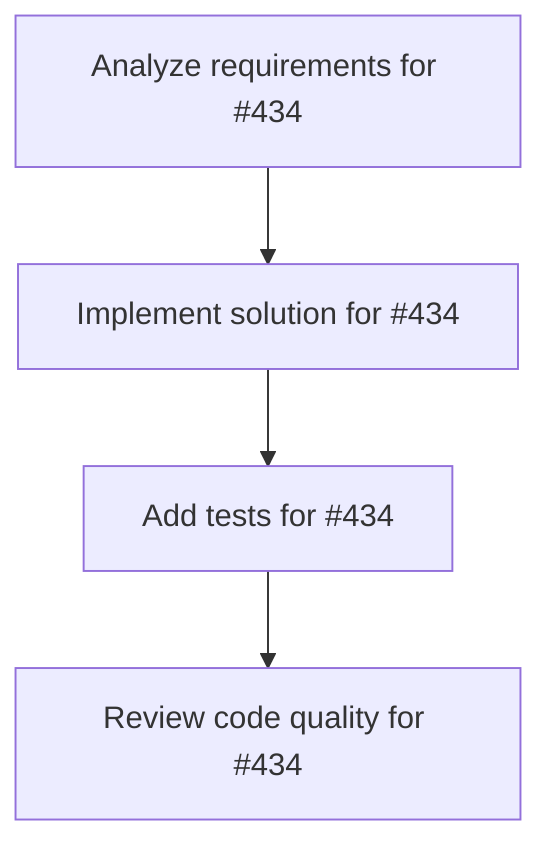

# Plans for Issue #434

**Title**: feat(dashboard): Add click interaction and task details modal to Vector Space Universe

**URL**: https://github.com/customer-cloud/miyabi-private/issues/434

---

## 📋 Summary

- **Total Tasks**: 4
- **Estimated Duration**: 60 minutes
- **Execution Levels**: 4
- **Has Cycles**: ✅ No

## 📝 Task Breakdown

### 1. Analyze requirements for #434

- **ID**: `task-434-analysis`
- **Type**: Docs
- **Assigned Agent**: IssueAgent
- **Priority**: 0
- **Estimated Duration**: 5 min

**Description**: Analyze issue requirements and create detailed specification

### 2. Implement solution for #434

- **ID**: `task-434-impl`
- **Type**: Feature
- **Assigned Agent**: CodeGenAgent
- **Priority**: 1
- **Estimated Duration**: 30 min
- **Dependencies**: task-434-analysis

**Description**: ## 🎯 Objective
Implement click interaction on TaskStar spheres that opens a modal/panel displaying full task details.

## 📋 Requirements
- [ ] Add `onClick` event handler to TaskStar mesh
- [ ] Create TaskDetailsModal component with HeroUI
- [ ] Display all task information:
  - Title, description, status, priority
  - Module, layer, estimated time
  - Semantic links (related tasks)
  - Dependencies (if any)
  - Agent comments (if any)
- [ ] Add "View in GitHub" link
- [ ] Add "Close" button with ESC key support
- [ ] Animate modal entrance/exit

## 🎨 Design
```tsx
<mesh onClick={(e) => {
  e.stopPropagation();
  setSelectedTask(task);
  setModalOpen(true);
}}>
  {/* ... */}
</mesh>

<Modal isOpen={modalOpen} onClose={() => setModalOpen(false)}>
  <ModalContent>
    <ModalHeader>{selectedTask?.title}</ModalHeader>
    <ModalBody>
      {/* Task details */}
    </ModalBody>
    <ModalFooter>
      <Button onClick={() => window.open(githubUrl)}>
        View in GitHub
      </Button>
    </ModalFooter>
  </ModalContent>
</Modal>
```

## 📁 Files
- `crates/miyabi-a2a/dashboard/src/components/vector-space-universe.tsx`
- `crates/miyabi-a2a/dashboard/src/components/task-details-modal.tsx` (new)

## 🔗 Related
- Related to #433 (hover tooltips)
- Part of Vector Space Universe Infinity Mode

## ✅ Acceptance Criteria
- Click opens modal immediately
- Modal displays all task information
- ESC key closes modal
- Click outside modal closes it
- GitHub link opens in new tab

### 3. Add tests for #434

- **ID**: `task-434-test`
- **Type**: Test
- **Assigned Agent**: CodeGenAgent
- **Priority**: 2
- **Estimated Duration**: 15 min
- **Dependencies**: task-434-impl

**Description**: Create comprehensive test coverage

### 4. Review code quality for #434

- **ID**: `task-434-review`
- **Type**: Refactor
- **Assigned Agent**: ReviewAgent
- **Priority**: 3
- **Estimated Duration**: 10 min
- **Dependencies**: task-434-test

**Description**: Run quality checks and code review

## 🔄 Execution Plan (DAG Levels)

Tasks can be executed in parallel within each level:

### Level 0 (Parallel Execution)

- `task-434-analysis` - Analyze requirements for #434

### Level 1 (Parallel Execution)

- `task-434-impl` - Implement solution for #434

### Level 2 (Parallel Execution)

- `task-434-test` - Add tests for #434

### Level 3 (Parallel Execution)

- `task-434-review` - Review code quality for #434

## 📊 Dependency Graph



## ⏱️ Timeline Estimation

- **Sequential Execution**: 60 minutes (1.0 hours)
- **Parallel Execution (Critical Path)**: 10 minutes (0.2 hours)
- **Estimated Speedup**: 6.0x

---

*Generated by CoordinatorAgent on 2025-11-01 11:17:49 UTC*
