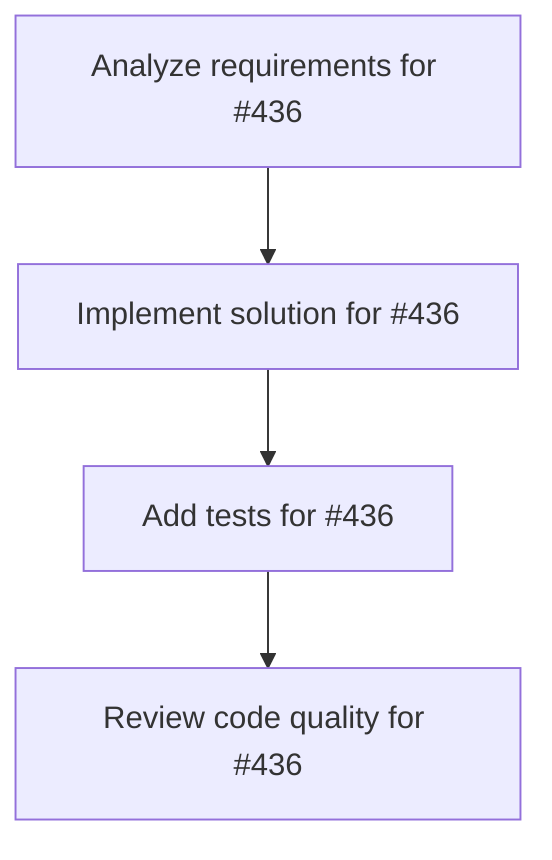

# Plans for Issue #436

**Title**: bug(dashboard): Fix React Three Fiber 'locator' errors with drei components (Line, Text, torusGeometry)

**URL**: https://github.com/customer-cloud/miyabi-private/issues/436

---

## 📋 Summary

- **Total Tasks**: 4
- **Estimated Duration**: 60 minutes
- **Execution Levels**: 4
- **Has Cycles**: ✅ No

## 📝 Task Breakdown

### 1. Analyze requirements for #436

- **ID**: `task-436-analysis`
- **Type**: Docs
- **Assigned Agent**: IssueAgent
- **Priority**: 0
- **Estimated Duration**: 5 min

**Description**: Analyze issue requirements and create detailed specification

### 2. Implement solution for #436

- **ID**: `task-436-impl`
- **Type**: Bug
- **Assigned Agent**: CodeGenAgent
- **Priority**: 1
- **Estimated Duration**: 30 min
- **Dependencies**: task-436-analysis

**Description**: ## 🐛 Problem
React Three Fiber throws `TypeError: Cannot read properties of undefined (reading 'locator')` when using certain `@react-three/drei` components in Vector Space Universe:

- `Line` component (semantic links between tasks)
- `Text` component (cluster labels)
- `torusGeometry` (black hole accretion disk)

## 🔍 Error Details
```
TypeError: Cannot read properties of undefined (reading 'locator')
    at applyProps$1 (chunk-AZV5OK25.js:16716:50)
    at createInstance (chunk-AZV5OK25.js:16238:28)
```

## 🎯 Objective
Resolve the `locator` error and re-enable all drei components for full Vector Space Universe functionality.

## 📋 Investigation Steps
- [ ] Check `@react-three/drei` version compatibility with `@react-three/fiber`
- [ ] Test downgrading drei to stable version
- [ ] Investigate if `locator` is a prop serialization issue
- [ ] Try alternative implementations:
  - `Line2` from `three/examples/jsm/lines/Line2`
  - `troika-three-text` for Text
  - Manual `torusGeometry` construction

## 🔧 Workaround (Current)
Components are disabled:
```tsx
{/* <SemanticLinks taskVectors={taskVectors} /> */}
{/* <ClusterLabels taskVectors={taskVectors} /> */}
{/* <HayashiBlackHole position={hayashiBlackHolePosition} /> */}
```

## ✅ Success Criteria
- No `locator` errors in console
- Semantic links visible between related tasks
- Cluster labels visible above task groups
- Black hole visualization with accretion disk

## 📁 Files
- `crates/miyabi-a2a/dashboard/src/components/vector-space-universe.tsx`
- `crates/miyabi-a2a/dashboard/package.json` (dependency versions)

## 🔗 Related
- Blocking #433, #434, #435 (full interactivity)
- drei version: 9.93.0
- fiber version: 8.15.0
- three version: 0.160.0

### 3. Add tests for #436

- **ID**: `task-436-test`
- **Type**: Test
- **Assigned Agent**: CodeGenAgent
- **Priority**: 2
- **Estimated Duration**: 15 min
- **Dependencies**: task-436-impl

**Description**: Create comprehensive test coverage

### 4. Review code quality for #436

- **ID**: `task-436-review`
- **Type**: Refactor
- **Assigned Agent**: ReviewAgent
- **Priority**: 3
- **Estimated Duration**: 10 min
- **Dependencies**: task-436-test

**Description**: Run quality checks and code review

## 🔄 Execution Plan (DAG Levels)

Tasks can be executed in parallel within each level:

### Level 0 (Parallel Execution)

- `task-436-analysis` - Analyze requirements for #436

### Level 1 (Parallel Execution)

- `task-436-impl` - Implement solution for #436

### Level 2 (Parallel Execution)

- `task-436-test` - Add tests for #436

### Level 3 (Parallel Execution)

- `task-436-review` - Review code quality for #436

## 📊 Dependency Graph



## ⏱️ Timeline Estimation

- **Sequential Execution**: 60 minutes (1.0 hours)
- **Parallel Execution (Critical Path)**: 10 minutes (0.2 hours)
- **Estimated Speedup**: 6.0x

---

*Generated by CoordinatorAgent on 2025-11-01 11:25:14 UTC*
