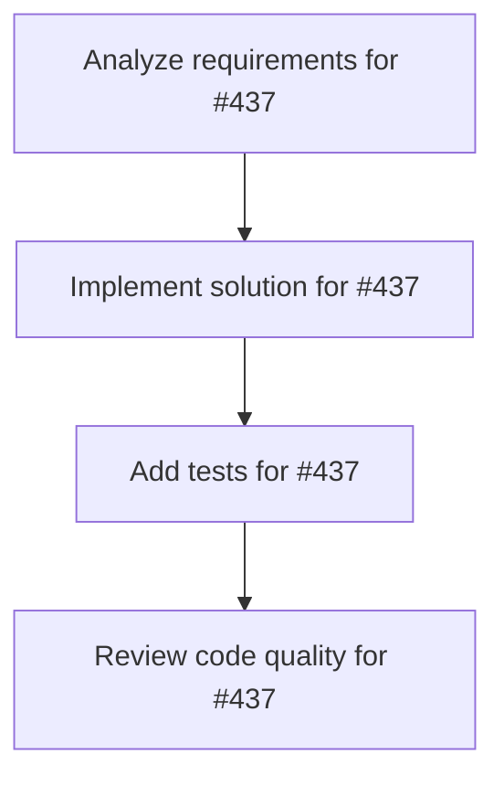

# Plans for Issue #437

**Title**: chore(deps): Bump tokio-tungstenite from 0.21.0 to 0.24.0 in the tokio-ecosystem group

**URL**: https://github.com/customer-cloud/miyabi-private/pull/437

---

## 📋 Summary

- **Total Tasks**: 4
- **Estimated Duration**: 60 minutes
- **Execution Levels**: 4
- **Has Cycles**: ✅ No

## 📝 Task Breakdown

### 1. Analyze requirements for #437

- **ID**: `task-437-analysis`
- **Type**: Docs
- **Assigned Agent**: IssueAgent
- **Priority**: 0
- **Estimated Duration**: 5 min

**Description**: Analyze issue requirements and create detailed specification

### 2. Implement solution for #437

- **ID**: `task-437-impl`
- **Type**: Feature
- **Assigned Agent**: CodeGenAgent
- **Priority**: 1
- **Estimated Duration**: 30 min
- **Dependencies**: task-437-analysis

**Description**: Bumps the tokio-ecosystem group with 1 update: [tokio-tungstenite](https://github.com/snapview/tokio-tungstenite).

Updates `tokio-tungstenite` from 0.21.0 to 0.24.0

Changelog

<em>Sourced from <a href="https://github.com/snapview/tokio-tungstenite/blob/master/CHANGELOG.md">tokio-tungstenite's changelog</a>.</em>

<blockquote>
<h1>0.24.0</h1>
<ul>
<li>Update dependencies (TLS, tungstenite).</li>
<li>Return a runtime error when WSS URLs are used without a proper TLS feature enabled.</li>
</ul>
<h1>0.23.1</h1>
<ul>
<li>Introduce a <code>url</code> feature (proxies to <code>tungstenite/url</code>).</li>
</ul>
<h1>0.23.0</h1>
<ul>
<li>Update <code>tungstenite</code> to <code>0.23.0</code>.</li>
<li>Disable default features on TLS crates.</li>
</ul>
<h1>0.22.0</h1>
<ul>
<li>Update TLS dependencies.</li>
<li><del>Update <code>tungstenite</code> to match <code>0.22.0</code>.</del></li>
</ul>
</blockquote>

Commits

<ul>
<li><a href="https://github.com/snapview/tokio-tungstenite/commit/cae2e89102dbb212ee723b912f7dc540398be28e"><code>cae2e89</code></a> Bump version -&gt; 0.24.0</li>
<li><a href="https://github.com/snapview/tokio-tungstenite/commit/0b9d97bc148daabc51a36a38a10d0b1b2b13c55e"><code>0b9d97b</code></a> deps: update <code>rustls-native-certs</code> to 0.8 (<a href="https://redirect.github.com/snapview/tokio-tungstenite/issues/348">#348</a>)</li>
<li><a href="https://github.com/snapview/tokio-tungstenite/commit/94a35a0d6bcdc2f07d05f9e3edcbc7fcb1d5b020"><code>94a35a0</code></a> Additional Documentation of <code>IntoClientRequest</code> on <code>connect_async</code> (<a href="https://redirect.github.com/snapview/tokio-tungstenite/issues/342">#342</a>)</li>
<li><a href="https://github.com/snapview/tokio-tungstenite/commit/83258250c25d505f6e7c6ff29fed3f08433b49fe"><code>8325825</code></a> Prepare 0.23.1 release</li>
<li><a href="https://github.com/snapview/tokio-tungstenite/commit/db9ae7eb715e2b4a89deed4bc25d83e1d513d01f"><code>db9ae7e</code></a> Re-introduce the <code>url</code> feature</li>
<li><a href="https://github.com/snapview/tokio-tungstenite/commit/a53454b16d9eff3fbaa7445541c7fe1c6ccad4d7"><code>a53454b</code></a> Prepare 0.23.0 release</li>
<li><a href="https://github.com/snapview/tokio-tungstenite/commit/c1025d59ff15eeefc2dc07495fd6a8365cc6e0af"><code>c1025d5</code></a> Disable rustls default features</li>
<li><a href="https://github.com/snapview/tokio-tungstenite/commit/ff311384b6816aa8df20b3f2be828abbe5f2abca"><code>ff31138</code></a> Prepare 0.22.0 release</li>
<li><a href="https://github.com/snapview/tokio-tungstenite/commit/ad1d511a30878590c7a41e9cd50b668e8b19cd37"><code>ad1d511</code></a> Update <code>rustls</code> to 0.23 and <code>tokio-rustls</code> to 0.26</li>
<li><a href="https://github.com/snapview/tokio-tungstenite/commit/052d085aff4708b924b92becaa83923b15045841"><code>052d085</code></a> Simplify response body type in <code>server-custom-accept</code> example</li>
<li>Additional commits viewable in <a href="https://github.com/snapview/tokio-tungstenite/compare/v0.21.0...v0.24.0">compare view</a></li>
</ul>

 

Dependabot will resolve any conflicts with this PR as long as you don't alter it yourself. You can also trigger a rebase manually by commenting `@dependabot rebase`.

[//]: # (dependabot-automerge-start)
[//]: # (dependabot-automerge-end)

---

Dependabot commands and options

 

You can trigger Dependabot actions by commenting on this PR:
- `@dependabot rebase` will rebase this PR
- `@dependabot recreate` will recreate this PR, overwriting any edits that have been made to it
- `@dependabot merge` will merge this PR after your CI passes on it
- `@dependabot squash and merge` will squash and merge this PR after your CI passes on it
- `@dependabot cancel merge` will cancel a previously requested merge and block automerging
- `@dependabot reopen` will reopen this PR if it is closed
- `@dependabot close` will close this PR and stop Dependabot recreating it. You can achieve the same result by closing it manually
- `@dependabot show <dependency name> ignore conditions` will show all of the ignore conditions of the specified dependency
- `@dependabot ignore <dependency name> major version` will close this group update PR and stop Dependabot creating any more for the specific dependency's major version (unless you unignore this specific dependency's major version or upgrade to it yourself)
- `@dependabot ignore <dependency name> minor version` will close this group update PR and stop Dependabot creating any more for the specific dependency's minor version (unless you unignore this specific dependency's minor version or upgrade to it yourself)
- `@dependabot ignore <dependency name>` will close this group update PR and stop Dependabot creating any more for the specific dependency (unless you unignore this specific dependency or upgrade to it yourself)
- `@dependabot unignore <dependency name>` will remove all of the ignore conditions of the specified dependency
- `@dependabot unignore <dependency name> <ignore condition>` will remove the ignore condition of the specified dependency and ignore conditions

### 3. Add tests for #437

- **ID**: `task-437-test`
- **Type**: Test
- **Assigned Agent**: CodeGenAgent
- **Priority**: 2
- **Estimated Duration**: 15 min
- **Dependencies**: task-437-impl

**Description**: Create comprehensive test coverage

### 4. Review code quality for #437

- **ID**: `task-437-review`
- **Type**: Refactor
- **Assigned Agent**: ReviewAgent
- **Priority**: 3
- **Estimated Duration**: 10 min
- **Dependencies**: task-437-test

**Description**: Run quality checks and code review

## 🔄 Execution Plan (DAG Levels)

Tasks can be executed in parallel within each level:

### Level 0 (Parallel Execution)

- `task-437-analysis` - Analyze requirements for #437

### Level 1 (Parallel Execution)

- `task-437-impl` - Implement solution for #437

### Level 2 (Parallel Execution)

- `task-437-test` - Add tests for #437

### Level 3 (Parallel Execution)

- `task-437-review` - Review code quality for #437

## 📊 Dependency Graph

## ⏱️ Timeline Estimation

- **Sequential Execution**: 60 minutes (1.0 hours)
- **Parallel Execution (Critical Path)**: 10 minutes (0.2 hours)
- **Estimated Speedup**: 6.0x

---

*Generated by CoordinatorAgent on 2025-11-01 11:25:15 UTC*
