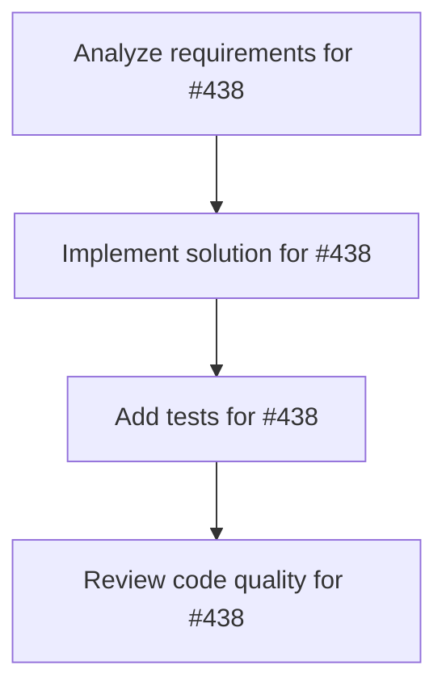

# Plans for Issue #438

**Title**: chore(deps): Bump pulldown-cmark from 0.9.6 to 0.13.0

**URL**: https://github.com/customer-cloud/miyabi-private/pull/438

---

## 📋 Summary

- **Total Tasks**: 4
- **Estimated Duration**: 60 minutes
- **Execution Levels**: 4
- **Has Cycles**: ✅ No

## 📝 Task Breakdown

### 1. Analyze requirements for #438

- **ID**: `task-438-analysis`
- **Type**: Docs
- **Assigned Agent**: IssueAgent
- **Priority**: 0
- **Estimated Duration**: 5 min

**Description**: Analyze issue requirements and create detailed specification

### 2. Implement solution for #438

- **ID**: `task-438-impl`
- **Type**: Feature
- **Assigned Agent**: CodeGenAgent
- **Priority**: 1
- **Estimated Duration**: 30 min
- **Dependencies**: task-438-analysis

**Description**: Bumps [pulldown-cmark](https://github.com/raphlinus/pulldown-cmark) from 0.9.6 to 0.13.0.

Release notes

<em>Sourced from <a href="https://github.com/raphlinus/pulldown-cmark/releases">pulldown-cmark's releases</a>.</em>

<blockquote>
<h2>v0.13.0</h2>
<h2>Breaking Changes</h2>
<ul>
<li>super and sub script support by <a href="https://github.com/jim-taylor-business"><code>@​jim-taylor-business</code></a> in <a href="https://redirect.github.com/pulldown-cmark/pulldown-cmark/pull/966">pulldown-cmark/pulldown-cmark#966</a></li>
<li>Implement extension WikiLinks; <code>Options::ENABLE_WIKILINKS</code> by <a href="https://github.com/frostu8"><code>@​frostu8</code></a> in <a href="https://redirect.github.com/pulldown-cmark/pulldown-cmark/pull/991">pulldown-cmark/pulldown-cmark#991</a></li>
</ul>
<h2>New Features</h2>
<ul>
<li>feat: add <code>-D</code> CLI option to enable definition lists by <a href="https://github.com/ytmimi"><code>@​ytmimi</code></a> in <a href="https://redirect.github.com/pulldown-cmark/pulldown-cmark/pull/972">pulldown-cmark/pulldown-cmark#972</a></li>
</ul>
<h2>Bug Fixes and Code Enhancements</h2>
<ul>
<li>Safer definition lists implementation by <a href="https://github.com/mondeja"><code>@​mondeja</code></a> in <a href="https://redirect.github.com/pulldown-cmark/pulldown-cmark/pull/974">pulldown-cmark/pulldown-cmark#974</a></li>
<li>Factor duplicate code out of parsers by <a href="https://github.com/notriddle"><code>@​notriddle</code></a> in <a href="https://redirect.github.com/pulldown-cmark/pulldown-cmark/pull/976">pulldown-cmark/pulldown-cmark#976</a></li>
<li>Stop using string slicing for math where bytes will do by <a href="https://github.com/notriddle"><code>@​notriddle</code></a> in <a href="https://redirect.github.com/pulldown-cmark/pulldown-cmark/pull/977">pulldown-cmark/pulldown-cmark#977</a></li>
<li>Make indent calc for definition lists match commonmark-hs closer by <a href="https://github.com/notriddle"><code>@​notriddle</code></a> in <a href="https://redirect.github.com/pulldown-cmark/pulldown-cmark/pull/978">pulldown-cmark/pulldown-cmark#978</a></li>
<li>Ensure &quot;parse&quot; fuzz target covers all options by <a href="https://github.com/ollpu"><code>@​ollpu</code></a> in <a href="https://redirect.github.com/pulldown-cmark/pulldown-cmark/pull/980">pulldown-cmark/pulldown-cmark#980</a></li>
<li>Change subscript CLI flag to -B by <a href="https://github.com/ollpu"><code>@​ollpu</code></a> in <a href="https://redirect.github.com/pulldown-cmark/pulldown-cmark/pull/993">pulldown-cmark/pulldown-cmark#993</a></li>
<li>Fix OOB access due to erroneous shift in process_mask by <a href="https://github.com/ollpu"><code>@​ollpu</code></a> in <a href="https://redirect.github.com/pulldown-cmark/pulldown-cmark/pull/990">pulldown-cmark/pulldown-cmark#990</a></li>
<li>Use slice patterns for <code>unescape</code> by <a href="https://github.com/notriddle"><code>@​notriddle</code></a> in <a href="https://redirect.github.com/pulldown-cmark/pulldown-cmark/pull/996">pulldown-cmark/pulldown-cmark#996</a></li>
<li>Use slice patterns for <code>scan_eol</code> by <a href="https://github.com/notriddle"><code>@​notriddle</code></a> in <a href="https://redirect.github.com/pulldown-cmark/pulldown-cmark/pull/998">pulldown-cmark/pulldown-cmark#998</a></li>
<li>Stop using scan_ch when get will do by <a href="https://github.com/notriddle"><code>@​notriddle</code></a> in <a href="https://redirect.github.com/pulldown-cmark/pulldown-cmark/pull/1003">pulldown-cmark/pulldown-cmark#1003</a></li>
<li>Fix panic when symbols are present in wikilink before pipe by <a href="https://github.com/frostu8"><code>@​frostu8</code></a> in <a href="https://redirect.github.com/pulldown-cmark/pulldown-cmark/pull/1004">pulldown-cmark/pulldown-cmark#1004</a></li>
<li>Added a WASM build step to github actions <a href="https://redirect.github.com/raphlinus/pulldown-cmark/issues/1005">#1005</a> by <a href="https://github.com/rimutaka"><code>@​rimutaka</code></a> in <a href="https://redirect.github.com/pulldown-cmark/pulldown-cmark/pull/1006">pulldown-cmark/pulldown-cmark#1006</a></li>
<li>Use an explicit node for tight paragraphs by <a href="https://github.com/notriddle"><code>@​notriddle</code></a> in <a href="https://redirect.github.com/pulldown-cmark/pulldown-cmark/pull/1015">pulldown-cmark/pulldown-cmark#1015</a></li>
<li>Fix tasklist parsing bugs by <a href="https://github.com/notriddle"><code>@​notriddle</code></a> in <a href="https://redirect.github.com/pulldown-cmark/pulldown-cmark/pull/1017">pulldown-cmark/pulldown-cmark#1017</a></li>
<li>Prevent definition list defs from interrupting non-paragraphs by <a href="https://github.com/notriddle"><code>@​notriddle</code></a> in <a href="https://redirect.github.com/pulldown-cmark/pulldown-cmark/pull/1018">pulldown-cmark/pulldown-cmark#1018</a></li>
</ul>
<h2>Docs</h2>
<ul>
<li>Add basic skeleton for developer docs by <a href="https://github.com/systemsoverload"><code>@​systemsoverload</code></a> in <a href="https://redirect.github.com/pulldown-cmark/pulldown-cmark/pull/988">pulldown-cmark/pulldown-cmark#988</a></li>
<li>docs: Added a doc-comment for ENABLE_SMART_PUNCTUATION option. by <a href="https://github.com/rimutaka"><code>@​rimutaka</code></a> in <a href="https://redirect.github.com/pulldown-cmark/pulldown-cmark/pull/1007">pulldown-cmark/pulldown-cmark#1007</a></li>
<li>Document more Events and Tags by <a href="https://github.com/ModProg"><code>@​ModProg</code></a> in <a href="https://redirect.github.com/pulldown-cmark/pulldown-cmark/pull/1010">pulldown-cmark/pulldown-cmark#1010</a></li>
</ul>
<h2>New Contributors</h2>
<ul>
<li><a href="https://github.com/ytmimi"><code>@​ytmimi</code></a> made their first contribution in <a href="https://redirect.github.com/pulldown-cmark/pulldown-cmark/pull/972">pulldown-cmark/pulldown-cmark#972</a></li>
<li><a href="https://github.com/mondeja"><code>@​mondeja</code></a> made their first contribution in <a href="https://redirect.github.com/pulldown-cmark/pulldown-cmark/pull/974">pulldown-cmark/pulldown-cmark#974</a></li>
<li><a href="https://github.com/jim-taylor-business"><code>@​jim-taylor-business</code></a> made their first contribution in <a href="https://redirect.github.com/pulldown-cmark/pulldown-cmark/pull/966">pulldown-cmark/pulldown-cmark#966</a></li>
<li><a href="https://github.com/systemsoverload"><code>@​systemsoverload</code></a> made their first contribution in <a href="https://redirect.github.com/pulldown-cmark/pulldown-cmark/pull/988">pulldown-cmark/pulldown-cmark#988</a></li>
<li><a href="https://github.com/frostu8"><code>@​frostu8</code></a> made their first contribution in <a href="https://redirect.github.com/pulldown-cmark/pulldown-cmark/pull/991">pulldown-cmark/pulldown-cmark#991</a></li>
<li><a href="https://github.com/rimutaka"><code>@​rimutaka</code></a> made their first contribution in <a href="https://redirect.github.com/pulldown-cmark/pulldown-cmark/pull/1006">pulldown-cmark/pulldown-cmark#1006</a></li>
<li><a href="https://github.com/ModProg"><code>@​ModProg</code></a> made their first contribution in <a href="https://redirect.github.com/pulldown-cmark/pulldown-cmark/pull/1010">pulldown-cmark/pulldown-cmark#1010</a></li>
</ul>

<strong>Full Changelog</strong>: <a href="https://github.com/pulldown-cmark/pulldown-cmark/compare/v0.12.2...v0.13.0">https://github.com/pulldown-cmark/pulldown-cmark/compare/v0.12.2...v0.13.0</a>

<h2>0.12.2</h2>
<h2>What's Changed</h2>
<ul>
<li>Fix compiilation error in fuzzers by <a href="https://github.com/kdarkhan"><code>@​kdarkhan</code></a> in <a href="https://redirect.github.com/pulldown-cmark/pulldown-cmark/pull/947">pulldown-cmark/pulldown-cmark#947</a></li>
<li>Make <code>fuzz</code> dir part of the workspace by <a href="https://github.com/kdarkhan"><code>@​kdarkhan</code></a> in <a href="https://redirect.github.com/pulldown-cmark/pulldown-cmark/pull/948">pulldown-cmark/pulldown-cmark#948</a></li>
<li>Fix and improve <code>bench</code> by <a href="https://github.com/notriddle"><code>@​notriddle</code></a> in <a href="https://redirect.github.com/pulldown-cmark/pulldown-cmark/pull/950">pulldown-cmark/pulldown-cmark#950</a></li>
<li>Reuse a couple hash maps across blocks by <a href="https://github.com/notriddle"><code>@​notriddle</code></a> in <a href="https://redirect.github.com/pulldown-cmark/pulldown-cmark/pull/951">pulldown-cmark/pulldown-cmark#951</a></li>
</ul>
<!-- raw HTML omitted -->
</blockquote>

... (truncated)

Commits

<ul>
<li><a href="https://github.com/pulldown-cmark/pulldown-cmark/commit/f17d98ae9e7ef9c3be601fcb1c9fbd536d3cb873"><code>f17d98a</code></a> chore: bump version to 0.13.0</li>
<li><a href="https://github.com/pulldown-cmark/pulldown-cmark/commit/47f60de8928ac3db4402cdf50e48ea672a7911aa"><code>47f60de</code></a> chore: cargo update and bump version to 0.12.3</li>
<li><a href="https://github.com/pulldown-cmark/pulldown-cmark/commit/e42259fe2d1b30f5881b29d0e9dca4acea8c9568"><code>e42259f</code></a> Merge pull request <a href="https://redirect.github.com/raphlinus/pulldown-cmark/issues/1018">#1018</a> from notriddle/deflist-lazy</li>
<li><a href="https://github.com/pulldown-cmark/pulldown-cmark/commit/052c635acb156081d2168ddf85457911232d087e"><code>052c635</code></a> Merge pull request <a href="https://redirect.github.com/raphlinus/pulldown-cmark/issues/1017">#1017</a> from notriddle/master</li>
<li><a href="https://github.com/pulldown-cmark/pulldown-cmark/commit/0ede612b0ef67dcc544ef2490764bb8b5fb78f7c"><code>0ede612</code></a> Prevent definition list defs from interrupting non-paragraphs</li>
<li><a href="https://github.com/pulldown-cmark/pulldown-cmark/commit/2c16b4edf274778086ff9c5228577a972af76d35"><code>2c16b4e</code></a> Fix tasklist parsing bugs</li>
<li><a href="https://github.com/pulldown-cmark/pulldown-cmark/commit/c59ff5484a5d79ce2117a471e34b4437314f0987"><code>c59ff54</code></a> Merge pull request <a href="https://redirect.github.com/raphlinus/pulldown-cmark/issues/1015">#1015</a> from notriddle/tight-paragraph</li>
<li><a href="https://github.com/pulldown-cmark/pulldown-cmark/commit/4409722ad9e1451ee4c341a7a242e2efde05e805"><code>4409722</code></a> Use an explicit node for tight paragraphs</li>
<li><a href="https://github.com/pulldown-cmark/pulldown-cmark/commit/4564d43c5d0785a7890164d5505f32502cf47e94"><code>4564d43</code></a> Merge pull request <a href="https://redirect.github.com/raphlinus/pulldown-cmark/issues/1010">#1010</a> from ModProg/document-events</li>
<li><a href="https://github.com/pulldown-cmark/pulldown-cmark/commit/62cae02c7a2e3a127d1c1e584b031fef429bdf2d"><code>62cae02</code></a> fix metadatablock doc comment</li>
<li>Additional commits viewable in <a href="https://github.com/raphlinus/pulldown-cmark/compare/v0.9.6...v0.13.0">compare view</a></li>
</ul>

 

Dependabot will resolve any conflicts with this PR as long as you don't alter it yourself. You can also trigger a rebase manually by commenting `@dependabot rebase`.

[//]: # (dependabot-automerge-start)
[//]: # (dependabot-automerge-end)

---

Dependabot commands and options

 

You can trigger Dependabot actions by commenting on this PR:
- `@dependabot rebase` will rebase this PR
- `@dependabot recreate` will recreate this PR, overwriting any edits that have been made to it
- `@dependabot merge` will merge this PR after your CI passes on it
- `@dependabot squash and merge` will squash and merge this PR after your CI passes on it
- `@dependabot cancel merge` will cancel a previously requested merge and block automerging
- `@dependabot reopen` will reopen this PR if it is closed
- `@dependabot close` will close this PR and stop Dependabot recreating it. You can achieve the same result by closing it manually
- `@dependabot show <dependency name> ignore conditions` will show all of the ignore conditions of the specified dependency
- `@dependabot ignore this major version` will close this PR and stop Dependabot creating any more for this major version (unless you reopen the PR or upgrade to it yourself)
- `@dependabot ignore this minor version` will close this PR and stop Dependabot creating any more for this minor version (unless you reopen the PR or upgrade to it yourself)
- `@dependabot ignore this dependency` will close this PR and stop Dependabot creating any more for this dependency (unless you reopen the PR or upgrade to it yourself)

### 3. Add tests for #438

- **ID**: `task-438-test`
- **Type**: Test
- **Assigned Agent**: CodeGenAgent
- **Priority**: 2
- **Estimated Duration**: 15 min
- **Dependencies**: task-438-impl

**Description**: Create comprehensive test coverage

### 4. Review code quality for #438

- **ID**: `task-438-review`
- **Type**: Refactor
- **Assigned Agent**: ReviewAgent
- **Priority**: 3
- **Estimated Duration**: 10 min
- **Dependencies**: task-438-test

**Description**: Run quality checks and code review

## 🔄 Execution Plan (DAG Levels)

Tasks can be executed in parallel within each level:

### Level 0 (Parallel Execution)

- `task-438-analysis` - Analyze requirements for #438

### Level 1 (Parallel Execution)

- `task-438-impl` - Implement solution for #438

### Level 2 (Parallel Execution)

- `task-438-test` - Add tests for #438

### Level 3 (Parallel Execution)

- `task-438-review` - Review code quality for #438

## 📊 Dependency Graph

## ⏱️ Timeline Estimation

- **Sequential Execution**: 60 minutes (1.0 hours)
- **Parallel Execution (Critical Path)**: 10 minutes (0.2 hours)
- **Estimated Speedup**: 6.0x

---

*Generated by CoordinatorAgent on 2025-11-01 11:25:15 UTC*
