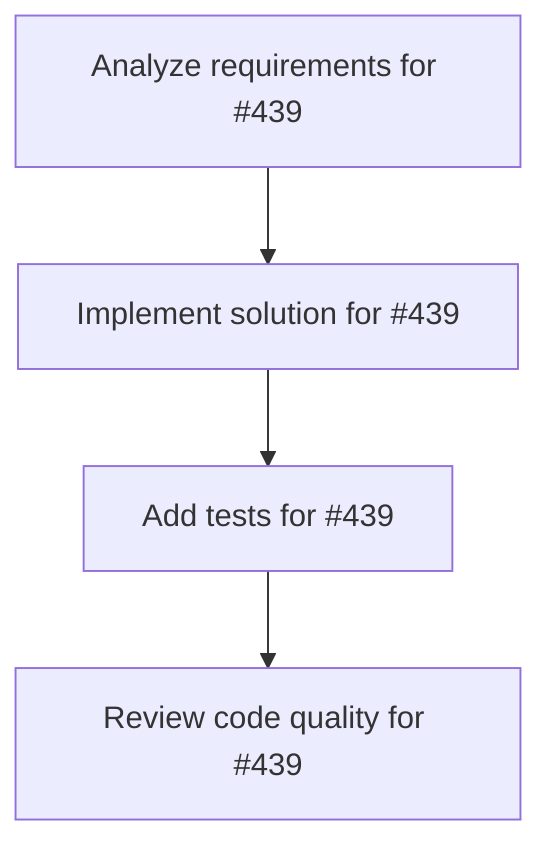

# Plans for Issue #439

**Title**: chore(deps): Bump utoipa from 4.2.3 to 5.4.0

**URL**: https://github.com/customer-cloud/miyabi-private/pull/439

---

## 📋 Summary

- **Total Tasks**: 4
- **Estimated Duration**: 60 minutes
- **Execution Levels**: 4
- **Has Cycles**: ✅ No

## 📝 Task Breakdown

### 1. Analyze requirements for #439

- **ID**: `task-439-analysis`
- **Type**: Docs
- **Assigned Agent**: IssueAgent
- **Priority**: 0
- **Estimated Duration**: 5 min

**Description**: Analyze issue requirements and create detailed specification

### 2. Implement solution for #439

- **ID**: `task-439-impl`
- **Type**: Feature
- **Assigned Agent**: CodeGenAgent
- **Priority**: 1
- **Estimated Duration**: 30 min
- **Dependencies**: task-439-analysis

**Description**: Bumps [utoipa](https://github.com/juhaku/utoipa) from 4.2.3 to 5.4.0.

Release notes

<em>Sourced from <a href="https://github.com/juhaku/utoipa/releases">utoipa's releases</a>.</em>

<blockquote>
<h2>utoipa-5.4.0</h2>
<h2>What's New :gem: :new: :tada:</h2>
<ul>
<li>(a024aca) Chore update utoipa and utoipa-gen versions (<a href="https://redirect.github.com/juhaku/utoipa/issues/1415">#1415</a>) <a href="https://github.com/juhaku"><code>@​juhaku</code></a></li>
<li>(7bde710) Update utoipa CHANGELOG.md <a href="https://github.com/juhaku"><code>@​juhaku</code></a></li>
<li>(9b17a2e) Enhance ToSchema and ComposeSchema implementations for HashMap and HashSet to support custom hashers (<a href="https://redirect.github.com/juhaku/utoipa/issues/1319">#1319</a>) <a href="https://github.com/alwayys-afk"><code>@​alwayys-afk</code></a></li>
<li>(ac71b23) Add support for jiff v0.2 (<a href="https://redirect.github.com/juhaku/utoipa/issues/1332">#1332</a>) <a href="https://github.com/Turbo87"><code>@​Turbo87</code></a></li>
<li>(9c51272) replaced <code>serde_yml</code> with <code>serde_norway</code> (<a href="https://redirect.github.com/juhaku/utoipa/issues/1311">#1311</a>) <a href="https://github.com/DenuxPlays"><code>@​DenuxPlays</code></a></li>
<li>(993f7d4) Exclude snapshots from published packages (<a href="https://redirect.github.com/juhaku/utoipa/issues/1283">#1283</a>) <a href="https://github.com/weiznich"><code>@​weiznich</code></a></li>
<li>(16892bb) replaced <code>serde_yaml</code> with <code>serde_yml</code> (<a href="https://redirect.github.com/juhaku/utoipa/issues/1280">#1280</a>) <a href="https://github.com/DenuxPlays"><code>@​DenuxPlays</code></a></li>
</ul>
<h4>Full <a href="https://github.com/juhaku/utoipa/compare/utoipa-5.3.1...utoipa-5.4.0">change log</a></h4>
<h2>utoipa-gen-5.4.0</h2>
<h2>What's New :gem: :new: :tada:</h2>
<ul>
<li>(a024aca) Chore update utoipa and utoipa-gen versions (<a href="https://redirect.github.com/juhaku/utoipa/issues/1415">#1415</a>) <a href="https://github.com/juhaku"><code>@​juhaku</code></a></li>
<li>(d267907) Add feature support extensions in <code>utoipa::path</code> macro (<a href="https://redirect.github.com/juhaku/utoipa/issues/1292">#1292</a>) <a href="https://github.com/juliendecharentenay"><code>@​juliendecharentenay</code></a></li>
<li>(ac71b23) Add support for jiff v0.2 (<a href="https://redirect.github.com/juhaku/utoipa/issues/1332">#1332</a>) <a href="https://github.com/Turbo87"><code>@​Turbo87</code></a></li>
<li>(0c76056) Fix typo in schema_derive_test <a href="https://github.com/juhaku"><code>@​juhaku</code></a></li>
<li>(feeb97e) Fix build <a href="https://github.com/juhaku"><code>@​juhaku</code></a></li>
<li>(993f7d4) Exclude snapshots from published packages (<a href="https://redirect.github.com/juhaku/utoipa/issues/1283">#1283</a>) <a href="https://github.com/weiznich"><code>@​weiznich</code></a></li>
</ul>
<h4>Full <a href="https://github.com/juhaku/utoipa/compare/utoipa-gen-5.3.1...utoipa-gen-5.4.0">change log</a></h4>
<h2>utoipa-5.3.1</h2>
<h2>What's New :gem: :new: :tada:</h2>
<ul>
<li>(e5bb59f) Update next release versions (<a href="https://redirect.github.com/juhaku/utoipa/issues/1278">#1278</a>) <a href="https://github.com/juhaku"><code>@​juhaku</code></a></li>
<li>(d522f74) Update axum to v0.8.0 (<a href="https://redirect.github.com/juhaku/utoipa/issues/1269">#1269</a>) <a href="https://github.com/Turbo87"><code>@​Turbo87</code></a></li>
<li>(d1f706e) utoipa: Replace <code>assert-json-diff</code> with snapshot testing via <code>insta</code> (<a href="https://redirect.github.com/juhaku/utoipa/issues/1254">#1254</a>) <a href="https://github.com/Turbo87"><code>@​Turbo87</code></a></li>
</ul>
<h4>Full <a href="https://github.com/juhaku/utoipa/compare/utoipa-5.3.0...utoipa-5.3.1">change log</a></h4>
<h2>utoipa-gen-5.3.1</h2>
<h2>What's New :gem: :new: :tada:</h2>
<ul>
<li>(e5bb59f) Update next release versions (<a href="https://redirect.github.com/juhaku/utoipa/issues/1278">#1278</a>) <a href="https://github.com/juhaku"><code>@​juhaku</code></a></li>
<li>(ee1067e) Fix bug in generic schemas on OpenApi derive macro (<a href="https://redirect.github.com/juhaku/utoipa/issues/1277">#1277</a>) <a href="https://github.com/juhaku"><code>@​juhaku</code></a></li>
<li>(59098c7) Fix format <a href="https://github.com/juhaku"><code>@​juhaku</code></a></li>
<li>(a914253) Add summary and description missing documentation <a href="https://github.com/juhaku"><code>@​juhaku</code></a></li>
<li>(d522f74) Update axum to v0.8.0 (<a href="https://redirect.github.com/juhaku/utoipa/issues/1269">#1269</a>) <a href="https://github.com/Turbo87"><code>@​Turbo87</code></a></li>
<li>(2782358) utoipa-gen: Replace <code>assert-json-diff</code> with snapshot testing via <code>insta</code> (<a href="https://redirect.github.com/juhaku/utoipa/issues/1253">#1253</a>) <a href="https://github.com/Turbo87"><code>@​Turbo87</code></a></li>
<li>(6d8d2ac) scripts/test.sh: Fix <code>auto_into_responses</code> feature declaration (<a href="https://redirect.github.com/juhaku/utoipa/issues/1252">#1252</a>) <a href="https://github.com/Turbo87"><code>@​Turbo87</code></a></li>
</ul>
<h4>Full <a href="https://github.com/juhaku/utoipa/compare/utoipa-gen-5.3.0...utoipa-gen-5.3.1">change log</a></h4>
<h2>utoipa-5.3.0</h2>
<h2>What's New :gem: :new: :tada:</h2>

Thanks to the remarkable community members of their hard work and hours spend on changes to the utoipa. This release would not have been possible without you :tada:

<ul>
<li>(aa0d27f) Update next release versions (<a href="https://redirect.github.com/juhaku/utoipa/issues/1250">#1250</a>) <a href="https://github.com/juhaku"><code>@​juhaku</code></a></li>
<li>(a0bfe11) Use a re-exported serde_json dependency in macros (<a href="https://redirect.github.com/juhaku/utoipa/issues/1243">#1243</a>) <a href="https://github.com/Sufflope"><code>@​Sufflope</code></a></li>
<li>(2671aec) Add default to Example string fields (<a href="https://redirect.github.com/juhaku/utoipa/issues/1218">#1218</a>) <a href="https://github.com/Feiryn"><code>@​Feiryn</code></a></li>
<li>(7cf06e6) Fix diverging axum route and openapi spec (<a href="https://redirect.github.com/juhaku/utoipa/issues/1199">#1199</a>) <a href="https://github.com/boemjay"><code>@​boemjay</code></a></li>
</ul>
<!-- raw HTML omitted -->
</blockquote>

... (truncated)

Changelog

<em>Sourced from <a href="https://github.com/juhaku/utoipa/blob/master/utoipa-rapidoc/CHANGELOG.md">utoipa's changelog</a>.</em>

<blockquote>
<h1>Changelog - utoipa-rapidoc</h1>
<h2>6.0.0 - Thu 16 2025</h2>
<h3>Changed</h3>
<ul>
<li>Re-release 5.0.1 since axum upgrade is a breaking change (<a href="https://redirect.github.com/juhaku/utoipa/pull/1295">juhaku/utoipa#1295</a>)</li>
</ul>
<h2>5.0.1 - Jan 6 2025</h2>
<h3>Changed</h3>
<ul>
<li>Update axum to v0.8 (<a href="https://redirect.github.com/juhaku/utoipa/pull/1269">juhaku/utoipa#1269</a>)</li>
</ul>
<h2>5.0.0 - Oct 14 2024</h2>
<h3>Added</h3>
<ul>
<li>Add macros feature flag (<a href="https://redirect.github.com/juhaku/utoipa/pull/1015">juhaku/utoipa#1015</a>)</li>
<li>Add nest <code>OpenApi</code> support (<a href="https://redirect.github.com/juhaku/utoipa/pull/930">juhaku/utoipa#930</a>)</li>
</ul>
<h3>Fixed</h3>
<ul>
<li>Fix testing without explicit features (<a href="https://redirect.github.com/juhaku/utoipa/pull/1041">juhaku/utoipa#1041</a>)</li>
<li>Fix building utoipa-rapidoc &amp; utoipa-scalar (<a href="https://redirect.github.com/juhaku/utoipa/pull/1039">juhaku/utoipa#1039</a>)</li>
<li>Fix RapiDoc with empty URL panic on axum (<a href="https://redirect.github.com/juhaku/utoipa/pull/997">juhaku/utoipa#997</a>)</li>
<li>Fix samples in documentation when with_openapi is used (<a href="https://redirect.github.com/juhaku/utoipa/pull/988">juhaku/utoipa#988</a>)</li>
<li>Fix openapi serialized twice when served with Rocket (<a href="https://redirect.github.com/juhaku/utoipa/pull/987">juhaku/utoipa#987</a>)</li>
</ul>
<h3>Changed</h3>
<ul>
<li>Remove commit commit id from changelogs (<a href="https://redirect.github.com/juhaku/utoipa/pull/1077">juhaku/utoipa#1077</a>)</li>
<li>Update to rc version</li>
<li>Disable unused default features of rust_decimal (<a href="https://redirect.github.com/juhaku/utoipa/pull/1029">juhaku/utoipa#1029</a>)</li>
<li>Update next beta versions</li>
<li>Chore update docs and relax <code>url</code> version (<a href="https://redirect.github.com/juhaku/utoipa/pull/1001">juhaku/utoipa#1001</a>)</li>
<li>Bump up versions (<a href="https://redirect.github.com/juhaku/utoipa/pull/998">juhaku/utoipa#998</a>)</li>
<li>Update versions</li>
<li>Update min Rust version and utoipa-swagger-ui version</li>
</ul>
<h2>4.0.0 - May 5 2024</h2>
<h3>Added</h3>
<ul>
<li>Add <code>default-features = false</code> to the optional axum dependency to avoid pulling in tokio in non-tokio environments (<a href="https://redirect.github.com/juhaku/utoipa/pull/874">juhaku/utoipa#874</a>)</li>
</ul>
<h3>Fixed</h3>
<ul>
<li>Fix spelling (<a href="https://redirect.github.com/juhaku/utoipa/pull/846">juhaku/utoipa#846</a>)</li>
</ul>
<!-- raw HTML omitted -->
</blockquote>

... (truncated)

Commits

<ul>
<li><a href="https://github.com/juhaku/utoipa/commit/a024acaab9645a8e8a6d25aeb151a10eed07729a"><code>a024aca</code></a> Chore update utoipa and utoipa-gen versions (<a href="https://redirect.github.com/juhaku/utoipa/issues/1415">#1415</a>)</li>
<li><a href="https://github.com/juhaku/utoipa/commit/7bde710045c677f4d2b02113cfa6a57bdf392fe0"><code>7bde710</code></a> Update utoipa CHANGELOG.md</li>
<li><a href="https://github.com/juhaku/utoipa/commit/9b17a2e0527b751548c589ffa663cf37556a0d3f"><code>9b17a2e</code></a> Enhance ToSchema and ComposeSchema implementations for HashMap and HashSet to...</li>
<li><a href="https://github.com/juhaku/utoipa/commit/d2679076246e68e81d8bc5b593a311d4e70e5d52"><code>d267907</code></a> Add feature support extensions in <code>utoipa::path</code> macro (<a href="https://redirect.github.com/juhaku/utoipa/issues/1292">#1292</a>)</li>
<li><a href="https://github.com/juhaku/utoipa/commit/85952757ee50632be4b84e6580f16530397808d1"><code>8595275</code></a> Update <code>utoipa-swagger-ui</code> version (<a href="https://redirect.github.com/juhaku/utoipa/issues/1396">#1396</a>)</li>
<li><a href="https://github.com/juhaku/utoipa/commit/c2e9f4573e49b30b6064d5fc55a42688faf02150"><code>c2e9f45</code></a> fix: avoid cloning ApiDoc on every request for axum (<a href="https://redirect.github.com/juhaku/utoipa/issues/1393">#1393</a>)</li>
<li><a href="https://github.com/juhaku/utoipa/commit/cecda0531bf7d90800af66b186055932ee730526"><code>cecda05</code></a> swagger-ui: Use zip 3.0.0 (<a href="https://redirect.github.com/juhaku/utoipa/issues/1391">#1391</a>)</li>
<li><a href="https://github.com/juhaku/utoipa/commit/ac71b2353e144998f50bfe38d37794f39c151027"><code>ac71b23</code></a> Add support for jiff v0.2 (<a href="https://redirect.github.com/juhaku/utoipa/issues/1332">#1332</a>)</li>
<li><a href="https://github.com/juhaku/utoipa/commit/2e19e9a5951a4191b3e607ee42f99bf5618c9a20"><code>2e19e9a</code></a> Update next version (<a href="https://redirect.github.com/juhaku/utoipa/issues/1366">#1366</a>)</li>
<li><a href="https://github.com/juhaku/utoipa/commit/0c76056eb28106eb9654616ee0d8bdeec569ac3a"><code>0c76056</code></a> Fix typo in schema_derive_test</li>
<li>Additional commits viewable in <a href="https://github.com/juhaku/utoipa/compare/utoipa-4.2.3...utoipa-5.4.0">compare view</a></li>
</ul>

 

Dependabot will resolve any conflicts with this PR as long as you don't alter it yourself. You can also trigger a rebase manually by commenting `@dependabot rebase`.

[//]: # (dependabot-automerge-start)
[//]: # (dependabot-automerge-end)

---

Dependabot commands and options

 

You can trigger Dependabot actions by commenting on this PR:
- `@dependabot rebase` will rebase this PR
- `@dependabot recreate` will recreate this PR, overwriting any edits that have been made to it
- `@dependabot merge` will merge this PR after your CI passes on it
- `@dependabot squash and merge` will squash and merge this PR after your CI passes on it
- `@dependabot cancel merge` will cancel a previously requested merge and block automerging
- `@dependabot reopen` will reopen this PR if it is closed
- `@dependabot close` will close this PR and stop Dependabot recreating it. You can achieve the same result by closing it manually
- `@dependabot show <dependency name> ignore conditions` will show all of the ignore conditions of the specified dependency
- `@dependabot ignore this major version` will close this PR and stop Dependabot creating any more for this major version (unless you reopen the PR or upgrade to it yourself)
- `@dependabot ignore this minor version` will close this PR and stop Dependabot creating any more for this minor version (unless you reopen the PR or upgrade to it yourself)
- `@dependabot ignore this dependency` will close this PR and stop Dependabot creating any more for this dependency (unless you reopen the PR or upgrade to it yourself)

### 3. Add tests for #439

- **ID**: `task-439-test`
- **Type**: Test
- **Assigned Agent**: CodeGenAgent
- **Priority**: 2
- **Estimated Duration**: 15 min
- **Dependencies**: task-439-impl

**Description**: Create comprehensive test coverage

### 4. Review code quality for #439

- **ID**: `task-439-review`
- **Type**: Refactor
- **Assigned Agent**: ReviewAgent
- **Priority**: 3
- **Estimated Duration**: 10 min
- **Dependencies**: task-439-test

**Description**: Run quality checks and code review

## 🔄 Execution Plan (DAG Levels)

Tasks can be executed in parallel within each level:

### Level 0 (Parallel Execution)

- `task-439-analysis` - Analyze requirements for #439

### Level 1 (Parallel Execution)

- `task-439-impl` - Implement solution for #439

### Level 2 (Parallel Execution)

- `task-439-test` - Add tests for #439

### Level 3 (Parallel Execution)

- `task-439-review` - Review code quality for #439

## 📊 Dependency Graph

## ⏱️ Timeline Estimation

- **Sequential Execution**: 60 minutes (1.0 hours)
- **Parallel Execution (Critical Path)**: 10 minutes (0.2 hours)
- **Estimated Speedup**: 6.0x

---

*Generated by CoordinatorAgent on 2025-11-01 11:25:15 UTC*
