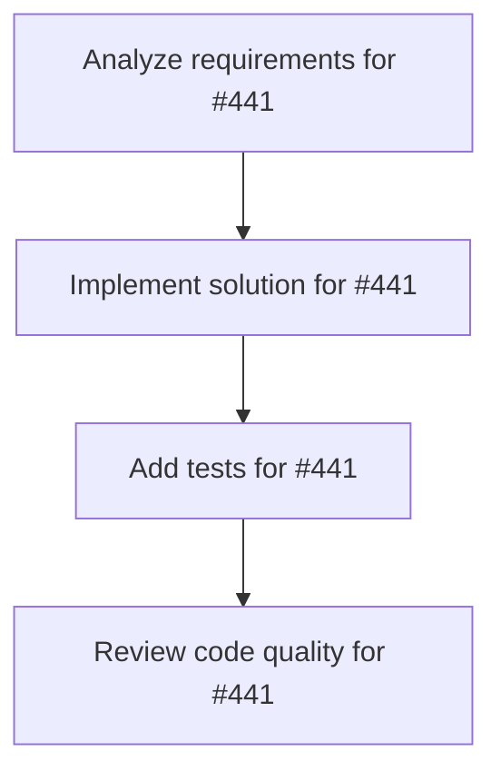

# Plans for Issue #441

**Title**: Claude/check task priority 011 cup bdd fn k cwj tt ejp e6 kv

**URL**: https://github.com/customer-cloud/miyabi-private/pull/441

---

## 📋 Summary

- **Total Tasks**: 4
- **Estimated Duration**: 60 minutes
- **Execution Levels**: 4
- **Has Cycles**: ✅ No

## 📝 Task Breakdown

### 1. Analyze requirements for #441

- **ID**: `task-441-analysis`
- **Type**: Docs
- **Assigned Agent**: IssueAgent
- **Priority**: 0
- **Estimated Duration**: 5 min

**Description**: Analyze issue requirements and create detailed specification

### 2. Implement solution for #441

- **ID**: `task-441-impl`
- **Type**: Feature
- **Assigned Agent**: CodeGenAgent
- **Priority**: 1
- **Estimated Duration**: 30 min
- **Dependencies**: task-441-analysis

### 3. Add tests for #441

- **ID**: `task-441-test`
- **Type**: Test
- **Assigned Agent**: CodeGenAgent
- **Priority**: 2
- **Estimated Duration**: 15 min
- **Dependencies**: task-441-impl

**Description**: Create comprehensive test coverage

### 4. Review code quality for #441

- **ID**: `task-441-review`
- **Type**: Refactor
- **Assigned Agent**: ReviewAgent
- **Priority**: 3
- **Estimated Duration**: 10 min
- **Dependencies**: task-441-test

**Description**: Run quality checks and code review

## 🔄 Execution Plan (DAG Levels)

Tasks can be executed in parallel within each level:

### Level 0 (Parallel Execution)

- `task-441-analysis` - Analyze requirements for #441

### Level 1 (Parallel Execution)

- `task-441-impl` - Implement solution for #441

### Level 2 (Parallel Execution)

- `task-441-test` - Add tests for #441

### Level 3 (Parallel Execution)

- `task-441-review` - Review code quality for #441

## 📊 Dependency Graph

## ⏱️ Timeline Estimation

- **Sequential Execution**: 60 minutes (1.0 hours)
- **Parallel Execution (Critical Path)**: 10 minutes (0.2 hours)
- **Estimated Speedup**: 6.0x

---

*Generated by CoordinatorAgent on 2025-11-01 11:25:16 UTC*
