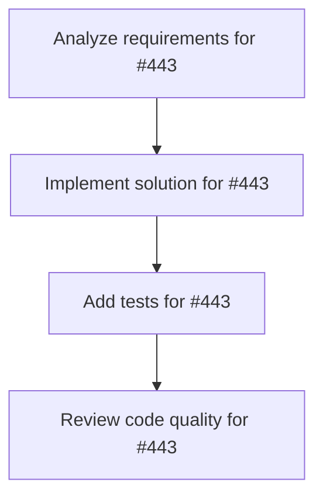

# Plans for Issue #443

**Title**: [P1-001] miyabi-a2a コンパイルエラー修正

**URL**: https://github.com/customer-cloud/miyabi-private/issues/443

---

## 📋 Summary

- **Total Tasks**: 4
- **Estimated Duration**: 60 minutes
- **Execution Levels**: 4
- **Has Cycles**: ✅ No

## 📝 Task Breakdown

### 1. Analyze requirements for #443

- **ID**: `task-443-analysis`
- **Type**: Docs
- **Assigned Agent**: IssueAgent
- **Priority**: 0
- **Estimated Duration**: 5 min

**Description**: Analyze issue requirements and create detailed specification

### 2. Implement solution for #443

- **ID**: `task-443-impl`
- **Type**: Refactor
- **Assigned Agent**: CodeGenAgent
- **Priority**: 1
- **Estimated Duration**: 30 min
- **Dependencies**: task-443-analysis

**Description**: ## 📋 タスク概要

**タスクID**: P1-001
**Phase**: Phase 1 - 緊急対応・基盤安定化
**優先度**: **P0 - Critical**
**推定工数**: 2h
**担当Agent**: @codegen-agent

## 🎯 目的

miyabi-a2aクレートの`grpc_integration`テストがtonic crateの欠落により9箇所でコンパイルエラーを起こしている問題を修正する。

## 🔍 現状分析

**エラー箇所**: 9箇所
**影響範囲**: `tests/grpc_integration.rs`

### 原因

- tonicがdev-dependenciesに未追加
- Cargo.tomlにtonicの依存関係が記載されていない

## 📝 作業内容

### tonic依存関係追加

\`\`\`toml
# crates/miyabi-a2a/Cargo.toml
[dev-dependencies]
tonic = "0.10"
tokio-test = "0.4"
\`\`\`

### コンパイル確認

\`\`\`bash
cd crates/miyabi-a2a
cargo test --no-run
cargo test --all
\`\`\`

## ✅ 完了条件

- [ ] tonic依存関係追加
- [ ] \`cargo test --no-run\` 成功
- [ ] 9箇所のエラー解消
- [ ] \`cargo check --all\` 成功

## 📚 参照

- [リファクタリングマスタープラン](docs/REFACTORING_MASTER_PLAN.md)
- [P1-001詳細](docs/refactoring/phase1/P1-001_miyabi-a2a-compilation-fix.md)

**Phase**: 1/5 | **期限**: 2日以内

### 3. Add tests for #443

- **ID**: `task-443-test`
- **Type**: Test
- **Assigned Agent**: CodeGenAgent
- **Priority**: 2
- **Estimated Duration**: 15 min
- **Dependencies**: task-443-impl

**Description**: Create comprehensive test coverage

### 4. Review code quality for #443

- **ID**: `task-443-review`
- **Type**: Refactor
- **Assigned Agent**: ReviewAgent
- **Priority**: 3
- **Estimated Duration**: 10 min
- **Dependencies**: task-443-test

**Description**: Run quality checks and code review

## 🔄 Execution Plan (DAG Levels)

Tasks can be executed in parallel within each level:

### Level 0 (Parallel Execution)

- `task-443-analysis` - Analyze requirements for #443

### Level 1 (Parallel Execution)

- `task-443-impl` - Implement solution for #443

### Level 2 (Parallel Execution)

- `task-443-test` - Add tests for #443

### Level 3 (Parallel Execution)

- `task-443-review` - Review code quality for #443

## 📊 Dependency Graph

## ⏱️ Timeline Estimation

- **Sequential Execution**: 60 minutes (1.0 hours)
- **Parallel Execution (Critical Path)**: 10 minutes (0.2 hours)
- **Estimated Speedup**: 6.0x

---

*Generated by CoordinatorAgent on 2025-11-01 11:25:16 UTC*
