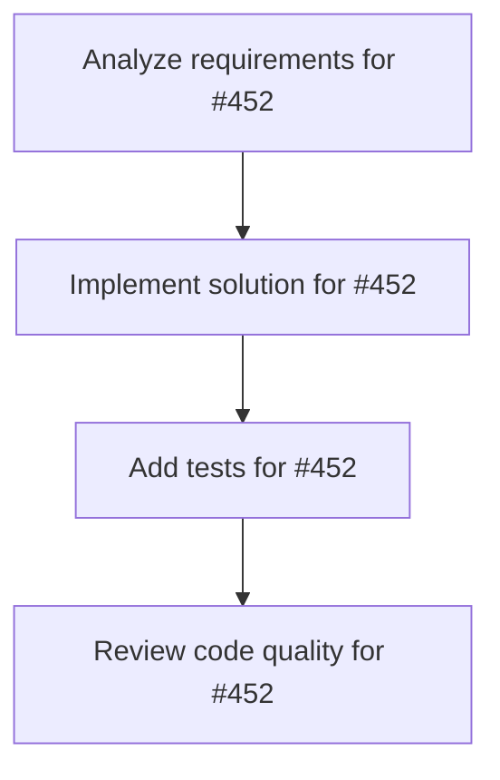

# Plans for Issue #452

**Title**: [P2-002] miyabi-types Unit Tests（目標: 90%）

**URL**: https://github.com/customer-cloud/miyabi-private/issues/452

---

## 📋 Summary

- **Total Tasks**: 4
- **Estimated Duration**: 60 minutes
- **Execution Levels**: 4
- **Has Cycles**: ✅ No

## 📝 Task Breakdown

### 1. Analyze requirements for #452

- **ID**: `task-452-analysis`
- **Type**: Docs
- **Assigned Agent**: IssueAgent
- **Priority**: 0
- **Estimated Duration**: 5 min

**Description**: Analyze issue requirements and create detailed specification

### 2. Implement solution for #452

- **ID**: `task-452-impl`
- **Type**: Refactor
- **Assigned Agent**: CodeGenAgent
- **Priority**: 1
- **Estimated Duration**: 30 min
- **Dependencies**: task-452-analysis

**Description**: ## 📋 タスク概要
**タスクID**: P2-002
**Phase**: Phase 2
**優先度**: **P1 - High**
**推定工数**: 6h
**担当Agent**: @review-agent

## 🎯 目的
miyabi-typesクレートのUnit Testを作成し、カバレッジ90%以上を達成する。

## ✅ 完了条件
- [ ] カバレッジ90%以上
- [ ] コア型定義のテスト
- [ ] シリアライゼーションテスト

**Phase**: 2/5 | **期限**: Week 3-4

### 3. Add tests for #452

- **ID**: `task-452-test`
- **Type**: Test
- **Assigned Agent**: CodeGenAgent
- **Priority**: 2
- **Estimated Duration**: 15 min
- **Dependencies**: task-452-impl

**Description**: Create comprehensive test coverage

### 4. Review code quality for #452

- **ID**: `task-452-review`
- **Type**: Refactor
- **Assigned Agent**: ReviewAgent
- **Priority**: 3
- **Estimated Duration**: 10 min
- **Dependencies**: task-452-test

**Description**: Run quality checks and code review

## 🔄 Execution Plan (DAG Levels)

Tasks can be executed in parallel within each level:

### Level 0 (Parallel Execution)

- `task-452-analysis` - Analyze requirements for #452

### Level 1 (Parallel Execution)

- `task-452-impl` - Implement solution for #452

### Level 2 (Parallel Execution)

- `task-452-test` - Add tests for #452

### Level 3 (Parallel Execution)

- `task-452-review` - Review code quality for #452

## 📊 Dependency Graph

## ⏱️ Timeline Estimation

- **Sequential Execution**: 60 minutes (1.0 hours)
- **Parallel Execution (Critical Path)**: 10 minutes (0.2 hours)
- **Estimated Speedup**: 6.0x

---

*Generated by CoordinatorAgent on 2025-11-01 11:25:19 UTC*
