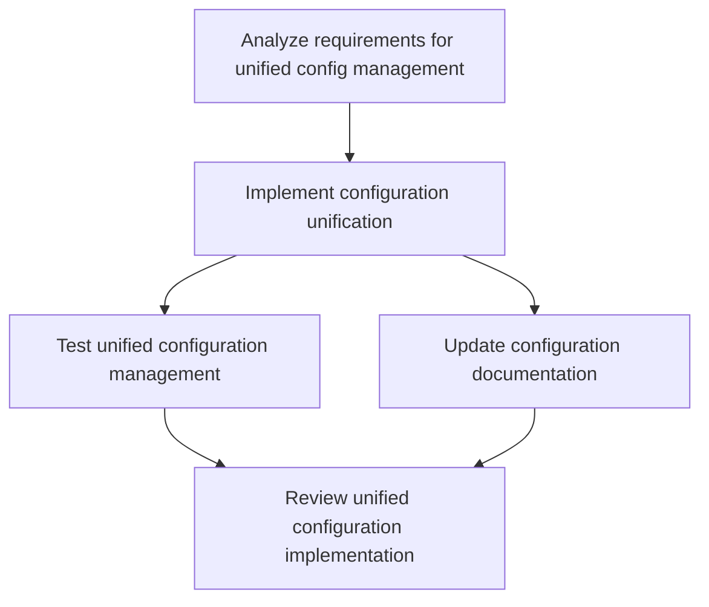

# Plans for Issue #484

**Title**: [P5-007] 設定管理の統一（TOML/YAML/ENV）

**URL**: https://github.com/customer-cloud/miyabi-private/issues/484

---

## Summary

- **Total Tasks**: 5
- **Estimated Duration**: 310 minutes
- **Execution Levels**: 4
- **Has Cycles**: ✅ No

## Task Breakdown

### 1. Analyze requirements for unified config management

- **ID**: `task-484-analysis`
- **Type**: Docs
- **Assigned Agent**: IssueAgent
- **Priority**: 1
- **Estimated Duration**: 10 min

**Description**: Review the current configuration handling using environment variables, TOML, and YAML. Determine how they can be unified using the config crate in Rust.

### 2. Implement configuration unification

- **ID**: `task-484-impl-config`
- **Type**: Feature
- **Assigned Agent**: CodeGenAgent
- **Priority**: 2
- **Estimated Duration**: 240 min
- **Dependencies**: task-484-analysis

**Description**: Modify the Rust application to unify configuration management as per analysis, integrating environment variables, TOML, and YAML support using the config crate.

### 3. Test unified configuration management

- **ID**: `task-484-test-config`
- **Type**: Test
- **Assigned Agent**: CodeGenAgent
- **Priority**: 3
- **Estimated Duration**: 30 min
- **Dependencies**: task-484-impl-config

**Description**: Develop and execute test cases to ensure that configuration files in environment variables, TOML, and YAML formats are correctly parsed and used by the application.

### 4. Update configuration documentation

- **ID**: `task-484-docs-update`
- **Type**: Docs
- **Assigned Agent**: CodeGenAgent
- **Priority**: 4
- **Estimated Duration**: 15 min
- **Dependencies**: task-484-impl-config

**Description**: Update project documentation to reflect the new unified configuration management system, detailing how to set up and use environment variables, TOML, and YAML files.

### 5. Review unified configuration implementation

- **ID**: `task-484-review`
- **Type**: Feature
- **Assigned Agent**: ReviewAgent
- **Priority**: 5
- **Estimated Duration**: 15 min
- **Dependencies**: task-484-test-config, task-484-docs-update

**Description**: Conduct a review of the implementation changes and documentation updates to ensure quality and adherence to project standards.

## Execution Plan

Tasks can be executed in parallel within each level:

### Level 0 (Parallel Execution)

- `task-484-analysis` - Analyze requirements for unified config management

### Level 1 (Parallel Execution)

- `task-484-impl-config` - Implement configuration unification

### Level 2 (Parallel Execution)

- `task-484-docs-update` - Update configuration documentation
- `task-484-test-config` - Test unified configuration management

### Level 3 (Parallel Execution)

- `task-484-review` - Review unified configuration implementation

## Dependencies

## ⏱️ Timeline Estimation

- **Sequential Execution**: 310 minutes (5.2 hours)
- **Parallel Execution (Critical Path)**: 45 minutes (0.8 hours)
- **Estimated Speedup**: 6.9x

---

*Generated by CoordinatorAgent on 2025-10-25 03:44:58 UTC*
