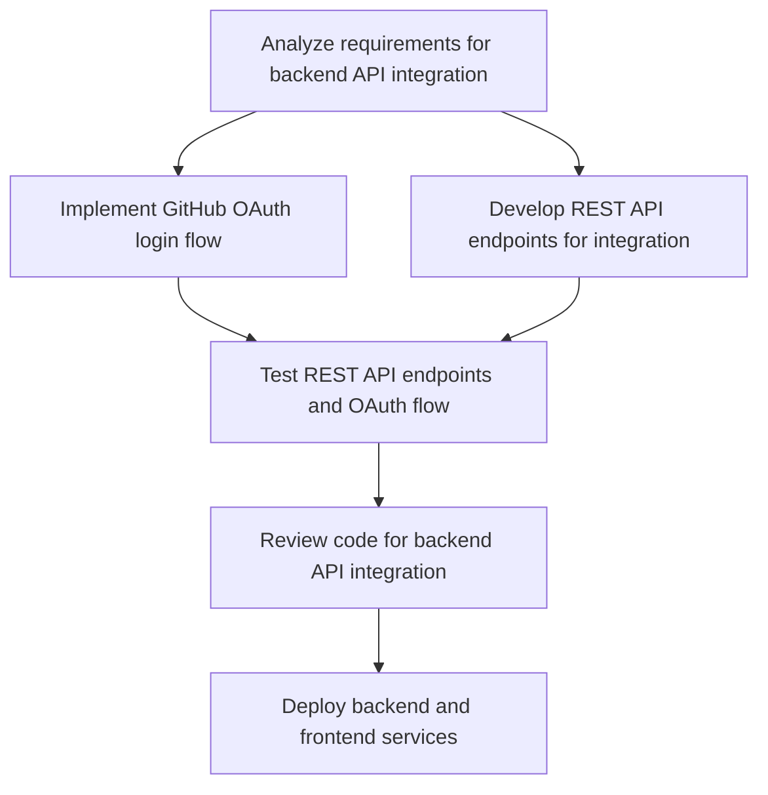

# Plans for Issue #491

**Title**: feat(backend): complete Phase 2 - Backend API Integration

**URL**: https://github.com/customer-cloud/miyabi-private/pull/491

---

## Summary

- **Total Tasks**: 6
- **Estimated Duration**: 160 minutes
- **Execution Levels**: 5
- **Has Cycles**: ✅ No

## Task Breakdown

### 1. Analyze requirements for backend API integration

- **ID**: `task-491-analysis`
- **Type**: Docs
- **Assigned Agent**: IssueAgent
- **Priority**: 0
- **Estimated Duration**: 10 min

**Description**: Analyze the requirements for completing the backend API integration focusing on the PostgreSQL, GitHub OAuth 2.0, and Rust Axum components.

### 2. Implement GitHub OAuth login flow

- **ID**: `task-491-impl-auth`
- **Type**: Feature
- **Assigned Agent**: CodeGenAgent
- **Priority**: 1
- **Estimated Duration**: 45 min
- **Dependencies**: task-491-analysis

**Description**: Develop and integrate the GitHub OAuth login and callback handlings, ensuring correct setup in the frontend and backend.

### 3. Develop REST API endpoints for integration

- **ID**: `task-491-impl-api`
- **Type**: Feature
- **Assigned Agent**: CodeGenAgent
- **Priority**: 2
- **Estimated Duration**: 40 min
- **Dependencies**: task-491-analysis

**Description**: Implement the remaining API integration points focusing on the Repository and Agent routes, ensuring complete functionality.

### 4. Test REST API endpoints and OAuth flow

- **ID**: `task-491-test-api`
- **Type**: Test
- **Assigned Agent**: CodeGenAgent
- **Priority**: 3
- **Estimated Duration**: 30 min
- **Dependencies**: task-491-impl-auth, task-491-impl-api

**Description**: Conduct thorough testing of the implemented REST API endpoints and OAuth flow to ensure data integrity and correct authentication.

### 5. Review code for backend API integration

- **ID**: `task-491-review`
- **Type**: Feature
- **Assigned Agent**: ReviewAgent
- **Priority**: 4
- **Estimated Duration**: 15 min
- **Dependencies**: task-491-test-api

**Description**: Perform a comprehensive review of the code changes made for the backend API integration to ensure standard compliance and efficiency.

### 6. Deploy backend and frontend services

- **ID**: `task-491-deployment`
- **Type**: Deployment
- **Assigned Agent**: DeploymentAgent
- **Priority**: 5
- **Estimated Duration**: 20 min
- **Dependencies**: task-491-review

**Description**: Deploy the backend services with PostgreSQL and Axum server integration, and the Next.js frontend, ensuring proper configurations and running state.

## Execution Plan

Tasks can be executed in parallel within each level:

### Level 0 (Parallel Execution)

- `task-491-analysis` - Analyze requirements for backend API integration

### Level 1 (Parallel Execution)

- `task-491-impl-api` - Develop REST API endpoints for integration
- `task-491-impl-auth` - Implement GitHub OAuth login flow

### Level 2 (Parallel Execution)

- `task-491-test-api` - Test REST API endpoints and OAuth flow

### Level 3 (Parallel Execution)

- `task-491-review` - Review code for backend API integration

### Level 4 (Parallel Execution)

- `task-491-deployment` - Deploy backend and frontend services

## Dependencies

## ⏱️ Timeline Estimation

- **Sequential Execution**: 160 minutes (2.7 hours)
- **Parallel Execution (Critical Path)**: 85 minutes (1.4 hours)
- **Estimated Speedup**: 1.9x

---

*Generated by CoordinatorAgent on 2025-10-25 03:44:42 UTC*
