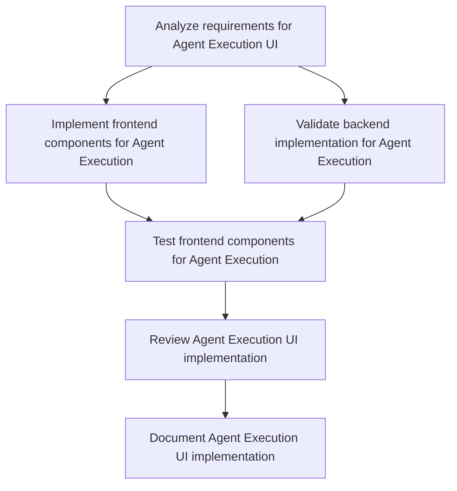

# Plans for Issue #502

**Title**: feat(web-api): Agent Execution UI - Backend + Frontend Skeleton (#428)

**URL**: https://github.com/customer-cloud/miyabi-private/pull/502

---

## Summary

- **Total Tasks**: 6
- **Estimated Duration**: 165 minutes
- **Execution Levels**: 5
- **Has Cycles**: ✅ No

## Task Breakdown

### 1. Analyze requirements for Agent Execution UI

- **ID**: `task-502-analysis`
- **Type**: Docs
- **Assigned Agent**: IssueAgent
- **Priority**: 0
- **Estimated Duration**: 10 min

**Description**: Review the provided GitHub issue and related issue #428 to understand the complete frontend and backend requirements for the Agent Execution UI.

### 2. Implement frontend components for Agent Execution

- **ID**: `task-502-frontend-impl`
- **Type**: Feature
- **Assigned Agent**: CodeGenAgent
- **Priority**: 1
- **Estimated Duration**: 60 min
- **Dependencies**: task-502-analysis

**Description**: Develop the skeleton components in TypeScript/React for the Agent Execution UI including ExecuteAgentDialog, useExecuteAgent hook, and status page. Ensure components cover all TODO markers and interface requirements.

### 3. Validate backend implementation for Agent Execution

- **ID**: `task-502-backend-validation`
- **Type**: Test
- **Assigned Agent**: CodeGenAgent
- **Priority**: 2
- **Estimated Duration**: 30 min
- **Dependencies**: task-502-analysis

**Description**: Verify the backend functionality, ensuring correct database migrations, service layers, and API endpoints are operational. Perform testing against the backend.

### 4. Test frontend components for Agent Execution

- **ID**: `task-502-frontend-test`
- **Type**: Test
- **Assigned Agent**: CodeGenAgent
- **Priority**: 2
- **Estimated Duration**: 30 min
- **Dependencies**: task-502-frontend-impl, task-502-backend-validation

**Description**: Implement and execute tests for the developed frontend components to ensure functionality and integration with the backend services.

### 5. Review Agent Execution UI implementation

- **ID**: `task-502-review`
- **Type**: Feature
- **Assigned Agent**: ReviewAgent
- **Priority**: 3
- **Estimated Duration**: 15 min
- **Dependencies**: task-502-frontend-test

**Description**: Conduct a code review for both the frontend and backend work done on this issue. Ensure code quality, adherence to standards, and completeness of functionality.

### 6. Document Agent Execution UI implementation

- **ID**: `task-502-docs`
- **Type**: Docs
- **Assigned Agent**: CodeGenAgent
- **Priority**: 4
- **Estimated Duration**: 20 min
- **Dependencies**: task-502-review

**Description**: Update documentation to reflect changes and new features added to the system. Include user guides for new UI components and changes.

## Execution Plan

Tasks can be executed in parallel within each level:

### Level 0 (Parallel Execution)

- `task-502-analysis` - Analyze requirements for Agent Execution UI

### Level 1 (Parallel Execution)

- `task-502-backend-validation` - Validate backend implementation for Agent Execution
- `task-502-frontend-impl` - Implement frontend components for Agent Execution

### Level 2 (Parallel Execution)

- `task-502-frontend-test` - Test frontend components for Agent Execution

### Level 3 (Parallel Execution)

- `task-502-review` - Review Agent Execution UI implementation

### Level 4 (Parallel Execution)

- `task-502-docs` - Document Agent Execution UI implementation

## Dependencies

## ⏱️ Timeline Estimation

- **Sequential Execution**: 165 minutes (2.8 hours)
- **Parallel Execution (Critical Path)**: 90 minutes (1.5 hours)
- **Estimated Speedup**: 1.8x

---

*Generated by CoordinatorAgent on 2025-10-25 03:44:28 UTC*
