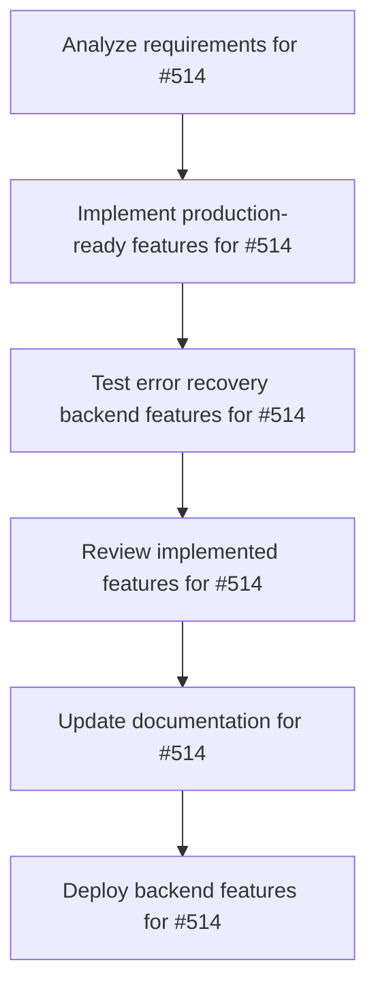

# Plans for Issue #514

**Title**: feat(a2a): Complete Error Recovery Backend - Phase 2.2 Production-Ready Implementation

**URL**: https://github.com/customer-cloud/miyabi-private/pull/514

---

## Summary

- **Total Tasks**: 6
- **Estimated Duration**: 135 minutes
- **Execution Levels**: 6
- **Has Cycles**: ✅ No

## Task Breakdown

### 1. Analyze requirements for #514

- **ID**: `task-514-analysis`
- **Type**: Docs
- **Assigned Agent**: IssueAgent
- **Priority**: 0
- **Estimated Duration**: 10 min

**Description**: Review completion status and verify production readiness for Phase 2.2.

### 2. Implement production-ready features for #514

- **ID**: `task-514-impl`
- **Type**: Feature
- **Assigned Agent**: CodeGenAgent
- **Priority**: 1
- **Estimated Duration**: 40 min
- **Dependencies**: task-514-analysis

**Description**: Ensure all production-ready features are implemented and aligned with #415 requirements.

### 3. Test error recovery backend features for #514

- **ID**: `task-514-test`
- **Type**: Test
- **Assigned Agent**: CodeGenAgent
- **Priority**: 2
- **Estimated Duration**: 30 min
- **Dependencies**: task-514-impl

**Description**: Conduct thorough testing on error recovery backend, including retry and cancel systems and WebSocket broadcasting.

### 4. Review implemented features for #514

- **ID**: `task-514-review`
- **Type**: Feature
- **Assigned Agent**: ReviewAgent
- **Priority**: 3
- **Estimated Duration**: 15 min
- **Dependencies**: task-514-test

**Description**: Conduct a code review to ensure all features are correctly implemented and functions as expected.

### 5. Update documentation for #514

- **ID**: `task-514-docs`
- **Type**: Docs
- **Assigned Agent**: CodeGenAgent
- **Priority**: 4
- **Estimated Duration**: 20 min
- **Dependencies**: task-514-review

**Description**: Update ERROR_RECOVERY_GUIDE.md and any other relevant documentation with Phase 2.2 information.

### 6. Deploy backend features for #514

- **ID**: `task-514-deploy`
- **Type**: Deployment
- **Assigned Agent**: DeploymentAgent
- **Priority**: 5
- **Estimated Duration**: 20 min
- **Dependencies**: task-514-docs

**Description**: Deploy the updated error recovery backend to production environment.

## Execution Plan

Tasks can be executed in parallel within each level:

### Level 0 (Parallel Execution)

- `task-514-analysis` - Analyze requirements for #514

### Level 1 (Parallel Execution)

- `task-514-impl` - Implement production-ready features for #514

### Level 2 (Parallel Execution)

- `task-514-test` - Test error recovery backend features for #514

### Level 3 (Parallel Execution)

- `task-514-review` - Review implemented features for #514

### Level 4 (Parallel Execution)

- `task-514-docs` - Update documentation for #514

### Level 5 (Parallel Execution)

- `task-514-deploy` - Deploy backend features for #514

## Dependencies

## ⏱️ Timeline Estimation

- **Sequential Execution**: 135 minutes (2.2 hours)
- **Parallel Execution (Critical Path)**: 20 minutes (0.3 hours)
- **Estimated Speedup**: 6.8x

---

*Generated by CoordinatorAgent on 2025-10-25 03:44:20 UTC*
