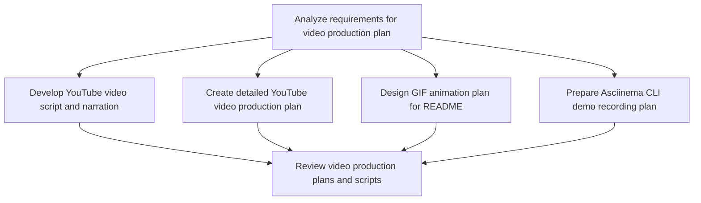

# Plans for Issue #516

**Title**: feat: Add comprehensive demo video production plan (#344)

**URL**: https://github.com/customer-cloud/miyabi-private/pull/516

---

## Summary

- **Total Tasks**: 6
- **Estimated Duration**: 225 minutes
- **Execution Levels**: 3
- **Has Cycles**: ✅ No

## Task Breakdown

### 1. Analyze requirements for video production plan

- **ID**: `task-516-analysis`
- **Type**: Docs
- **Assigned Agent**: IssueAgent
- **Priority**: 0
- **Estimated Duration**: 10 min

**Description**: Review the issue #516 to understand the requirements for creating a comprehensive YouTube demo video plan, GIF animation plan, and Asciinema recording.

### 2. Develop YouTube video script and narration

- **ID**: `task-516-youtube-script`
- **Type**: Feature
- **Assigned Agent**: CodeGenAgent
- **Priority**: 1
- **Estimated Duration**: 60 min
- **Dependencies**: task-516-analysis

**Description**: Create the complete script for the 3-minute YouTube video including the scene-by-scene breakdown and narration script in both Japanese and English. Integrate precise timestamps.

### 3. Create detailed YouTube video production plan

- **ID**: `task-516-youtube-plan`
- **Type**: Feature
- **Assigned Agent**: CodeGenAgent
- **Priority**: 1
- **Estimated Duration**: 50 min
- **Dependencies**: task-516-analysis

**Description**: Formulate a 7-day comprehensive production plan including 84+ asset documentation, budget options, and tool recommendations.

### 4. Design GIF animation plan for README

- **ID**: `task-516-gif-plan`
- **Type**: Feature
- **Assigned Agent**: CodeGenAgent
- **Priority**: 2
- **Estimated Duration**: 45 min
- **Dependencies**: task-516-analysis

**Description**: Develop a plan for a 10-second GIF animation for the README.md hero section, including terminal recording specifications and optimization workflow.

### 5. Prepare Asciinema CLI demo recording plan

- **ID**: `task-516-asciinema-plan`
- **Type**: Feature
- **Assigned Agent**: CodeGenAgent
- **Priority**: 2
- **Estimated Duration**: 40 min
- **Dependencies**: task-516-analysis

**Description**: Outline an act-by-act script for a 5-minute interactive CLI demonstration using Asciinema, ensuring it's embeddable and copy/paste friendly.

### 6. Review video production plans and scripts

- **ID**: `task-516-review`
- **Type**: Docs
- **Assigned Agent**: ReviewAgent
- **Priority**: 3
- **Estimated Duration**: 20 min
- **Dependencies**: task-516-youtube-script, task-516-youtube-plan, task-516-gif-plan, task-516-asciinema-plan

**Description**: Conduct a thorough review of the developed scripts and plans for the YouTube video, GIF animation, and Asciinema recording.

## Execution Plan

Tasks can be executed in parallel within each level:

### Level 0 (Parallel Execution)

- `task-516-analysis` - Analyze requirements for video production plan

### Level 1 (Parallel Execution)

- `task-516-asciinema-plan` - Prepare Asciinema CLI demo recording plan
- `task-516-gif-plan` - Design GIF animation plan for README
- `task-516-youtube-plan` - Create detailed YouTube video production plan
- `task-516-youtube-script` - Develop YouTube video script and narration

### Level 2 (Parallel Execution)

- `task-516-review` - Review video production plans and scripts

## Dependencies

## 💡 Recommendations

- Consider adding test coverage

## ⏱️ Timeline Estimation

- **Sequential Execution**: 225 minutes (3.8 hours)
- **Parallel Execution (Critical Path)**: 195 minutes (3.2 hours)
- **Estimated Speedup**: 1.2x

---

*Generated by CoordinatorAgent on 2025-10-25 03:44:12 UTC*
