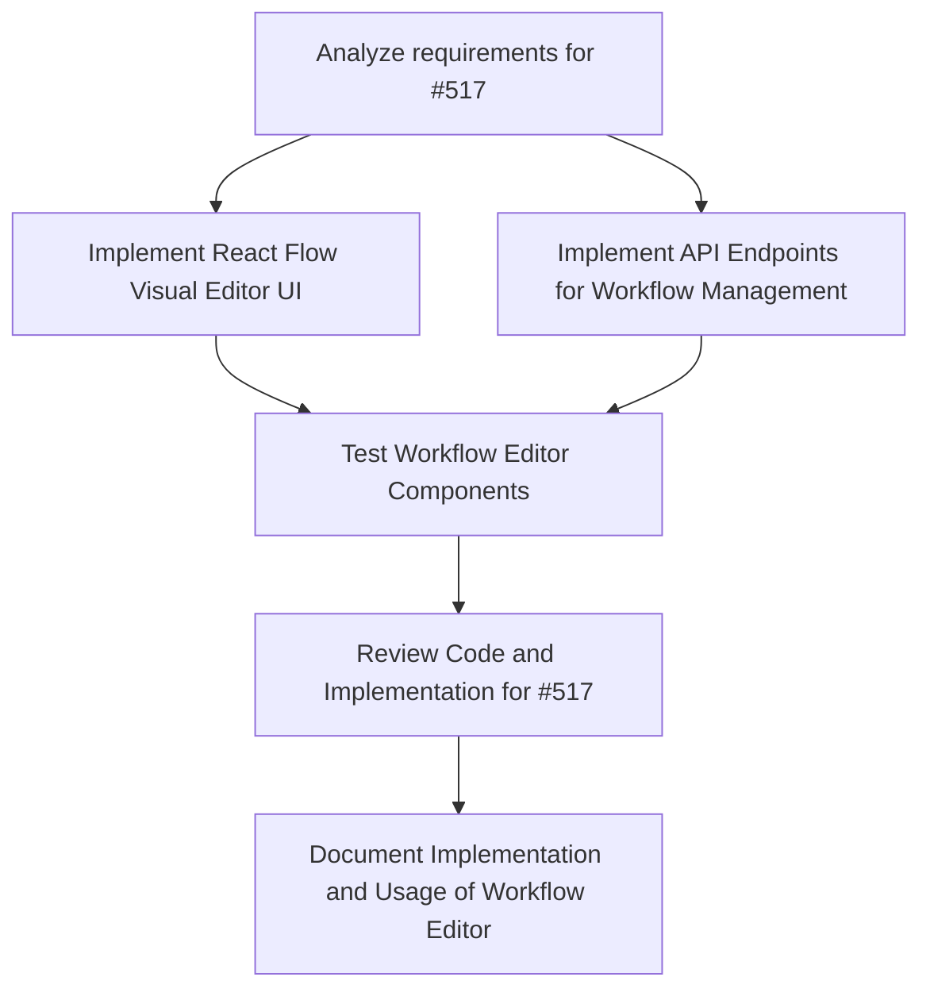

# Plans for Issue #517

**Title**: feat(workflow): Phase 2 - React Flow Visual Editor Implementation (#427)

**URL**: https://github.com/customer-cloud/miyabi-private/pull/517

---

## Summary

- **Total Tasks**: 6
- **Estimated Duration**: 145 minutes
- **Execution Levels**: 5
- **Has Cycles**: ✅ No

## Task Breakdown

### 1. Analyze requirements for #517

- **ID**: `task-517-analysis`
- **Type**: Docs
- **Assigned Agent**: IssueAgent
- **Priority**: 0
- **Estimated Duration**: 10 min

**Description**: Review issue #517 to understand the scope, requirements from issue #427, and the integration points for React Flow. Define the expected output for the visual workflow editor and confirm the implementation matches the specification.

### 2. Implement React Flow Visual Editor UI

- **ID**: `task-517-frontend-impl`
- **Type**: Feature
- **Assigned Agent**: CodeGenAgent
- **Priority**: 1
- **Estimated Duration**: 40 min
- **Dependencies**: task-517-analysis

**Description**: Develop the frontend components for the visual workflow editor using React Flow, ensuring drag-and-drop functionality, node connections, and custom nodes with agent nodes, issue nodes, and condition nodes.

### 3. Implement API Endpoints for Workflow Management

- **ID**: `task-517-backend-api`
- **Type**: Feature
- **Assigned Agent**: CodeGenAgent
- **Priority**: 1
- **Estimated Duration**: 30 min
- **Dependencies**: task-517-analysis

**Description**: Develop and integrate backend API endpoints with Rust Axum for managing agents and workflow data. This includes creating workflows, listing agents, and ensuring data is correctly validated and stored.

### 4. Test Workflow Editor Components

- **ID**: `task-517-testing`
- **Type**: Test
- **Assigned Agent**: CodeGenAgent
- **Priority**: 2
- **Estimated Duration**: 30 min
- **Dependencies**: task-517-frontend-impl, task-517-backend-api

**Description**: Write and run tests for the AgentNode, IssueNode, and ConditionNode components, ensuring all test cases pass including rendering, styling, and interactions. Verify the frontend and backend components are working as expected.

### 5. Review Code and Implementation for #517

- **ID**: `task-517-review`
- **Type**: Feature
- **Assigned Agent**: ReviewAgent
- **Priority**: 3
- **Estimated Duration**: 15 min
- **Dependencies**: task-517-testing

**Description**: Conduct a comprehensive review of the code, architecture, and overall implementation of the visual workflow editor to ensure it meets the project's coding standards and the specifications outlined in the issue.

### 6. Document Implementation and Usage of Workflow Editor

- **ID**: `task-517-documentation`
- **Type**: Docs
- **Assigned Agent**: CodeGenAgent
- **Priority**: 4
- **Estimated Duration**: 20 min
- **Dependencies**: task-517-review

**Description**: Update the project documentation to include detailed information on the new workflow editor, including usage instructions, capabilities of each node type, and API integration details.

## Execution Plan

Tasks can be executed in parallel within each level:

### Level 0 (Parallel Execution)

- `task-517-analysis` - Analyze requirements for #517

### Level 1 (Parallel Execution)

- `task-517-backend-api` - Implement API Endpoints for Workflow Management
- `task-517-frontend-impl` - Implement React Flow Visual Editor UI

### Level 2 (Parallel Execution)

- `task-517-testing` - Test Workflow Editor Components

### Level 3 (Parallel Execution)

- `task-517-review` - Review Code and Implementation for #517

### Level 4 (Parallel Execution)

- `task-517-documentation` - Document Implementation and Usage of Workflow Editor

## Dependencies

## ⏱️ Timeline Estimation

- **Sequential Execution**: 145 minutes (2.4 hours)
- **Parallel Execution (Critical Path)**: 70 minutes (1.2 hours)
- **Estimated Speedup**: 2.1x

---

*Generated by CoordinatorAgent on 2025-10-25 03:44:01 UTC*
