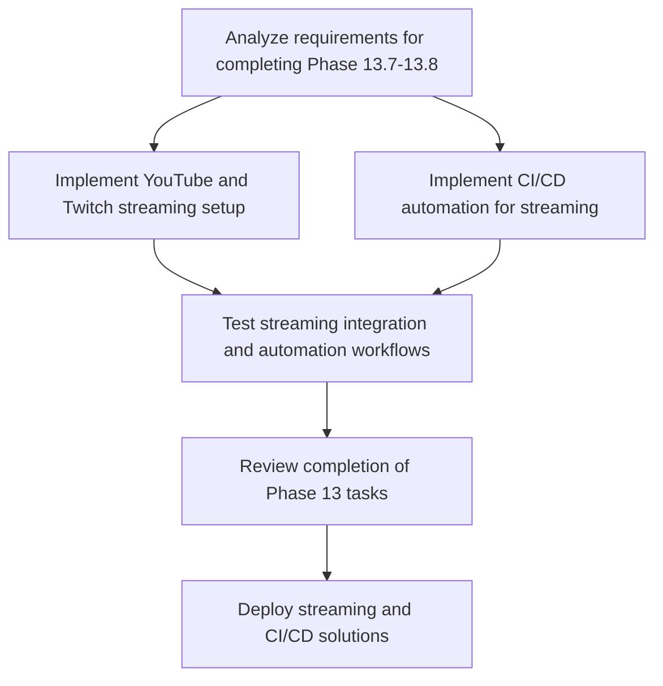

# Plans for Issue #518

**Title**: feat(phase-13): Complete Phase 13.7-13.8 - YouTube/Twitch Streaming and CI/CD Automation (#490)

**URL**: https://github.com/customer-cloud/miyabi-private/pull/518

---

## Summary

- **Total Tasks**: 6
- **Estimated Duration**: 165 minutes
- **Execution Levels**: 5
- **Has Cycles**: ✅ No

## Task Breakdown

### 1. Analyze requirements for completing Phase 13.7-13.8

- **ID**: `task-518-analysis`
- **Type**: Docs
- **Assigned Agent**: IssueAgent
- **Priority**: 0
- **Estimated Duration**: 10 min

**Description**: Review the project completion requirements for streaming integration and CI/CD automation. Identify all necessary documentation and implementation components.

### 2. Implement YouTube and Twitch streaming setup

- **ID**: `task-518-youtube-twitch-setup`
- **Type**: Feature
- **Assigned Agent**: CodeGenAgent
- **Priority**: 1
- **Estimated Duration**: 50 min
- **Dependencies**: task-518-analysis

**Description**: Configure YouTube and Twitch streaming setups according to the guides. Optimize OBS settings for streaming performance.

### 3. Implement CI/CD automation for streaming

- **ID**: `task-518-ci-cd-automation`
- **Type**: Feature
- **Assigned Agent**: CodeGenAgent
- **Priority**: 1
- **Estimated Duration**: 40 min
- **Dependencies**: task-518-analysis

**Description**: Set up GitHub Actions for daily narration workflow, integrate YouTube Data API, implement OAuth 2.0 and Discord notifications, ensure error handling is robust.

### 4. Test streaming integration and automation workflows

- **ID**: `task-518-testing`
- **Type**: Test
- **Assigned Agent**: CodeGenAgent
- **Priority**: 2
- **Estimated Duration**: 30 min
- **Dependencies**: task-518-youtube-twitch-setup, task-518-ci-cd-automation

**Description**: Execute integration tests for streaming setup and CI/CD automation. Report issues found during testing.

### 5. Review completion of Phase 13 tasks

- **ID**: `task-518-review`
- **Type**: Feature
- **Assigned Agent**: ReviewAgent
- **Priority**: 3
- **Estimated Duration**: 15 min
- **Dependencies**: task-518-testing

**Description**: Review documentation and implementation to ensure thoroughness and accuracy. Confirm that requirements are met and high-quality output is achieved.

### 6. Deploy streaming and CI/CD solutions

- **ID**: `task-518-deployment`
- **Type**: Deployment
- **Assigned Agent**: DeploymentAgent
- **Priority**: 4
- **Estimated Duration**: 20 min
- **Dependencies**: task-518-review

**Description**: Finalize deployment of the streaming and CI/CD solutions. Monitor the first automated execution and verify output quality.

## Execution Plan

Tasks can be executed in parallel within each level:

### Level 0 (Parallel Execution)

- `task-518-analysis` - Analyze requirements for completing Phase 13.7-13.8

### Level 1 (Parallel Execution)

- `task-518-ci-cd-automation` - Implement CI/CD automation for streaming
- `task-518-youtube-twitch-setup` - Implement YouTube and Twitch streaming setup

### Level 2 (Parallel Execution)

- `task-518-testing` - Test streaming integration and automation workflows

### Level 3 (Parallel Execution)

- `task-518-review` - Review completion of Phase 13 tasks

### Level 4 (Parallel Execution)

- `task-518-deployment` - Deploy streaming and CI/CD solutions

## Dependencies

## ⏱️ Timeline Estimation

- **Sequential Execution**: 165 minutes (2.8 hours)
- **Parallel Execution (Critical Path)**: 90 minutes (1.5 hours)
- **Estimated Speedup**: 1.8x

---

*Generated by CoordinatorAgent on 2025-10-25 03:43:42 UTC*
