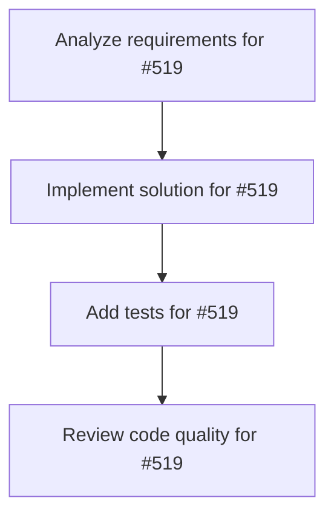

# Plans for Issue #519

**Title**: refactor: Deduplicate ConfigLoader across commands (Phase 1-1)

**URL**: https://github.com/customer-cloud/miyabi-private/issues/519

---

## 📋 Summary

- **Total Tasks**: 4
- **Estimated Duration**: 60 minutes
- **Execution Levels**: 4
- **Has Cycles**: ✅ No

## 📝 Task Breakdown

### 1. Analyze requirements for #519

- **ID**: `task-519-analysis`
- **Type**: Docs
- **Assigned Agent**: IssueAgent
- **Priority**: 0
- **Estimated Duration**: 5 min

**Description**: Analyze issue requirements and create detailed specification

### 2. Implement solution for #519

- **ID**: `task-519-impl`
- **Type**: Refactor
- **Assigned Agent**: CodeGenAgent
- **Priority**: 1
- **Estimated Duration**: 30 min
- **Dependencies**: task-519-analysis

**Description**: ## 📋 概要

`agent.rs` と `parallel.rs` で重複している設定ロード処理を統合します。

**実行フロー改善提案**: Phase 1-4 Config Management の実装

## 🎯 目的

- コード重複削減: 140行 → 共通化
- キャッシング: 設定ロード1回のみ（`OnceCell`使用）
- 保守性向上: 設定ロジックの一元管理

## 📝 タスク

### 実装
- [ ] `crates/miyabi-cli/src/config.rs` 新規作成
- [ ] `ConfigLoader` 構造体実装
  - [ ] `global()` メソッド（Singleton）
  - [ ] `load()` メソッド（キャッシング付き）
  - [ ] `get_github_token()` 統合
  - [ ] `parse_git_remote()` 統合
- [ ] `crates/miyabi-cli/src/commands/agent.rs:161-300` リファクタリング
  - [ ] `load_config()` を `ConfigLoader::global().load()` に置換
  - [ ] 重複メソッド削除
- [ ] `crates/miyabi-cli/src/commands/parallel.rs:267-376` リファクタリング
  - [ ] `load_config()` を `ConfigLoader::global().load()` に置換
  - [ ] 重複メソッド削除

### テスト
- [ ] `config.rs` ユニットテスト追加
  - [ ] `test_config_loader_caching()`
  - [ ] `test_github_token_from_env()`
  - [ ] `test_github_token_from_gh_cli()`
  - [ ] `test_parse_git_remote_https()`
  - [ ] `test_parse_git_remote_ssh()`

### ドキュメント
- [ ] `config.rs` にdocコメント追加
- [ ] `CHANGELOG.md` 更新

## ✅ 成功基準

- [ ] `cargo check` エラー 0件
- [ ] `cargo clippy` 警告 0件
- [ ] `cargo test` 全テスト合格
- [ ] コード行数削減: 140行 → 80行（約43%削減）

## 📊 期待効果

| 指標 | Before | After | 改善率 |
|-----|--------|-------|--------|
| 重複コード | 140行 | 0行 | 100% |
| 設定ロード回数 | N回 | 1回 | キャッシング |
| 保守性 | 2箇所管理 | 1箇所管理 | 50% |

## 🔗 関連

- **実装計画**: メイン実行フロー改善提案 Phase 1-4
- **優先度**: Quick Wins（1週間以内完了目標）
- **工数**: 0.5日

## 📂 実装箇所

```
crates/miyabi-cli/
├── src/
│   ├── config.rs           # ✅ NEW
│   ├── commands/
│   │   ├── agent.rs        # 🔧 REFACTOR L161-300
│   │   └── parallel.rs     # 🔧 REFACTOR L267-376
│   └── lib.rs              # 🔧 pub mod config 追加
```

## 🚀 実装例

```rust
// crates/miyabi-cli/src/config.rs
use once_cell::sync::OnceCell;

pub struct ConfigLoader {
    cache: OnceCell<AgentConfig>,
}

impl ConfigLoader {
    pub fn global() -> &'static Self {
        static INSTANCE: OnceCell<ConfigLoader> = OnceCell::new();
        INSTANCE.get_or_init(|| ConfigLoader {
            cache: OnceCell::new(),
        })
    }

    pub fn load(&self) -> Result<AgentConfig> {
        self.cache.get_or_try_init(|| {
            let github_token = Self::get_github_token()?;
            let (repo_owner, repo_name) = Self::parse_git_remote()?;
            // ... 設定構築
        }).cloned()
    }
}
```

🤖 Generated with [Claude Code](https://claude.com/claude-code)

### 3. Add tests for #519

- **ID**: `task-519-test`
- **Type**: Test
- **Assigned Agent**: CodeGenAgent
- **Priority**: 2
- **Estimated Duration**: 15 min
- **Dependencies**: task-519-impl

**Description**: Create comprehensive test coverage

### 4. Review code quality for #519

- **ID**: `task-519-review`
- **Type**: Refactor
- **Assigned Agent**: ReviewAgent
- **Priority**: 3
- **Estimated Duration**: 10 min
- **Dependencies**: task-519-test

**Description**: Run quality checks and code review

## 🔄 Execution Plan (DAG Levels)

Tasks can be executed in parallel within each level:

### Level 0 (Parallel Execution)

- `task-519-analysis` - Analyze requirements for #519

### Level 1 (Parallel Execution)

- `task-519-impl` - Implement solution for #519

### Level 2 (Parallel Execution)

- `task-519-test` - Add tests for #519

### Level 3 (Parallel Execution)

- `task-519-review` - Review code quality for #519

## 📊 Dependency Graph



## ⏱️ Timeline Estimation

- **Sequential Execution**: 60 minutes (1.0 hours)
- **Parallel Execution (Critical Path)**: 10 minutes (0.2 hours)
- **Estimated Speedup**: 6.0x

---

*Generated by CoordinatorAgent on 2025-10-24 13:06:26 UTC*
