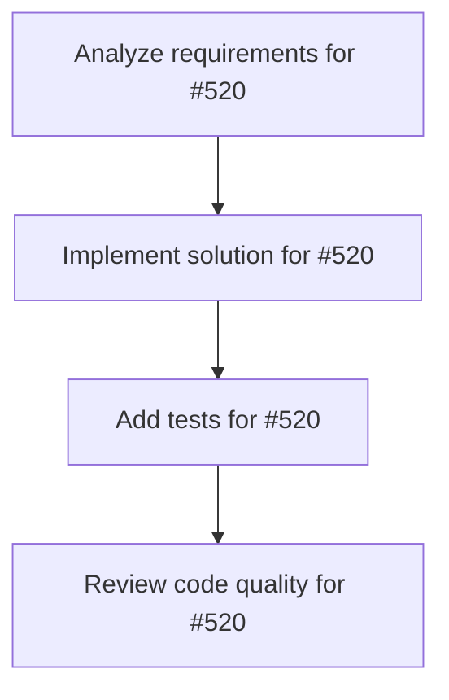

# Plans for Issue #520

**Title**: feat: Implement real-time progress tracking for agents (Phase 1-2)

**URL**: https://github.com/customer-cloud/miyabi-private/issues/520

---

## 📋 Summary

- **Total Tasks**: 4
- **Estimated Duration**: 60 minutes
- **Execution Levels**: 4
- **Has Cycles**: ✅ No

## 📝 Task Breakdown

### 1. Analyze requirements for #520

- **ID**: `task-520-analysis`
- **Type**: Docs
- **Assigned Agent**: IssueAgent
- **Priority**: 0
- **Estimated Duration**: 5 min

**Description**: Analyze issue requirements and create detailed specification

### 2. Implement solution for #520

- **ID**: `task-520-impl`
- **Type**: Feature
- **Assigned Agent**: CodeGenAgent
- **Priority**: 1
- **Estimated Duration**: 30 min
- **Dependencies**: task-520-analysis

**Description**: ## 📋 概要

Agent実行中のリアルタイム進捗表示を実装します。

**実行フロー改善提案**: Phase 1-3 Progress Tracking & Observable の実装

## 🎯 目的

- UX改善: Agent実行中の進捗を可視化
- 長時間実行タスク（30分以上）での不安解消
- リアルタイムログストリーミング

## 📝 タスク

### 実装
- [ ] `crates/miyabi-agent-core/src/observable.rs` 新規作成
  - [ ] `ProgressObserver` trait 定義
  - [ ] `ProgressUpdate` 構造体
  - [ ] `LogEntry` 構造体
  - [ ] `ObservableAgent<A>` ラッパー実装
- [ ] `crates/miyabi-agent-core/src/lib.rs` 更新
  - [ ] `pub mod observable;` 追加
  - [ ] trait export
- [ ] `crates/miyabi-cli/Cargo.toml` 依存追加
  - [ ] `indicatif = "0.17"` 追加
- [ ] `crates/miyabi-cli/src/commands/agent.rs` 統合
  - [ ] `CLIProgressObserver` 実装
  - [ ] `run_coordinator_agent()` でプログレスバー使用
  - [ ] `run_codegen_agent()` でプログレスバー使用
  - [ ] `run_review_agent()` でプログレスバー使用

### テスト
- [ ] `observable.rs` ユニットテスト追加
  - [ ] `test_observable_agent_notifies_observers()`
  - [ ] `test_progress_update_creation()`
  - [ ] `test_multiple_observers()`

### ドキュメント
- [ ] `observable.rs` にdocコメント追加
- [ ] `CHANGELOG.md` 更新

## ✅ 成功基準

- [ ] `cargo check` エラー 0件
- [ ] `cargo clippy` 警告 0件
- [ ] `cargo test` 全テスト合格
- [ ] プログレスバー表示確認（手動テスト）
- [ ] 長時間実行タスクでの動作確認

## 📊 期待効果

| 指標 | Before | After | 改善 |
|-----|--------|-------|------|
| 進捗可視性 | ❌ なし | ✅ リアルタイム表示 | UX大幅改善 |
| ユーザー不安 | 😰 高い | 😊 低い | ストレス軽減 |
| ログ確認 | 事後確認のみ | リアルタイム | デバッグ効率化 |

## 🔗 関連

- **実装計画**: メイン実行フロー改善提案 Phase 1-3
- **優先度**: High（UX大幅改善）
- **工数**: 1-2日

## 📂 実装箇所

```
crates/
├── miyabi-agent-core/
│   └── src/
│       ├── observable.rs   # ✅ NEW
│       └── lib.rs          # 🔧 UPDATE
└── miyabi-cli/
    ├── Cargo.toml          # 🔧 ADD indicatif
    └── src/commands/
        └── agent.rs        # 🔧 INTEGRATE L357-373
```

## 🚀 実装例

```rust
// CLIProgressObserver implementation
use indicatif::{ProgressBar, ProgressStyle};

let progress_bar = ProgressBar::new(100);
progress_bar.set_style(
    ProgressStyle::default_bar()
        .template("[{elapsed_precise}] {bar:40.cyan/blue} {pos:>3}% {msg}")
);

observable.add_observer(Box::new(CLIProgressObserver { 
    progress_bar: progress_bar.clone() 
})).await;
```

## 🎨 表示例

```
[00:00:35] ████████████████░░░░░░░░░░░ 65% Generating Rust code...
```

🤖 Generated with [Claude Code](https://claude.com/claude-code)

### 3. Add tests for #520

- **ID**: `task-520-test`
- **Type**: Test
- **Assigned Agent**: CodeGenAgent
- **Priority**: 2
- **Estimated Duration**: 15 min
- **Dependencies**: task-520-impl

**Description**: Create comprehensive test coverage

### 4. Review code quality for #520

- **ID**: `task-520-review`
- **Type**: Refactor
- **Assigned Agent**: ReviewAgent
- **Priority**: 3
- **Estimated Duration**: 10 min
- **Dependencies**: task-520-test

**Description**: Run quality checks and code review

## 🔄 Execution Plan (DAG Levels)

Tasks can be executed in parallel within each level:

### Level 0 (Parallel Execution)

- `task-520-analysis` - Analyze requirements for #520

### Level 1 (Parallel Execution)

- `task-520-impl` - Implement solution for #520

### Level 2 (Parallel Execution)

- `task-520-test` - Add tests for #520

### Level 3 (Parallel Execution)

- `task-520-review` - Review code quality for #520

## 📊 Dependency Graph



## ⏱️ Timeline Estimation

- **Sequential Execution**: 60 minutes (1.0 hours)
- **Parallel Execution (Critical Path)**: 10 minutes (0.2 hours)
- **Estimated Speedup**: 6.0x

---

*Generated by CoordinatorAgent on 2025-10-24 13:23:17 UTC*
