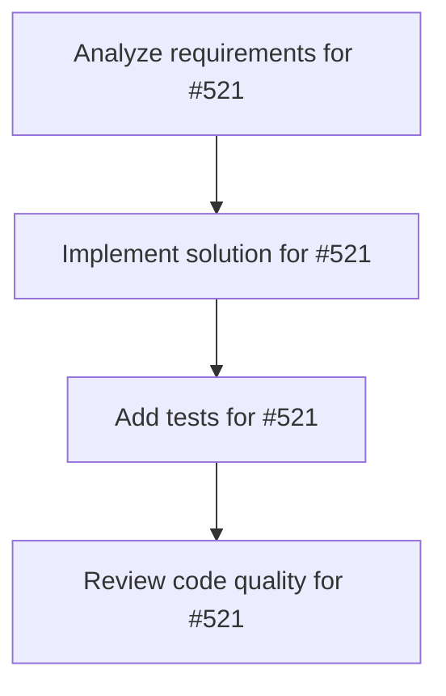

# Plans for Issue #521

**Title**: feat: Enhance result display with rich formatting (Phase 1-3)

**URL**: https://github.com/customer-cloud/miyabi-private/issues/521

---

## 📋 Summary

- **Total Tasks**: 4
- **Estimated Duration**: 60 minutes
- **Execution Levels**: 4
- **Has Cycles**: ✅ No

## 📝 Task Breakdown

### 1. Analyze requirements for #521

- **ID**: `task-521-analysis`
- **Type**: Docs
- **Assigned Agent**: IssueAgent
- **Priority**: 0
- **Estimated Duration**: 5 min

**Description**: Analyze issue requirements and create detailed specification

### 2. Implement solution for #521

- **ID**: `task-521-impl`
- **Type**: Feature
- **Assigned Agent**: CodeGenAgent
- **Priority**: 1
- **Estimated Duration**: 30 min
- **Dependencies**: task-521-analysis

**Description**: ## 📋 概要

Agent実行結果の表示を改善します。

**実行フロー改善提案**: Phase 1-7 Result Display の実装

## 🎯 目的

- 結果表示の視認性向上
- エラー詳細の充実化
- JSON出力対応（AI統合用）

## 📝 タスク

### 実装
- [ ] `crates/miyabi-cli/src/display.rs` 新規作成
  - [ ] `ResultFormatter` 構造体実装
  - [ ] `format_agent_result()` メソッド
  - [ ] `format_as_table()` メソッド（comfy-table使用）
  - [ ] JSON出力対応
- [ ] `crates/miyabi-cli/Cargo.toml` 依存追加
  - [ ] `comfy-table = "7.1"` 追加
- [ ] `crates/miyabi-cli/src/commands/agent.rs` 統合
  - [ ] `display_business_result()` を `ResultFormatter` 使用に置換
  - [ ] 全Agent実行メソッドで統一表示

### テスト
- [ ] `display.rs` ユニットテスト追加
  - [ ] `test_format_agent_result_success()`
  - [ ] `test_format_agent_result_failure()`
  - [ ] `test_format_json_output()`
  - [ ] `test_format_table_output()`

### ドキュメント
- [ ] `display.rs` にdocコメント追加
- [ ] `CHANGELOG.md` 更新

## ✅ 成功基準

- [ ] `cargo check` エラー 0件
- [ ] `cargo clippy` 警告 0件
- [ ] `cargo test` 全テスト合格
- [ ] 表示の視認性確認（手動テスト）
- [ ] JSON出力の妥当性確認

## 📊 期待効果

| 指標 | Before | After | 改善 |
|-----|--------|-------|------|
| 視認性 | ⚠️ 低い | ✅ 高い（テーブル表示） | 可読性向上 |
| エラー詳細 | ⚠️ 不足 | ✅ 充実 | デバッグ効率化 |
| AI統合 | ❌ なし | ✅ JSON対応 | 自動化対応 |

## 🔗 関連

- **実装計画**: メイン実行フロー改善提案 Phase 1-7
- **優先度**: Medium（Quick Wins最終）
- **工数**: 0.5日

## 📂 実装箇所

```
crates/miyabi-cli/
├── Cargo.toml          # 🔧 ADD comfy-table
└── src/
    ├── display.rs      # ✅ NEW
    └── commands/
        └── agent.rs    # 🔧 UPDATE L360-373, L1004-1026
```

## 🚀 実装例

```rust
// Rich table display
┌─────────────────┬────────────────────────────┐
│ Metric          │ Value                      │
├─────────────────┼────────────────────────────┤
│ Status          │ Success ✅                 │
│ Duration        │ 38,421ms                   │
│ Quality Score   │ 92/100 ✅                  │
│ Lines Changed   │ +243 -12                   │
│ Tests Added     │ 15                         │
└─────────────────┴────────────────────────────┘
```

🤖 Generated with [Claude Code](https://claude.com/claude-code)

### 3. Add tests for #521

- **ID**: `task-521-test`
- **Type**: Test
- **Assigned Agent**: CodeGenAgent
- **Priority**: 2
- **Estimated Duration**: 15 min
- **Dependencies**: task-521-impl

**Description**: Create comprehensive test coverage

### 4. Review code quality for #521

- **ID**: `task-521-review`
- **Type**: Refactor
- **Assigned Agent**: ReviewAgent
- **Priority**: 3
- **Estimated Duration**: 10 min
- **Dependencies**: task-521-test

**Description**: Run quality checks and code review

## 🔄 Execution Plan (DAG Levels)

Tasks can be executed in parallel within each level:

### Level 0 (Parallel Execution)

- `task-521-analysis` - Analyze requirements for #521

### Level 1 (Parallel Execution)

- `task-521-impl` - Implement solution for #521

### Level 2 (Parallel Execution)

- `task-521-test` - Add tests for #521

### Level 3 (Parallel Execution)

- `task-521-review` - Review code quality for #521

## 📊 Dependency Graph



## ⏱️ Timeline Estimation

- **Sequential Execution**: 60 minutes (1.0 hours)
- **Parallel Execution (Critical Path)**: 10 minutes (0.2 hours)
- **Estimated Speedup**: 6.0x

---

*Generated by CoordinatorAgent on 2025-10-24 13:48:18 UTC*
