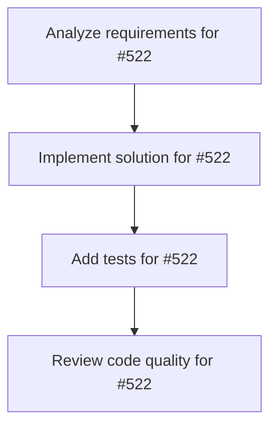

# Plans for Issue #522

**Title**: perf: Optimize Hook system with global registry (Phase 1-4)

**URL**: https://github.com/customer-cloud/miyabi-private/issues/522

---

## 📋 Summary

- **Total Tasks**: 4
- **Estimated Duration**: 60 minutes
- **Execution Levels**: 4
- **Has Cycles**: ✅ No

## 📝 Task Breakdown

### 1. Analyze requirements for #522

- **ID**: `task-522-analysis`
- **Type**: Docs
- **Assigned Agent**: IssueAgent
- **Priority**: 0
- **Estimated Duration**: 5 min

**Description**: Analyze issue requirements and create detailed specification

### 2. Implement solution for #522

- **ID**: `task-522-impl`
- **Type**: Refactor
- **Assigned Agent**: CodeGenAgent
- **Priority**: 1
- **Estimated Duration**: 30 min
- **Dependencies**: task-522-analysis

**Description**: ## 📋 概要

Hook実行システムを最適化します。

**実行フロー改善提案**: Phase 1-6 Hook Optimization の実装

## 🎯 目的

- Hook実行の効率化
- 不要な重複実行の排除
- グローバルHookとインスタンスHookの分離

## 📝 タスク

### 実装
- [ ] `crates/miyabi-agent-core/src/registry.rs` 新規作成
  - [ ] `HookRegistry` 構造体実装
  - [ ] `global()` メソッド（Singleton）
  - [ ] `register_global()` メソッド
  - [ ] `register_instance()` メソッド
  - [ ] `execute_global_hooks()` メソッド（キャッシング付き）
- [ ] `crates/miyabi-agent-core/src/hooks.rs` 更新
  - [ ] `HookRegistry` 統合
- [ ] `crates/miyabi-cli/src/main.rs` 統合
  - [ ] `init_global_hooks()` 関数追加
  - [ ] スタートアップ時にグローバルHook登録
- [ ] `crates/miyabi-cli/src/commands/agent.rs` 更新
  - [ ] `register_standard_hooks()` を `HookRegistry` 使用に変更

### テスト
- [ ] `registry.rs` ユニットテスト追加
  - [ ] `test_hook_registry_singleton()`
  - [ ] `test_global_hook_execution_once()`
  - [ ] `test_instance_hook_execution_multiple()`
  - [ ] `test_execution_cache()`

### ドキュメント
- [ ] `registry.rs` にdocコメント追加
- [ ] `CHANGELOG.md` 更新

## ✅ 成功基準

- [ ] `cargo check` エラー 0件
- [ ] `cargo clippy` 警告 0件
- [ ] `cargo test` 全テスト合格
- [ ] パフォーマンス測定: Hook実行時間削減確認
- [ ] 重複実行の排除確認

## 📊 期待効果

| 指標 | Before | After | 改善 |
|-----|--------|-------|------|
| Hook実行回数 | N回（全Agent） | 1回（グローバル） | 大幅削減 |
| 環境変数チェック | 毎回 | 初回のみ | 効率化 |
| 保守性 | ⚠️ 分散 | ✅ 一元管理 | 管理容易 |

## 🔗 関連

- **実装計画**: メイン実行フロー改善提案 Phase 1-6
- **優先度**: Medium（パフォーマンス改善）
- **工数**: 1日

## 📂 実装箇所

```
crates/
├── miyabi-agent-core/
│   └── src/
│       ├── registry.rs # ✅ NEW
│       ├── hooks.rs    # 🔧 UPDATE
│       └── lib.rs      # 🔧 pub mod registry
└── miyabi-cli/
    └── src/
        ├── main.rs     # 🔧 ADD init_global_hooks()
        └── commands/
            └── agent.rs # 🔧 UPDATE L314-322
```

## 🚀 実装例

```rust
// main.rs startup
pub fn init_global_hooks() {
    let mut registry = HookRegistry::global().lock().unwrap();
    registry.register_global(Box::new(
        EnvironmentCheckHook::new(["GITHUB_TOKEN"])
    ));
}

// agent.rs usage
let mut registry = HookRegistry::global().lock().unwrap();
registry.execute_global_hooks(&task).await?;
```

🤖 Generated with [Claude Code](https://claude.com/claude-code)

### 3. Add tests for #522

- **ID**: `task-522-test`
- **Type**: Test
- **Assigned Agent**: CodeGenAgent
- **Priority**: 2
- **Estimated Duration**: 15 min
- **Dependencies**: task-522-impl

**Description**: Create comprehensive test coverage

### 4. Review code quality for #522

- **ID**: `task-522-review`
- **Type**: Refactor
- **Assigned Agent**: ReviewAgent
- **Priority**: 3
- **Estimated Duration**: 10 min
- **Dependencies**: task-522-test

**Description**: Run quality checks and code review

## 🔄 Execution Plan (DAG Levels)

Tasks can be executed in parallel within each level:

### Level 0 (Parallel Execution)

- `task-522-analysis` - Analyze requirements for #522

### Level 1 (Parallel Execution)

- `task-522-impl` - Implement solution for #522

### Level 2 (Parallel Execution)

- `task-522-test` - Add tests for #522

### Level 3 (Parallel Execution)

- `task-522-review` - Review code quality for #522

## 📊 Dependency Graph



## ⏱️ Timeline Estimation

- **Sequential Execution**: 60 minutes (1.0 hours)
- **Parallel Execution (Critical Path)**: 10 minutes (0.2 hours)
- **Estimated Speedup**: 6.0x

---

*Generated by CoordinatorAgent on 2025-10-24 14:08:14 UTC*
