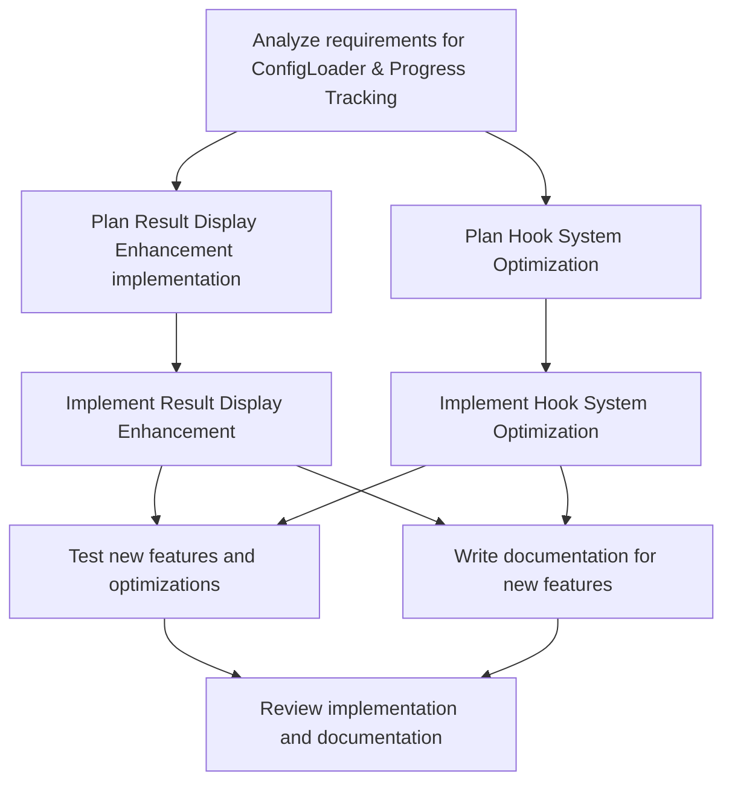

# Plans for Issue #527

**Title**: feat(phase-1): Complete Issues #519 & #520 - ConfigLoader & Progress Tracking

**URL**: https://github.com/customer-cloud/miyabi-private/pull/527

---

## Summary

- **Total Tasks**: 8
- **Estimated Duration**: 200 minutes
- **Execution Levels**: 5
- **Has Cycles**: ✅ No

## Task Breakdown

### 1. Analyze requirements for ConfigLoader & Progress Tracking

- **ID**: `task-527-analysis`
- **Type**: Docs
- **Assigned Agent**: IssueAgent
- **Priority**: 0
- **Estimated Duration**: 10 min

**Description**: Review the issue and completed tasks #519 and #520 to understand requirements for finishing Phase 1 improvements.

### 2. Plan Result Display Enhancement implementation

- **ID**: `task-527-result-display-planning`
- **Type**: Feature
- **Assigned Agent**: CodeGenAgent
- **Priority**: 1
- **Estimated Duration**: 20 min
- **Dependencies**: task-527-analysis

**Description**: Design the approach for implementing the result display enhancements, ensuring compatibility with the new progress tracking infrastructure.

### 3. Plan Hook System Optimization

- **ID**: `task-527-hook-system-planning`
- **Type**: Refactor
- **Assigned Agent**: CodeGenAgent
- **Priority**: 2
- **Estimated Duration**: 20 min
- **Dependencies**: task-527-analysis

**Description**: Develop a strategy to optimize the hook system by analyzing current bottlenecks and proposing improvements.

### 4. Implement Result Display Enhancement

- **ID**: `task-527-impl-result-display`
- **Type**: Feature
- **Assigned Agent**: CodeGenAgent
- **Priority**: 3
- **Estimated Duration**: 40 min
- **Dependencies**: task-527-result-display-planning

**Description**: Develop the result display features per the design, integrating them with the new progress tracking infrastructure.

### 5. Implement Hook System Optimization

- **ID**: `task-527-impl-hook-system`
- **Type**: Refactor
- **Assigned Agent**: CodeGenAgent
- **Priority**: 3
- **Estimated Duration**: 50 min
- **Dependencies**: task-527-hook-system-planning

**Description**: Execute the optimized hook system design to improve performance and system response times.

### 6. Test new features and optimizations

- **ID**: `task-527-testing`
- **Type**: Test
- **Assigned Agent**: ReviewAgent
- **Priority**: 1
- **Estimated Duration**: 30 min
- **Dependencies**: task-527-impl-result-display, task-527-impl-hook-system

**Description**: Perform tests on new features and optimizations, ensuring they meet the intended improvements without introducing issues.

### 7. Write documentation for new features

- **ID**: `task-527-documentation`
- **Type**: Docs
- **Assigned Agent**: CodeGenAgent
- **Priority**: 4
- **Estimated Duration**: 15 min
- **Dependencies**: task-527-impl-result-display, task-527-impl-hook-system

**Description**: Update existing documentation to include new result display enhancements and hook system optimizations.

### 8. Review implementation and documentation

- **ID**: `task-527-review`
- **Type**: Feature
- **Assigned Agent**: ReviewAgent
- **Priority**: 0
- **Estimated Duration**: 15 min
- **Dependencies**: task-527-testing, task-527-documentation

**Description**: Conduct a thorough review of the new implementations and accompanying documentation to ensure quality and accuracy.

## Execution Plan

Tasks can be executed in parallel within each level:

### Level 0 (Parallel Execution)

- `task-527-analysis` - Analyze requirements for ConfigLoader & Progress Tracking

### Level 1 (Parallel Execution)

- `task-527-hook-system-planning` - Plan Hook System Optimization
- `task-527-result-display-planning` - Plan Result Display Enhancement implementation

### Level 2 (Parallel Execution)

- `task-527-impl-hook-system` - Implement Hook System Optimization
- `task-527-impl-result-display` - Implement Result Display Enhancement

### Level 3 (Parallel Execution)

- `task-527-documentation` - Write documentation for new features
- `task-527-testing` - Test new features and optimizations

### Level 4 (Parallel Execution)

- `task-527-review` - Review implementation and documentation

## Dependencies

## ⏱️ Timeline Estimation

- **Sequential Execution**: 200 minutes (3.3 hours)
- **Parallel Execution (Critical Path)**: 45 minutes (0.8 hours)
- **Estimated Speedup**: 4.4x

---

*Generated by CoordinatorAgent on 2025-10-25 03:43:29 UTC*
