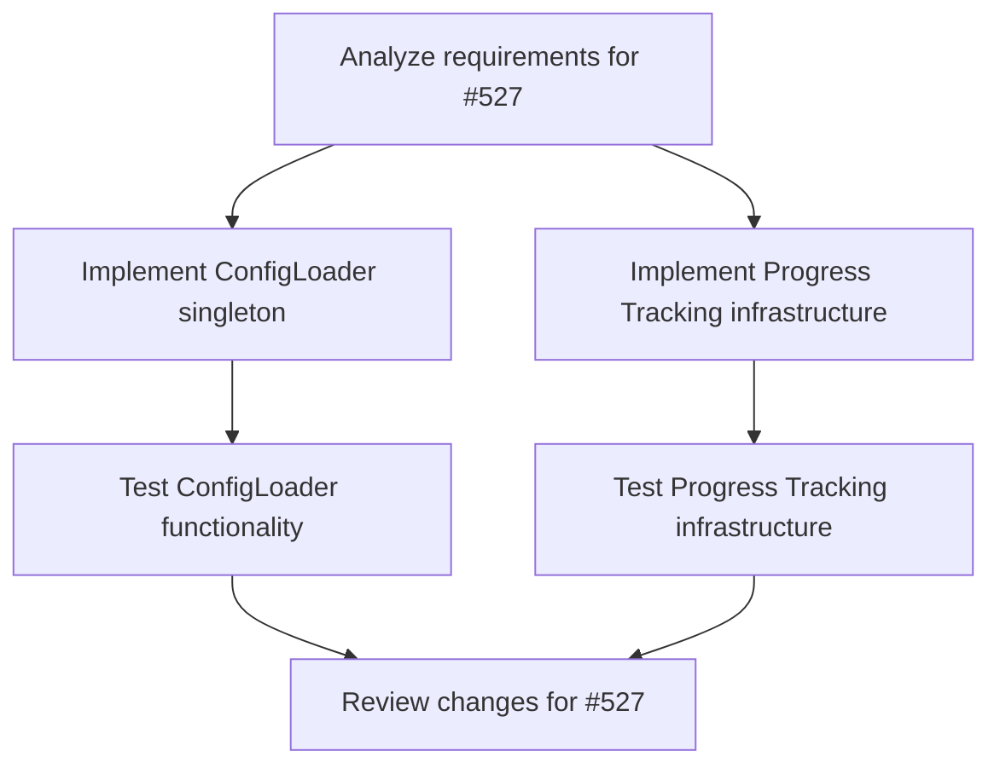

# Plans for Issue #527

**Title**: feat(phase-1): Complete Issues #519 & #520 - ConfigLoader & Progress Tracking

**URL**: https://github.com/customer-cloud/miyabi-private/pull/527

---

## Summary

- **Total Tasks**: 6
- **Estimated Duration**: 165 minutes
- **Execution Levels**: 4
- **Has Cycles**: ✅ No

## Task Breakdown

### 1. Analyze requirements for #527

- **ID**: `task-527-analysis`
- **Type**: Docs
- **Assigned Agent**: IssueAgent
- **Priority**: 0
- **Estimated Duration**: 10 min

**Description**: Review issue details for ConfigLoader and Progress Tracking improvements and extract actionable tasks.

### 2. Implement ConfigLoader singleton

- **ID**: `task-527-impl-config-loader`
- **Type**: Refactor
- **Assigned Agent**: CodeGenAgent
- **Priority**: 1
- **Estimated Duration**: 30 min
- **Dependencies**: task-527-analysis

**Description**: Create a centralized ConfigLoader with a OnceCell pattern to eliminate code duplication and ensure thread-safe configuration loading.

### 3. Implement Progress Tracking infrastructure

- **ID**: `task-527-impl-progress-tracking`
- **Type**: Feature
- **Assigned Agent**: CodeGenAgent
- **Priority**: 0
- **Estimated Duration**: 60 min
- **Dependencies**: task-527-analysis

**Description**: Develop real-time progress tracking using the Observable Agent pattern with support for CLI, WebSocket, and Metrics observers.

### 4. Test ConfigLoader functionality

- **ID**: `task-527-test-config-loader`
- **Type**: Test
- **Assigned Agent**: CodeGenAgent
- **Priority**: 1
- **Estimated Duration**: 20 min
- **Dependencies**: task-527-impl-config-loader

**Description**: Write and run unit tests to ensure the ConfigLoader loads configurations correctly and maintains thread safety.

### 5. Test Progress Tracking infrastructure

- **ID**: `task-527-test-progress-tracking`
- **Type**: Test
- **Assigned Agent**: CodeGenAgent
- **Priority**: 0
- **Estimated Duration**: 30 min
- **Dependencies**: task-527-impl-progress-tracking

**Description**: Conduct unit and integration tests for the Observable Agent pattern and check the functionality of various observers.

### 6. Review changes for #527

- **ID**: `task-527-review`
- **Type**: Feature
- **Assigned Agent**: ReviewAgent
- **Priority**: 1
- **Estimated Duration**: 15 min
- **Dependencies**: task-527-test-config-loader, task-527-test-progress-tracking

**Description**: Perform code review on ConfigLoader and Progress Tracking implementations to ensure quality and adherence to requirements.

## Execution Plan

Tasks can be executed in parallel within each level:

### Level 0 (Parallel Execution)

- `task-527-analysis` - Analyze requirements for #527

### Level 1 (Parallel Execution)

- `task-527-impl-config-loader` - Implement ConfigLoader singleton
- `task-527-impl-progress-tracking` - Implement Progress Tracking infrastructure

### Level 2 (Parallel Execution)

- `task-527-test-config-loader` - Test ConfigLoader functionality
- `task-527-test-progress-tracking` - Test Progress Tracking infrastructure

### Level 3 (Parallel Execution)

- `task-527-review` - Review changes for #527

## Dependencies

## ⏱️ Timeline Estimation

- **Sequential Execution**: 165 minutes (2.8 hours)
- **Parallel Execution (Critical Path)**: 50 minutes (0.8 hours)
- **Estimated Speedup**: 3.3x

---

*Generated by CoordinatorAgent on 2025-10-25 03:48:32 UTC*
