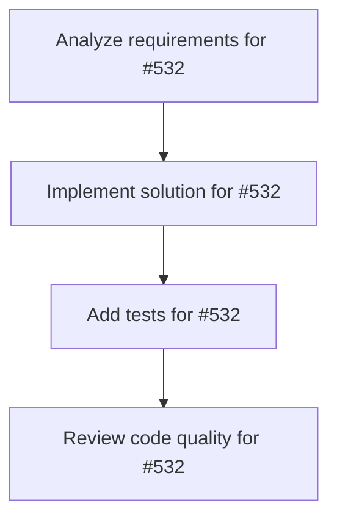

# Plans for Issue #532

**Title**: Epic: 歴史上の偉人AIアバター販売プラットフォーム開発

**URL**: https://github.com/customer-cloud/miyabi-private/issues/532

---

## 📋 Summary

- **Total Tasks**: 4
- **Estimated Duration**: 60 minutes
- **Execution Levels**: 4
- **Has Cycles**: ✅ No

## 📝 Task Breakdown

### 1. Analyze requirements for #532

- **ID**: `task-532-analysis`
- **Type**: Docs
- **Assigned Agent**: IssueAgent
- **Priority**: 0
- **Estimated Duration**: 5 min

**Description**: Analyze issue requirements and create detailed specification

### 2. Implement solution for #532

- **ID**: `task-532-impl`
- **Type**: Feature
- **Assigned Agent**: CodeGenAgent
- **Priority**: 1
- **Estimated Duration**: 30 min
- **Dependencies**: task-532-analysis

**Description**: # Epic: 歴史上の偉人AIアバター販売プラットフォーム

**作成日**: 2025-10-25
**優先度**: P0 - Critical
**カテゴリ**: Epic / New Feature
**目標リリース**: MVP v0.1.0 - 2週間以内

---

## 🎯 事業概要

歴史上の偉人（織田信長、坂本龍馬等）をAIアバター化し、対話サービスとして提供する。

### ターゲットユースケース
1. **経営者向け**: 織田信長AIに経営戦略を相談
2. **教育向け**: 坂本龍馬AIが子供に歴史を教える
3. **エンタメ向け**: 偉人との雑談・対話体験

---

## 📋 要件定義

### 機能要件

#### MVP v0.1.0（2週間）
- [ ] **偉人AI 3名実装**
  - 織田信長（経営者向け）
  - 坂本龍馬（教育向け）
  - 徳川家康（バランス型）
  
- [ ] **コア機能**
  - テキストチャット対話
  - 歴史知識RAG（Wikipedia + 専門書籍）
  - キャラクター性再現（口調・思考パターン）
  
- [ ] **UI/UX**
  - Webチャットインターフェース
  - 偉人選択画面
  - 対話履歴保存

#### Phase 2（1ヶ月）
- [ ] 音声合成（VOICEVOX統合）
- [ ] 画像生成（偉人の肖像画風アバター）
- [ ] 追加偉人10名（豊臣秀吉、西郷隆盛等）

#### Phase 3（3ヶ月）
- [ ] 有料プラン（$9.99/mo）
- [ ] API提供（$0.01/message）
- [ ] モバイルアプリ（iOS/Android）

---

## 🏗️ 技術アーキテクチャ

### バックエンド
- **Rust**: Axum HTTP server
- **LLM**: Claude 3.5 Sonnet (Anthropic)
- **RAG**: Qdrant (Vector DB) + Embedding
- **データ**: 歴史資料データセット（Wikipedia, 青空文庫）

### フロントエンド
- **Next.js 14** + TypeScript
- **UI**: Tailwind CSS + shadcn/ui
- **リアルタイム**: WebSocket or Server-Sent Events

### インフラ
- **Deploy**: Vercel (Frontend) + Fly.io (Backend)
- **DB**: PostgreSQL (Supabase)
- **Vector DB**: Qdrant Cloud

---

## 📊 サブタスク分解

### A. 技術実装系
- [ ] #TBD: RAGパイプライン構築（歴史資料→Vector DB）
- [ ] #TBD: プロンプトエンジニアリング（偉人キャラクター再現）
- [ ] #TBD: Axum APIサーバー実装
- [ ] #TBD: Next.jsチャットUI実装

### B. データ収集系
- [ ] #TBD: 織田信長データセット作成（Wikipedia + 書籍）
- [ ] #TBD: 坂本龍馬データセット作成
- [ ] #TBD: 徳川家康データセット作成
- [ ] #TBD: キャラクター定義書作成（口調・性格・思考）

### C. ビジネスモデル系
- [ ] #TBD: 価格設定（Free/Pro/Enterprise）
- [ ] #TBD: ランディングページ作成
- [ ] #TBD: GTM戦略（ターゲット顧客・マーケティング）

### D. 品質保証系
- [ ] #TBD: テストケース作成（対話品質・キャラ再現度）
- [ ] #TBD: ベータテスター募集（経営者10名、教師10名）

---

## 🎯 成功指標（KPI）

### MVP v0.1.0
- [ ] β版ユーザー50名獲得
- [ ] 対話満足度 4.0/5.0以上
- [ ] キャラ再現度 80%以上（主観評価）

### Phase 2
- [ ] 有料ユーザー100名
- [ ] MRR $1,000達成
- [ ] 偉人ラインナップ10名

---

## 🚀 実行計画

### Week 1
- Day 1-2: RAGパイプライン構築
- Day 3-4: 織田信長AIプロトタイプ
- Day 5-7: チャットUI実装 + 統合テスト

### Week 2
- Day 8-10: 坂本龍馬、徳川家康AI追加
- Day 11-12: ランディングページ + β版公開
- Day 13-14: フィードバック収集 + 改善

---

## 📚 参考資料

### 類似サービス
- **Character.AI**: キャラクター対話AI
- **Replika**: パーソナルAIコンパニオン
- **ChatGPT Custom GPTs**: カスタムボット作成

### 技術参考
- [Qdrant RAG Tutorial](https://qdrant.tech/)
- [Anthropic Prompt Engineering](https://docs.anthropic.com/claude/docs)

---

## 🏷️ Labels
- `epic`
- `feature/new`
- `priority/P0`
- `business/revenue`
- `tech/ai-ml`

---

🤖 Generated with [Claude Code](https://claude.com/claude-code)

Co-Authored-By: Claude <noreply@anthropic.com>

### 3. Add tests for #532

- **ID**: `task-532-test`
- **Type**: Test
- **Assigned Agent**: CodeGenAgent
- **Priority**: 2
- **Estimated Duration**: 15 min
- **Dependencies**: task-532-impl

**Description**: Create comprehensive test coverage

### 4. Review code quality for #532

- **ID**: `task-532-review`
- **Type**: Refactor
- **Assigned Agent**: ReviewAgent
- **Priority**: 3
- **Estimated Duration**: 10 min
- **Dependencies**: task-532-test

**Description**: Run quality checks and code review

## 🔄 Execution Plan (DAG Levels)

Tasks can be executed in parallel within each level:

### Level 0 (Parallel Execution)

- `task-532-analysis` - Analyze requirements for #532

### Level 1 (Parallel Execution)

- `task-532-impl` - Implement solution for #532

### Level 2 (Parallel Execution)

- `task-532-test` - Add tests for #532

### Level 3 (Parallel Execution)

- `task-532-review` - Review code quality for #532

## 📊 Dependency Graph

## ⏱️ Timeline Estimation

- **Sequential Execution**: 60 minutes (1.0 hours)
- **Parallel Execution (Critical Path)**: 10 minutes (0.2 hours)
- **Estimated Speedup**: 6.0x

---

*Generated by CoordinatorAgent on 2025-10-30 17:47:33 UTC*
