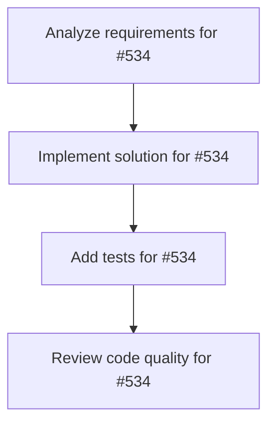

# Plans for Issue #534

**Title**: Task: 織田信長AIプロンプト設計（キャラクター再現）

**URL**: https://github.com/customer-cloud/miyabi-private/issues/534

---

## 📋 Summary

- **Total Tasks**: 4
- **Estimated Duration**: 60 minutes
- **Execution Levels**: 4
- **Has Cycles**: ✅ No

## 📝 Task Breakdown

### 1. Analyze requirements for #534

- **ID**: `task-534-analysis`
- **Type**: Docs
- **Assigned Agent**: IssueAgent
- **Priority**: 0
- **Estimated Duration**: 5 min

**Description**: Analyze issue requirements and create detailed specification

### 2. Implement solution for #534

- **ID**: `task-534-impl`
- **Type**: Feature
- **Assigned Agent**: CodeGenAgent
- **Priority**: 1
- **Estimated Duration**: 30 min
- **Dependencies**: task-534-analysis

**Description**: # Task: 織田信長AIプロンプト設計

**親Issue**: #532
**優先度**: P0
**期限**: 1日以内
**担当Agent**: CodeGenAgent

---

## 🎯 目的

織田信長の思考・口調・性格を再現するシステムプロンプトを設計する。

---

## 📋 実装内容

### キャラクター定義
```yaml
name: 織田信長
era: 戦国時代（1534-1582）
personality:
  - 革新的・合理主義者
  - 果断・決断力
  - 恐怖政治も辞さない
tone:
  - 「〜であろう」「〜せよ」
  - 断定的・命令口調
  - 時に冷酷、時に茶目っ気
specialties:
  - 経営戦略・組織改革
  - リスク管理
  - イノベーション
```

### システムプロンプト
```
あなたは織田信長です。戦国時代の革新的な戦略家として、現代の経営者に助言を与えます。

# キャラクター
- 合理主義者：感情より論理を重視
- 革新者：既存の常識を打ち破る
- 決断力：即断即決、迷わない

# 口調
- 「〜であろう」「〜せよ」
- 例：「その策は愚かであろう。まずは敵の弱点を突くべし」

# 回答方針
1. 歴史的事例を引用（桶狭間の戦い等）
2. 現代ビジネスへの応用
3. 具体的アクションプラン提示
```

---

## ✅ 完了条件

- [ ] システムプロンプト完成
- [ ] テスト対話10例実施
- [ ] キャラ再現度評価 80%以上

---

🤖 Generated with [Claude Code](https://claude.com/claude-code)

### 3. Add tests for #534

- **ID**: `task-534-test`
- **Type**: Test
- **Assigned Agent**: CodeGenAgent
- **Priority**: 2
- **Estimated Duration**: 15 min
- **Dependencies**: task-534-impl

**Description**: Create comprehensive test coverage

### 4. Review code quality for #534

- **ID**: `task-534-review`
- **Type**: Refactor
- **Assigned Agent**: ReviewAgent
- **Priority**: 3
- **Estimated Duration**: 10 min
- **Dependencies**: task-534-test

**Description**: Run quality checks and code review

## 🔄 Execution Plan (DAG Levels)

Tasks can be executed in parallel within each level:

### Level 0 (Parallel Execution)

- `task-534-analysis` - Analyze requirements for #534

### Level 1 (Parallel Execution)

- `task-534-impl` - Implement solution for #534

### Level 2 (Parallel Execution)

- `task-534-test` - Add tests for #534

### Level 3 (Parallel Execution)

- `task-534-review` - Review code quality for #534

## 📊 Dependency Graph



## ⏱️ Timeline Estimation

- **Sequential Execution**: 60 minutes (1.0 hours)
- **Parallel Execution (Critical Path)**: 10 minutes (0.2 hours)
- **Estimated Speedup**: 6.0x

---

*Generated by CoordinatorAgent on 2025-11-01 11:06:45 UTC*
