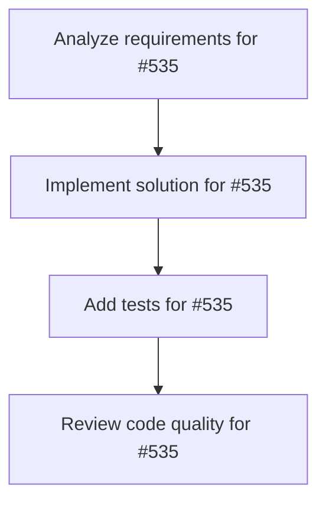

# Plans for Issue #535

**Title**: Task: Axum APIサーバー実装（/chat エンドポイント）

**URL**: https://github.com/customer-cloud/miyabi-private/issues/535

---

## 📋 Summary

- **Total Tasks**: 4
- **Estimated Duration**: 60 minutes
- **Execution Levels**: 4
- **Has Cycles**: ✅ No

## 📝 Task Breakdown

### 1. Analyze requirements for #535

- **ID**: `task-535-analysis`
- **Type**: Docs
- **Assigned Agent**: IssueAgent
- **Priority**: 0
- **Estimated Duration**: 5 min

**Description**: Analyze issue requirements and create detailed specification

### 2. Implement solution for #535

- **ID**: `task-535-impl`
- **Type**: Feature
- **Assigned Agent**: CodeGenAgent
- **Priority**: 1
- **Estimated Duration**: 30 min
- **Dependencies**: task-535-analysis

**Description**: # Task: Axum APIサーバー実装

**親Issue**: #532
**優先度**: P0
**期限**: 2日以内
**担当Agent**: CodeGenAgent

---

## 🎯 目的

偉人AIとの対話を提供するREST APIを実装する。

---

## 📋 実装内容

### API仕様
```
POST /api/chat
Content-Type: application/json

Request:
{
  "figure": "oda_nobunaga",
  "message": "新規事業の判断に迷っています",
  "user_id": "user_123"
}

Response:
{
  "reply": "その迷いは不要であろう。まずは...",
  "sources": ["Wikipedia: 桶狭間の戦い", ...],
  "timestamp": "2025-10-25T12:00:00Z"
}
```

### 実装
```rust
// crates/miyabi-historical-ai/src/api/chat.rs
use axum::{Json, Router};
use serde::{Deserialize, Serialize};

#[derive(Deserialize)]
struct ChatRequest {
    figure: String,
    message: String,
    user_id: String,
}

#[derive(Serialize)]
struct ChatResponse {
    reply: String,
    sources: Vec<String>,
    timestamp: String,
}

async fn chat_handler(
    Json(req): Json<ChatRequest>,
) -> Result<Json<ChatResponse>> {
    // 1. RAG検索
    let docs = search_knowledge(&req.message, &req.figure, 5).await?;
    
    // 2. プロンプト構築
    let prompt = build_prompt(&req.figure, &req.message, &docs);
    
    // 3. Claude API呼び出し
    let reply = call_claude(&prompt).await?;
    
    Ok(Json(ChatResponse {
        reply,
        sources: docs.iter().map(|d| d.title.clone()).collect(),
        timestamp: Utc::now().to_rfc3339(),
    }))
}
```

---

## ✅ 完了条件

- [ ] `/api/chat` エンドポイント実装
- [ ] Claude API統合
- [ ] RAG統合
- [ ] レスポンスタイム <2秒
- [ ] テスト10ケースPass

---

🤖 Generated with [Claude Code](https://claude.com/claude-code)

### 3. Add tests for #535

- **ID**: `task-535-test`
- **Type**: Test
- **Assigned Agent**: CodeGenAgent
- **Priority**: 2
- **Estimated Duration**: 15 min
- **Dependencies**: task-535-impl

**Description**: Create comprehensive test coverage

### 4. Review code quality for #535

- **ID**: `task-535-review`
- **Type**: Refactor
- **Assigned Agent**: ReviewAgent
- **Priority**: 3
- **Estimated Duration**: 10 min
- **Dependencies**: task-535-test

**Description**: Run quality checks and code review

## 🔄 Execution Plan (DAG Levels)

Tasks can be executed in parallel within each level:

### Level 0 (Parallel Execution)

- `task-535-analysis` - Analyze requirements for #535

### Level 1 (Parallel Execution)

- `task-535-impl` - Implement solution for #535

### Level 2 (Parallel Execution)

- `task-535-test` - Add tests for #535

### Level 3 (Parallel Execution)

- `task-535-review` - Review code quality for #535

## 📊 Dependency Graph



## ⏱️ Timeline Estimation

- **Sequential Execution**: 60 minutes (1.0 hours)
- **Parallel Execution (Critical Path)**: 10 minutes (0.2 hours)
- **Estimated Speedup**: 6.0x

---

*Generated by CoordinatorAgent on 2025-11-01 11:06:45 UTC*
