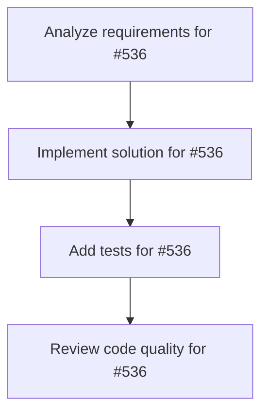

# Plans for Issue #536

**Title**: Task: Next.jsチャットUI実装

**URL**: https://github.com/customer-cloud/miyabi-private/issues/536

---

## 📋 Summary

- **Total Tasks**: 4
- **Estimated Duration**: 60 minutes
- **Execution Levels**: 4
- **Has Cycles**: ✅ No

## 📝 Task Breakdown

### 1. Analyze requirements for #536

- **ID**: `task-536-analysis`
- **Type**: Docs
- **Assigned Agent**: IssueAgent
- **Priority**: 0
- **Estimated Duration**: 5 min

**Description**: Analyze issue requirements and create detailed specification

### 2. Implement solution for #536

- **ID**: `task-536-impl`
- **Type**: Feature
- **Assigned Agent**: CodeGenAgent
- **Priority**: 1
- **Estimated Duration**: 30 min
- **Dependencies**: task-536-analysis

**Description**: # Task: Next.jsチャットUI実装

**親Issue**: #532
**優先度**: P1
**期限**: 3日以内
**担当Agent**: CodeGenAgent

---

## 🎯 目的

偉人AIと対話できるWebチャットインターフェースを実装する。

---

## 📋 実装内容

### 画面構成
1. **偉人選択画面**: 織田信長/坂本龍馬/徳川家康
2. **チャット画面**: メッセージ送受信
3. **履歴**: 過去の対話履歴表示

### 技術スタック
- Next.js 14 (App Router)
- TypeScript
- Tailwind CSS + shadcn/ui
- React Query (データフェッチ)

### コンポーネント構成
```
app/
├── page.tsx              # 偉人選択画面
├── chat/[figure]/page.tsx # チャット画面
components/
├── FigureSelector.tsx
├── ChatMessage.tsx
├── ChatInput.tsx
└── ChatHistory.tsx
```

---

## ✅ 完了条件

- [ ] 偉人選択→チャット遷移
- [ ] メッセージ送受信動作
- [ ] レスポンシブデザイン
- [ ] ローディング状態表示

---

🤖 Generated with [Claude Code](https://claude.com/claude-code)

### 3. Add tests for #536

- **ID**: `task-536-test`
- **Type**: Test
- **Assigned Agent**: CodeGenAgent
- **Priority**: 2
- **Estimated Duration**: 15 min
- **Dependencies**: task-536-impl

**Description**: Create comprehensive test coverage

### 4. Review code quality for #536

- **ID**: `task-536-review`
- **Type**: Refactor
- **Assigned Agent**: ReviewAgent
- **Priority**: 3
- **Estimated Duration**: 10 min
- **Dependencies**: task-536-test

**Description**: Run quality checks and code review

## 🔄 Execution Plan (DAG Levels)

Tasks can be executed in parallel within each level:

### Level 0 (Parallel Execution)

- `task-536-analysis` - Analyze requirements for #536

### Level 1 (Parallel Execution)

- `task-536-impl` - Implement solution for #536

### Level 2 (Parallel Execution)

- `task-536-test` - Add tests for #536

### Level 3 (Parallel Execution)

- `task-536-review` - Review code quality for #536

## 📊 Dependency Graph



## ⏱️ Timeline Estimation

- **Sequential Execution**: 60 minutes (1.0 hours)
- **Parallel Execution (Critical Path)**: 10 minutes (0.2 hours)
- **Estimated Speedup**: 6.0x

---

*Generated by CoordinatorAgent on 2025-10-30 17:47:35 UTC*
