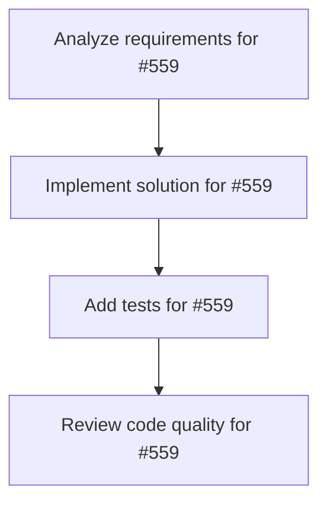

# Plans for Issue #559

**Title**: 🤖 [Week 5] Integrate OpenAI Agents SDK for Hybrid Routing

**URL**: https://github.com/customer-cloud/miyabi-private/issues/559

---

## 📋 Summary

- **Total Tasks**: 4
- **Estimated Duration**: 60 minutes
- **Execution Levels**: 4
- **Has Cycles**: ✅ No

## 📝 Task Breakdown

### 1. Analyze requirements for #559

- **ID**: `task-559-analysis`
- **Type**: Docs
- **Assigned Agent**: IssueAgent
- **Priority**: 0
- **Estimated Duration**: 5 min

**Description**: Analyze issue requirements and create detailed specification

### 2. Implement solution for #559

- **ID**: `task-559-impl`
- **Type**: Feature
- **Assigned Agent**: CodeGenAgent
- **Priority**: 1
- **Estimated Duration**: 30 min
- **Dependencies**: task-559-analysis

**Description**: ## Task: OpenAI Agents SDK Integration + Hybrid Routing

**Priority**: Medium
**Estimated Time**: 6-8 hours (Week 5)
**Dependencies**: Week 3-4 Rust FFI bridge complete

---

## Background

Implement hybrid routing to reduce costs by 60% ($30/month → $12/month for 100 issues).

**Strategy**:
- **Claude Sonnet 4.5** for complex tasks (D2, D5, D15)
- **GPT-4o-mini** for simple tasks (D1, D8, D11)

---

## Requirements

### OpenAI SDK Setup

```bash
npm install openai-agents
```

### Smart Router

```typescript
// scripts/sdk-wrapper/src/router.ts
export async function executeDecisionPoint(
  point: DecisionPoint,
  context: Context
): Promise<Result> {
  if (point.requiresDeepReasoning) {
    return claudeAgent.execute(point, context); // D2, D5, D15
  } else {
    return openaiAgent.execute(point, context);  // D1, D8, D11
  }
}
```

---

## Cost Optimization

**Before** (Pure Claude):
- 100 issues × $0.30/issue = $30/month

**After** (Hybrid):
- 60 complex × $0.15 (Claude) = $9
- 40 simple × $0.075 (OpenAI) = $3
- **Total: $12/month (60% savings)**

---

## Success Criteria

- [ ] OpenAI Agents SDK installed
- [ ] Hybrid router implemented
- [ ] A/B test quality (Claude vs OpenAI)
- [ ] Cost tracking dashboard
- [ ] 60% cost reduction achieved


### 3. Add tests for #559

- **ID**: `task-559-test`
- **Type**: Test
- **Assigned Agent**: CodeGenAgent
- **Priority**: 2
- **Estimated Duration**: 15 min
- **Dependencies**: task-559-impl

**Description**: Create comprehensive test coverage

### 4. Review code quality for #559

- **ID**: `task-559-review`
- **Type**: Refactor
- **Assigned Agent**: ReviewAgent
- **Priority**: 3
- **Estimated Duration**: 10 min
- **Dependencies**: task-559-test

**Description**: Run quality checks and code review

## 🔄 Execution Plan (DAG Levels)

Tasks can be executed in parallel within each level:

### Level 0 (Parallel Execution)

- `task-559-analysis` - Analyze requirements for #559

### Level 1 (Parallel Execution)

- `task-559-impl` - Implement solution for #559

### Level 2 (Parallel Execution)

- `task-559-test` - Add tests for #559

### Level 3 (Parallel Execution)

- `task-559-review` - Review code quality for #559

## 📊 Dependency Graph



## ⏱️ Timeline Estimation

- **Sequential Execution**: 60 minutes (1.0 hours)
- **Parallel Execution (Critical Path)**: 10 minutes (0.2 hours)
- **Estimated Speedup**: 6.0x

---

*Generated by CoordinatorAgent on 2025-11-01 11:05:16 UTC*
