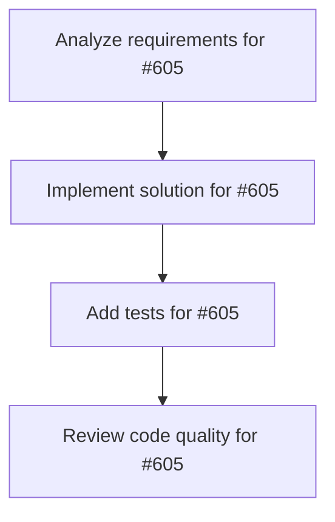

# Plans for Issue #605

**Title**: 🐛 [miyabi-worktree] 2 integration test failures

**URL**: https://github.com/customer-cloud/miyabi-private/issues/605

---

## 📋 Summary

- **Total Tasks**: 4
- **Estimated Duration**: 60 minutes
- **Execution Levels**: 4
- **Has Cycles**: ✅ No

## 📝 Task Breakdown

### 1. Analyze requirements for #605

- **ID**: `task-605-analysis`
- **Type**: Docs
- **Assigned Agent**: IssueAgent
- **Priority**: 0
- **Estimated Duration**: 5 min

**Description**: Analyze issue requirements and create detailed specification

### 2. Implement solution for #605

- **ID**: `task-605-impl`
- **Type**: Bug
- **Assigned Agent**: CodeGenAgent
- **Priority**: 1
- **Estimated Duration**: 30 min
- **Dependencies**: task-605-analysis

**Description**: ## 🐛 Bug Report

### Summary
`miyabi-worktree` crate has 2 failing integration tests discovered during full test suite execution.

---

## 📊 Test Failures

### 1. `hooks_integration_test::test_scenario_2_fail_fast_with_error_hooks`

**Location**: `crates/miyabi-worktree/tests/hooks_integration_test.rs:483`

**Error**:
```
thread 'test_scenario_2_fail_fast_with_error_hooks' panicked at crates/miyabi-worktree/tests/hooks_integration_test.rs:483:5:
assertion failed: result.cancelled_count >= 1
```

**Expected Behavior**: When fail-fast is enabled and an error occurs, subsequent tasks should be cancelled (`cancelled_count >= 1`)

**Actual Behavior**: `cancelled_count` is 0, indicating tasks were not cancelled as expected

**Assertion**:
```rust
assert!(result.cancelled_count >= 1); // At least some cancellations
```

---

### 2. `pool_integration_test::test_pool_execution_success`

**Location**: `crates/miyabi-worktree/tests/pool_integration_test.rs:158`

**Error**:
```
thread 'test_pool_execution_success' panicked at crates/miyabi-worktree/tests/pool_integration_test.rs:158:5:
assertion `left == right` failed
  left: 2
 right: 3
```

**Expected Behavior**: 3 tasks should succeed

**Actual Behavior**: Only 2 tasks succeeded

**Assertion**:
```rust
assert_eq!(result.success_count, 3);
```

---

## 🔍 Root Cause Analysis

### Test 1: Fail-Fast Cancellation
**Hypothesis**: The fail-fast mechanism may not be correctly propagating cancellation signals to pending tasks.

**Potential Issues**:
- Task cancellation logic not working
- Race condition in error detection
- Hook execution order issue

### Test 2: Success Count Mismatch
**Hypothesis**: One task is silently failing or not being counted correctly.

**Potential Issues**:
- Task execution counting bug
- Result aggregation logic error
- Worktree cleanup interfering with task completion

---

## 📋 Reproduction Steps

```bash
# Run specific failing tests
cargo test --package miyabi-worktree --test hooks_integration_test -- test_scenario_2_fail_fast_with_error_hooks
cargo test --package miyabi-worktree --test pool_integration_test -- test_pool_execution_success

# Or run all worktree tests
cargo test --package miyabi-worktree --all-targets
```

---

## 🎯 Success Criteria

- [ ] Both tests pass consistently
- [ ] Fail-fast cancellation works correctly (Test 1)
- [ ] All 3 tasks complete successfully and are counted (Test 2)
- [ ] No regressions in other worktree tests

---

## 📊 Test Suite Status

**Overall**: 2 failed, majority passing

**Passing Tests**:
- ✅ lifecycle_integration_test: 14/14
- ✅ parallel_execution_test: 5/6
- ⚠️ hooks_integration_test: 2/3 (1 failed)
- ⚠️ pool_integration_test: 7/8 (1 failed)

---

## 🔗 Related Files

- `crates/miyabi-worktree/tests/hooks_integration_test.rs`
- `crates/miyabi-worktree/tests/pool_integration_test.rs`
- `crates/miyabi-worktree/src/pool.rs` (likely)
- `crates/miyabi-worktree/src/manager.rs` (likely)

---

## 💡 Suggested Investigation

1. Add debug logging to fail-fast cancellation path
2. Verify task counting logic in pool execution
3. Check for race conditions in parallel task execution
4. Review hook execution timing
5. Add more granular assertions to understand intermediate states

---

**Discovered**: 2025-10-28 (during dry run test suite execution)
**Environment**: macOS, Rust 1.89.0, Tokio runtime

🤖 Generated with [Claude Code](https://claude.com/claude-code)

### 3. Add tests for #605

- **ID**: `task-605-test`
- **Type**: Test
- **Assigned Agent**: CodeGenAgent
- **Priority**: 2
- **Estimated Duration**: 15 min
- **Dependencies**: task-605-impl

**Description**: Create comprehensive test coverage

### 4. Review code quality for #605

- **ID**: `task-605-review`
- **Type**: Refactor
- **Assigned Agent**: ReviewAgent
- **Priority**: 3
- **Estimated Duration**: 10 min
- **Dependencies**: task-605-test

**Description**: Run quality checks and code review

## 🔄 Execution Plan (DAG Levels)

Tasks can be executed in parallel within each level:

### Level 0 (Parallel Execution)

- `task-605-analysis` - Analyze requirements for #605

### Level 1 (Parallel Execution)

- `task-605-impl` - Implement solution for #605

### Level 2 (Parallel Execution)

- `task-605-test` - Add tests for #605

### Level 3 (Parallel Execution)

- `task-605-review` - Review code quality for #605

## 📊 Dependency Graph



## ⏱️ Timeline Estimation

- **Sequential Execution**: 60 minutes (1.0 hours)
- **Parallel Execution (Critical Path)**: 10 minutes (0.2 hours)
- **Estimated Speedup**: 6.0x

---

*Generated by CoordinatorAgent on 2025-10-28 03:27:56 UTC*
