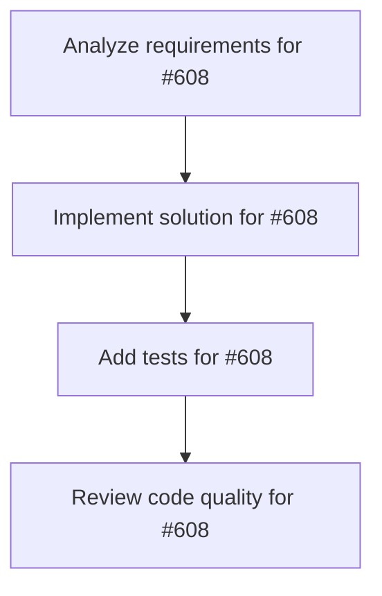

# Plans for Issue #608

**Title**: Spike: Mission Control dashboard PoC

**URL**: https://github.com/customer-cloud/miyabi-private/issues/608

---

## 📋 Summary

- **Total Tasks**: 4
- **Estimated Duration**: 60 minutes
- **Execution Levels**: 4
- **Has Cycles**: ✅ No

## 📝 Task Breakdown

### 1. Analyze requirements for #608

- **ID**: `task-608-analysis`
- **Type**: Docs
- **Assigned Agent**: IssueAgent
- **Priority**: 0
- **Estimated Duration**: 5 min

**Description**: Analyze issue requirements and create detailed specification

### 2. Implement solution for #608

- **ID**: `task-608-impl`
- **Type**: Feature
- **Assigned Agent**: CodeGenAgent
- **Priority**: 1
- **Estimated Duration**: 30 min
- **Dependencies**: task-608-analysis

**Description**: ## Summary
Investigate how to deliver a unified Mission Control view (inspired by GitHub Agent HQ) that coordinates Miyabi agents across CLI/Web.

## Goals
- Define UX for viewing active agent runs, branch controls, and progress in one place.
- Map required data sources (e.g., .ai/logs/, MCP miyabi__get_status) and API gaps.
- Propose initial UI surface (CLI dashboard, web panel, or both) and sequencing for implementation.

## Deliverables
- Short design brief outlining scope, data flow, and technical spikes.
- List of follow-up implementation tasks with rough estimates.
- Risks/unknowns (e.g., log streaming, concurrency handling, multi-agent orchestration).

## References
- GitHub Agent HQ Mission Control announcement (Universe 2025).
- Internal TODO.md roadmap candidates section.

### 3. Add tests for #608

- **ID**: `task-608-test`
- **Type**: Test
- **Assigned Agent**: CodeGenAgent
- **Priority**: 2
- **Estimated Duration**: 15 min
- **Dependencies**: task-608-impl

**Description**: Create comprehensive test coverage

### 4. Review code quality for #608

- **ID**: `task-608-review`
- **Type**: Refactor
- **Assigned Agent**: ReviewAgent
- **Priority**: 3
- **Estimated Duration**: 10 min
- **Dependencies**: task-608-test

**Description**: Run quality checks and code review

## 🔄 Execution Plan (DAG Levels)

Tasks can be executed in parallel within each level:

### Level 0 (Parallel Execution)

- `task-608-analysis` - Analyze requirements for #608

### Level 1 (Parallel Execution)

- `task-608-impl` - Implement solution for #608

### Level 2 (Parallel Execution)

- `task-608-test` - Add tests for #608

### Level 3 (Parallel Execution)

- `task-608-review` - Review code quality for #608

## 📊 Dependency Graph

## ⏱️ Timeline Estimation

- **Sequential Execution**: 60 minutes (1.0 hours)
- **Parallel Execution (Critical Path)**: 10 minutes (0.2 hours)
- **Estimated Speedup**: 6.0x

---

*Generated by CoordinatorAgent on 2025-10-30 17:47:36 UTC*
