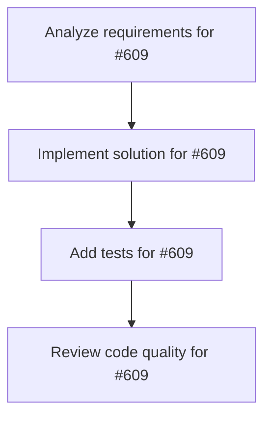

# Plans for Issue #609

**Title**: Spike: Plan Mode & AGENTS.md integration

**URL**: https://github.com/customer-cloud/miyabi-private/issues/609

---

## 📋 Summary

- **Total Tasks**: 4
- **Estimated Duration**: 60 minutes
- **Execution Levels**: 4
- **Has Cycles**: ✅ No

## 📝 Task Breakdown

### 1. Analyze requirements for #609

- **ID**: `task-609-analysis`
- **Type**: Docs
- **Assigned Agent**: IssueAgent
- **Priority**: 0
- **Estimated Duration**: 5 min

**Description**: Analyze issue requirements and create detailed specification

### 2. Implement solution for #609

- **ID**: `task-609-impl`
- **Type**: Feature
- **Assigned Agent**: CodeGenAgent
- **Priority**: 1
- **Estimated Duration**: 30 min
- **Dependencies**: task-609-analysis

**Description**: ## Summary
Explore bringing a GitHub Agent HQ-style Plan Mode and AGENTS.md guardrails into Miyabi’s workflow.

## Goals
- Define how plan-first workflows would look in Miyabi CLI / VS Code (question prompts, approval, execution hand-off).
- Design an AGENTS.md generator/manager that syncs with .codex/agents/ specs and project conventions.
- Identify required changes in code generation/review agents to honor the guardrails automatically.

## Deliverables
- Concept doc describing user journey, interfaces, and data flow.
- Prototype plan outlining steps to implement (CLI changes, VS Code extension hooks, backend adjustments).
- List of dependencies/risks (e.g., context persistence, skill selection logic, compatibility with existing plans).

## References
- GitHub Agent HQ Plan Mode / AGENTS.md feature (Universe 2025).
- TODO.md roadmap candidates (Plan Mode & AGENTS.md対応プロジェクト).

### 3. Add tests for #609

- **ID**: `task-609-test`
- **Type**: Test
- **Assigned Agent**: CodeGenAgent
- **Priority**: 2
- **Estimated Duration**: 15 min
- **Dependencies**: task-609-impl

**Description**: Create comprehensive test coverage

### 4. Review code quality for #609

- **ID**: `task-609-review`
- **Type**: Refactor
- **Assigned Agent**: ReviewAgent
- **Priority**: 3
- **Estimated Duration**: 10 min
- **Dependencies**: task-609-test

**Description**: Run quality checks and code review

## 🔄 Execution Plan (DAG Levels)

Tasks can be executed in parallel within each level:

### Level 0 (Parallel Execution)

- `task-609-analysis` - Analyze requirements for #609

### Level 1 (Parallel Execution)

- `task-609-impl` - Implement solution for #609

### Level 2 (Parallel Execution)

- `task-609-test` - Add tests for #609

### Level 3 (Parallel Execution)

- `task-609-review` - Review code quality for #609

## 📊 Dependency Graph

## ⏱️ Timeline Estimation

- **Sequential Execution**: 60 minutes (1.0 hours)
- **Parallel Execution (Critical Path)**: 10 minutes (0.2 hours)
- **Estimated Speedup**: 6.0x

---

*Generated by CoordinatorAgent on 2025-10-30 17:47:36 UTC*
