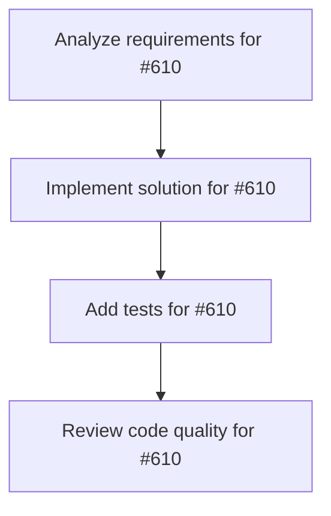

# Plans for Issue #610

**Title**: Spike: MCP Registry-style integration UX

**URL**: https://github.com/customer-cloud/miyabi-private/issues/610

---

## 📋 Summary

- **Total Tasks**: 4
- **Estimated Duration**: 60 minutes
- **Execution Levels**: 4
- **Has Cycles**: ✅ No

## 📝 Task Breakdown

### 1. Analyze requirements for #610

- **ID**: `task-610-analysis`
- **Type**: Docs
- **Assigned Agent**: IssueAgent
- **Priority**: 0
- **Estimated Duration**: 5 min

**Description**: Analyze issue requirements and create detailed specification

### 2. Implement solution for #610

- **ID**: `task-610-impl`
- **Type**: Feature
- **Assigned Agent**: CodeGenAgent
- **Priority**: 1
- **Estimated Duration**: 30 min
- **Dependencies**: task-610-analysis

**Description**: ## Summary
Design a Miyabi equivalent of the GitHub MCP Registry so developers can discover and enable external MCP servers (Stripe, Sentry, Figma, etc.) with minimal configuration.

## Goals
- Catalogue current MCP servers and define metadata required for discovery (description, auth, scopes, supported skills).
- Explore UX options (VS Code extension vs. CLI wizard) for browsing and enabling servers, including updates to mcp-config.json.
- Determine synchronization strategy between local configs and centralized registry (conflict resolution, auditing).

## Deliverables
- Design brief covering architecture, data model, and user flows.
- Prototype plan or proof-of-concept outline with task breakdown and rough estimates.
- Risk assessment (auth secrets management, per-project overrides, versioning of server definitions).

## References
- TODO.md Roadmap "MCP Registryライクな外部ツール連携UX" entry.
- GitHub Agent HQ announcements (Universe 2025) describing MCP Registry in VS Code.

### 3. Add tests for #610

- **ID**: `task-610-test`
- **Type**: Test
- **Assigned Agent**: CodeGenAgent
- **Priority**: 2
- **Estimated Duration**: 15 min
- **Dependencies**: task-610-impl

**Description**: Create comprehensive test coverage

### 4. Review code quality for #610

- **ID**: `task-610-review`
- **Type**: Refactor
- **Assigned Agent**: ReviewAgent
- **Priority**: 3
- **Estimated Duration**: 10 min
- **Dependencies**: task-610-test

**Description**: Run quality checks and code review

## 🔄 Execution Plan (DAG Levels)

Tasks can be executed in parallel within each level:

### Level 0 (Parallel Execution)

- `task-610-analysis` - Analyze requirements for #610

### Level 1 (Parallel Execution)

- `task-610-impl` - Implement solution for #610

### Level 2 (Parallel Execution)

- `task-610-test` - Add tests for #610

### Level 3 (Parallel Execution)

- `task-610-review` - Review code quality for #610

## 📊 Dependency Graph

## ⏱️ Timeline Estimation

- **Sequential Execution**: 60 minutes (1.0 hours)
- **Parallel Execution (Critical Path)**: 10 minutes (0.2 hours)
- **Estimated Speedup**: 6.0x

---

*Generated by CoordinatorAgent on 2025-11-01 11:05:18 UTC*
