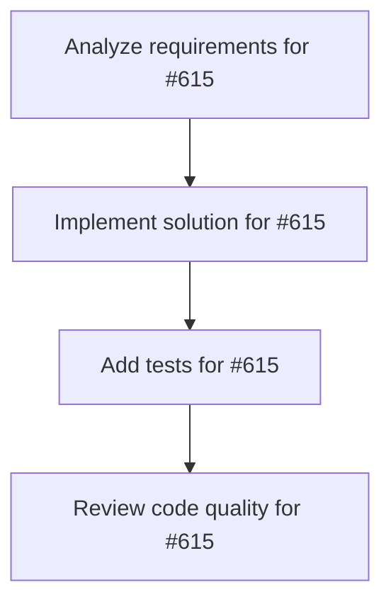

# Plans for Issue #615

**Title**: feat: Worktree状態管理の強化 - リアルタイム追跡とクリーンアップ

**URL**: https://github.com/customer-cloud/miyabi-private/issues/615

---

## 📋 Summary

- **Total Tasks**: 4
- **Estimated Duration**: 60 minutes
- **Execution Levels**: 4
- **Has Cycles**: ✅ No

## 📝 Task Breakdown

### 1. Analyze requirements for #615

- **ID**: `task-615-analysis`
- **Type**: Docs
- **Assigned Agent**: IssueAgent
- **Priority**: 0
- **Estimated Duration**: 5 min

**Description**: Analyze issue requirements and create detailed specification

### 2. Implement solution for #615

- **ID**: `task-615-impl`
- **Type**: Feature
- **Assigned Agent**: CodeGenAgent
- **Priority**: 1
- **Estimated Duration**: 30 min
- **Dependencies**: task-615-analysis

**Description**: # Worktree状態管理の強化

**Parent Issue**: #612 (Epic: KAMUI 4D設計パターン統合)
**Phase**: Phase 1 - 基盤整備
**Priority**: ⚠️ P1-High
**Estimated Time**: 3-5 days

## 📋 概要

Git Worktreeの状態をリアルタイムで追跡し、自動クリーンアップ、状態同期、エラーハンドリングを強化する。KAMUI 4Dのworktree管理設計を参考に、Miyabiの並列実行環境を最適化する。

## 🎯 目標

以下の機能でWorktree管理を強化：

- Worktree状態のリアルタイム追跡
- タスク完了時の自動クリーンアップ
- Worktreeエラーの検出と自動修復
- 孤立Worktreeの検出と削除
- Worktree状態と`.miyabi/tasks/*.json`の同期

## 📊 要件

### 必須要件

- [ ] Worktree状態の追跡システム
  - Active/Idle/Stuck/Orphaned状態の判別
  - 最終アクセス時刻の記録
  - ロック状態の検出
- [ ] 自動クリーンアップ機能
  - タスク完了時の自動Worktree削除
  - 孤立Worktreeの定期スキャン
  - `miyabi cleanup` コマンド
- [ ] エラーハンドリング
  - Worktreeロックの解除
  - 破損したWorktreeの修復
  - 不整合の自動検出
- [ ] 状態同期
  - Worktree状態 ↔ TaskMetadata同期
  - Git状態の監視

### オプション要件

- [ ] Worktreeヘルスチェック
- [ ] 容量管理（ディスク使用量監視）
- [ ] Worktreeアーカイブ機能

## 🛠️ 技術スタック

- **言語**: Rust 2021 Edition
- **Crate**: `miyabi-worktree`
- **依存**: `git2`, `tokio`, `notify` (ファイルシステム監視)

## 📐 設計

### Worktree状態管理

```rust
// crates/miyabi-worktree/src/state.rs

#[derive(Debug, Clone, Serialize, Deserialize)]
pub struct WorktreeState {
    pub path: PathBuf,
    pub branch: String,
    pub issue_number: Option<u64>,
    pub status: WorktreeStatus,
    pub last_accessed: DateTime<Utc>,
    pub is_locked: bool,
    pub has_uncommitted_changes: bool,
    pub disk_usage: u64,
}

#[derive(Debug, Clone, Copy, Serialize, Deserialize, PartialEq, Eq)]
pub enum WorktreeStatus {
    Active,      // 現在使用中
    Idle,        // 待機中（最近使用）
    Stuck,       // スタック（長時間応答なし）
    Orphaned,    // 孤立（対応するTaskMetadataなし）
    Corrupted,   // 破損
}

pub struct WorktreeStateManager {
    project_root: PathBuf,
    task_metadata_manager: TaskMetadataManager,
}

impl WorktreeStateManager {
    pub fn new(project_root: PathBuf) -> Result<Self>;
    
    /// 全Worktreeの状態をスキャン
    pub fn scan_worktrees(&self) -> Result<Vec<WorktreeState>>;
    
    /// 特定Worktreeの状態を取得
    pub fn get_worktree_state(&self, path: &Path) -> Result<WorktreeState>;
    
    /// 孤立Worktreeを検出
    pub fn find_orphaned_worktrees(&self) -> Result<Vec<WorktreeState>>;
    
    /// スタックしたWorktreeを検出
    pub fn find_stuck_worktrees(&self, timeout: Duration) -> Result<Vec<WorktreeState>>;
    
    /// Worktreeをクリーンアップ
    pub fn cleanup_worktree(&self, path: &Path) -> Result<()>;
    
    /// 全孤立Worktreeをクリーンアップ
    pub fn cleanup_orphaned(&self) -> Result<usize>;
    
    /// Worktreeとメタデータを同期
    pub fn sync_with_metadata(&self) -> Result<()>;
}
```

### 自動クリーンアップ

```rust
// crates/miyabi-worktree/src/cleanup.rs

pub struct WorktreeCleanupPolicy {
    pub delete_on_completion: bool,           // タスク完了時に削除
    pub delete_orphaned_after: Duration,      // 孤立Worktree削除タイムアウト
    pub delete_idle_after: Duration,          // アイドルWorktree削除タイムアウト
    pub max_worktrees: Option<usize>,         // 最大Worktree数
}

impl Default for WorktreeCleanupPolicy {
    fn default() -> Self {
        Self {
            delete_on_completion: true,
            delete_orphaned_after: Duration::from_secs(86400), // 24h
            delete_idle_after: Duration::from_secs(604800),    // 7 days
            max_worktrees: Some(10),
        }
    }
}

pub struct WorktreeCleanupManager {
    state_manager: WorktreeStateManager,
    policy: WorktreeCleanupPolicy,
}

impl WorktreeCleanupManager {
    pub fn new(state_manager: WorktreeStateManager, policy: WorktreeCleanupPolicy) -> Self;
    
    /// クリーンアップを実行
    pub async fn run_cleanup(&self) -> Result<CleanupReport>;
    
    /// 定期クリーンアップを開始
    pub async fn start_periodic_cleanup(&self, interval: Duration);
}

#[derive(Debug)]
pub struct CleanupReport {
    pub deleted_worktrees: Vec<PathBuf>,
    pub freed_disk_space: u64,
    pub errors: Vec<String>,
}
```

### CLIコマンド

```bash
# Worktree状態表示
miyabi worktree status

# 孤立Worktreeの検出
miyabi worktree scan --orphaned

# クリーンアップ実行
miyabi cleanup

# 強制クリーンアップ（すべて削除）
miyabi cleanup --force --all

# ドライラン（削除せずに確認）
miyabi cleanup --dry-run
```

### CLIコマンド出力例

```
$ miyabi worktree status

Worktree Status Report
━━━━━━━━━━━━━━━━━━━━━━━━━━━━━━━━━━━━━━

Active Worktrees (2):
  ✅ .worktrees/issue-270  [CoordinatorAgent]  Running  (1.2GB)
  ✅ .worktrees/issue-271  [CodeGenAgent]      Running  (980MB)

Idle Worktrees (1):
  ⏸️  .worktrees/issue-269  [ReviewAgent]       Idle     (1.5GB)
     Last accessed: 2 hours ago

Orphaned Worktrees (1):
  ⚠️  .worktrees/issue-268  [Unknown]           Orphaned (2.1GB)
     No corresponding task metadata

Total: 4 worktrees, 5.8GB

Recommendations:
  - Cleanup orphaned worktree: miyabi cleanup --orphaned
  - Archive idle worktree: miyabi worktree archive issue-269
```

## 🧪 テストケース

```rust
#[cfg(test)]
mod tests {
    #[test]
    fn test_scan_worktrees() {
        // Worktreeスキャン
    }

    #[test]
    fn test_detect_orphaned_worktrees() {
        // 孤立Worktree検出
    }

    #[test]
    fn test_cleanup_worktree() {
        // Worktreeクリーンアップ
    }

    #[test]
    fn test_sync_with_metadata() {
        // メタデータ同期
    }
}
```

## 🔗 参考リソース

### KAMUI 4D設計

```javascript
// git-worktree-task-system-design.md
worktree /path/to/main
HEAD abc1234
branch refs/heads/main

worktree /path/to/.worktrees/task-001
HEAD def5678
branch refs/heads/task/feature-001
```

### Miyabi既存実装

- `crates/miyabi-worktree/src/lib.rs` - Worktree基本操作
- `crates/miyabi-worktree/src/manager.rs` - Worktree管理

## 📊 成功条件

- [ ] `miyabi worktree status` でWorktree状態が表示される
- [ ] 孤立Worktreeが自動検出される
- [ ] `miyabi cleanup` で孤立Worktreeが削除される
- [ ] タスク完了時に自動的にWorktreeが削除される
- [ ] 全テストケースが通過する
- [ ] ドキュメントが更新される

## 🔄 Dependencies

- **Depends on**: #613 (タスクメタデータ永続化)
- **Blocks**: Phase 2の可視化機能

---

🤖 Generated with [Claude Code](https://claude.com/claude-code)

### 3. Add tests for #615

- **ID**: `task-615-test`
- **Type**: Test
- **Assigned Agent**: CodeGenAgent
- **Priority**: 2
- **Estimated Duration**: 15 min
- **Dependencies**: task-615-impl

**Description**: Create comprehensive test coverage

### 4. Review code quality for #615

- **ID**: `task-615-review`
- **Type**: Refactor
- **Assigned Agent**: ReviewAgent
- **Priority**: 3
- **Estimated Duration**: 10 min
- **Dependencies**: task-615-test

**Description**: Run quality checks and code review

## 🔄 Execution Plan (DAG Levels)

Tasks can be executed in parallel within each level:

### Level 0 (Parallel Execution)

- `task-615-analysis` - Analyze requirements for #615

### Level 1 (Parallel Execution)

- `task-615-impl` - Implement solution for #615

### Level 2 (Parallel Execution)

- `task-615-test` - Add tests for #615

### Level 3 (Parallel Execution)

- `task-615-review` - Review code quality for #615

## 📊 Dependency Graph



## ⏱️ Timeline Estimation

- **Sequential Execution**: 60 minutes (1.0 hours)
- **Parallel Execution (Critical Path)**: 10 minutes (0.2 hours)
- **Estimated Speedup**: 6.0x

---

*Generated by CoordinatorAgent on 2025-11-01 10:43:45 UTC*
