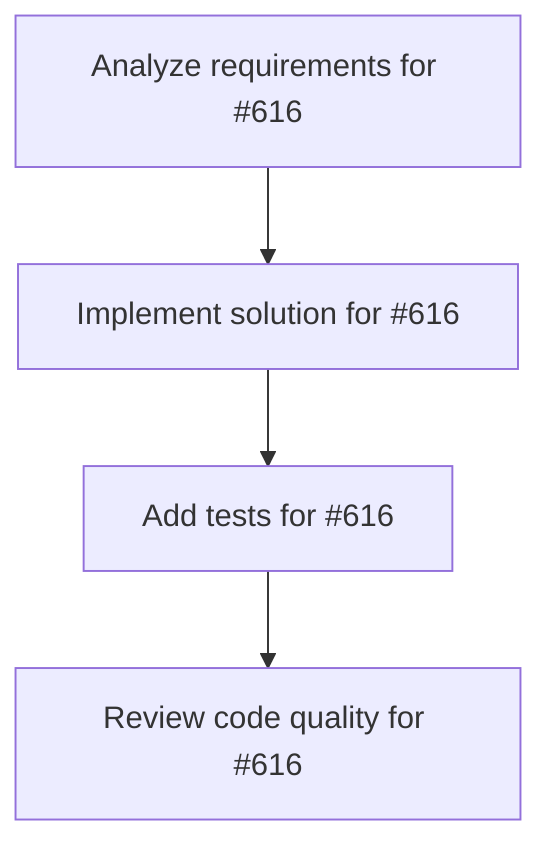

# Plans for Issue #616

**Title**: feat: TUI版Worktree状態表示の実装 (miyabi status --tui)

**URL**: https://github.com/customer-cloud/miyabi-private/issues/616

---

## 📋 Summary

- **Total Tasks**: 4
- **Estimated Duration**: 60 minutes
- **Execution Levels**: 4
- **Has Cycles**: ✅ No

## 📝 Task Breakdown

### 1. Analyze requirements for #616

- **ID**: `task-616-analysis`
- **Type**: Docs
- **Assigned Agent**: IssueAgent
- **Priority**: 0
- **Estimated Duration**: 5 min

**Description**: Analyze issue requirements and create detailed specification

### 2. Implement solution for #616

- **ID**: `task-616-impl`
- **Type**: Feature
- **Assigned Agent**: CodeGenAgent
- **Priority**: 1
- **Estimated Duration**: 30 min
- **Dependencies**: task-616-analysis

**Description**: # TUI版Worktree状態表示の実装

**Parent Issue**: #612 (Epic: KAMUI 4D設計パターン統合)
**Phase**: Phase 2 - 可視化
**Priority**: 📊 P2-Medium
**Estimated Time**: 5-7 days

## 📋 概要

ratatuiを使用したリッチなターミナルUIで、Worktree状態をリアルタイムに可視化する。KAMUI 4Dの3D可視化をTUI版としてCLIで再現し、複数Worktreeの並列実行状況を直感的に把握できるようにする。

## 🎯 目標

`miyabi status --tui` コマンドで以下の情報を対話的に表示：

- 全Worktreeの状態（Active/Idle/Orphaned）
- 各Worktreeの実行中Agent
- ディスク使用量
- 実行時間
- リアルタイム更新（1秒間隔）
- キーボード操作によるWorktree選択・操作

## 📊 要件

### 必須要件

- [ ] ratatuiによるTUI実装
- [ ] Worktreeリスト表示
  - 状態アイコン（✅ Active, ⏸️ Idle, ⚠️ Orphaned）
  - Issue番号、ブランチ名
  - 実行Agent名
  - 経過時間、ディスク使用量
- [ ] リアルタイム更新（1秒間隔）
- [ ] キーボード操作
  - `↑↓` - Worktree選択
  - `Enter` - 詳細表示
  - `d` - 削除
  - `r` - リフレッシュ
  - `q` - 終了
- [ ] Worktree詳細表示パネル
  - Git status
  - 最新コミット
  - 変更ファイル一覧

### オプション要件

- [ ] カラーテーマ設定
- [ ] フィルタ機能（Active/Idle/All）
- [ ] ソート機能（時間/サイズ/Issue番号）
- [ ] 統計情報パネル

## 🛠️ 技術スタック

- **言語**: Rust 2021 Edition
- **UI Framework**: ratatui (旧tui-rs)
- **依存**:
  - `ratatui` - TUIフレームワーク
  - `crossterm` - ターミナル制御
  - `tokio` - 非同期処理
  - `chrono` - 時刻表示

## 📐 設計

### TUIレイアウト

```
┌─────────────────────────────────────────────────────────────┐
│ Miyabi Worktree Status (Press 'q' to quit)                 │
├─────────────────────────────────────────────────────────────┤
│                                                             │
│ Active Worktrees (2):                                       │
│ ✅ issue-270 │ task/feature-270 │ CoordinatorAgent │ 1.2GB │
│ ✅ issue-271 │ task/bug-271     │ CodeGenAgent     │ 980MB │
│                                                             │
│ Idle Worktrees (1):                                         │
│ ⏸️  issue-269 │ task/refactor-269│ ReviewAgent      │ 1.5GB │
│                                                             │
│ Orphaned Worktrees (1):                                     │
│ ⚠️  issue-268 │ task/feature-268 │ [Unknown]        │ 2.1GB │
│                                                             │
├─────────────────────────────────────────────────────────────┤
│ Details: issue-270                                          │
│   Status:    Running (15m 32s)                              │
│   Agent:     CoordinatorAgent                               │
│   Branch:    task/feature-270                               │
│   Modified:  3 files changed                                │
│   Last:      feat: add worktree management                  │
│                                                             │
├─────────────────────────────────────────────────────────────┤
│ [↑↓] Select | [Enter] Details | [d] Delete | [r] Refresh   │
└─────────────────────────────────────────────────────────────┘
```

### Rust実装

```rust
// crates/miyabi-cli/src/tui/worktree_status.rs

use ratatui::{
    backend::CrosstermBackend,
    layout::{Constraint, Direction, Layout},
    style::{Color, Style},
    widgets::{Block, Borders, List, ListItem, Paragraph},
    Terminal,
};
use crossterm::{
    event::{self, Event, KeyCode},
    terminal::{enable_raw_mode, EnterAlternateScreen},
};

pub struct WorktreeStatusTui {
    state_manager: WorktreeStateManager,
    selected_index: usize,
    worktrees: Vec<WorktreeState>,
}

impl WorktreeStatusTui {
    pub fn new(state_manager: WorktreeStateManager) -> Self {
        Self {
            state_manager,
            selected_index: 0,
            worktrees: Vec::new(),
        }
    }

    pub async fn run(&mut self) -> Result<()> {
        enable_raw_mode()?;
        let mut stdout = io::stdout();
        execute!(stdout, EnterAlternateScreen)?;
        
        let backend = CrosstermBackend::new(stdout);
        let mut terminal = Terminal::new(backend)?;

        loop {
            // Worktree状態を更新
            self.worktrees = self.state_manager.scan_worktrees()?;
            
            // UI描画
            terminal.draw(|f| self.ui(f))?;
            
            // イベント処理
            if self.handle_events().await? {
                break; // 終了
            }
            
            tokio::time::sleep(Duration::from_secs(1)).await;
        }

        disable_raw_mode()?;
        execute!(terminal.backend_mut(), LeaveAlternateScreen)?;
        terminal.show_cursor()?;

        Ok(())
    }

    fn ui(&self, f: &mut Frame) {
        let chunks = Layout::default()
            .direction(Direction::Vertical)
            .constraints([
                Constraint::Length(3),      // ヘッダー
                Constraint::Min(10),        // Worktreeリスト
                Constraint::Length(8),      // 詳細パネル
                Constraint::Length(3),      // フッター
            ])
            .split(f.area());

        // ヘッダー
        let header = Paragraph::new("Miyabi Worktree Status")
            .block(Block::bordered().title("Status"));
        f.render_widget(header, chunks[0]);

        // Worktreeリスト
        let items: Vec<ListItem> = self.worktrees
            .iter()
            .map(|wt| {
                let icon = match wt.status {
                    WorktreeStatus::Active => "✅",
                    WorktreeStatus::Idle => "⏸️",
                    WorktreeStatus::Orphaned => "⚠️",
                    _ => "❓",
                };
                let content = format!(
                    "{} {} │ {} │ {} │ {}",
                    icon,
                    wt.issue_number.map_or("N/A".to_string(), |n| format!("issue-{}", n)),
                    wt.branch,
                    wt.agent.as_deref().unwrap_or("[Unknown]"),
                    format_bytes(wt.disk_usage)
                );
                ListItem::new(content)
            })
            .collect();

        let list = List::new(items)
            .block(Block::bordered().title("Worktrees"))
            .highlight_style(Style::default().bg(Color::DarkGray));
        f.render_stateful_widget(list, chunks[1], &mut self.list_state);

        // 詳細パネル
        if let Some(selected_wt) = self.worktrees.get(self.selected_index) {
            let details = format!(
                "Details: {}\n  Status:  {:?}\n  Agent:   {}\n  Branch:  {}",
                selected_wt.issue_number.map_or("N/A".to_string(), |n| format!("issue-{}", n)),
                selected_wt.status,
                selected_wt.agent.as_deref().unwrap_or("[Unknown]"),
                selected_wt.branch
            );
            let details_widget = Paragraph::new(details)
                .block(Block::bordered().title("Details"));
            f.render_widget(details_widget, chunks[2]);
        }

        // フッター
        let footer = Paragraph::new("[↑↓] Select | [Enter] Details | [d] Delete | [q] Quit")
            .block(Block::bordered());
        f.render_widget(footer, chunks[3]);
    }

    async fn handle_events(&mut self) -> Result<bool> {
        if event::poll(Duration::from_millis(100))? {
            if let Event::Key(key) = event::read()? {
                match key.code {
                    KeyCode::Char('q') => return Ok(true), // 終了
                    KeyCode::Up => {
                        if self.selected_index > 0 {
                            self.selected_index -= 1;
                        }
                    }
                    KeyCode::Down => {
                        if self.selected_index < self.worktrees.len() - 1 {
                            self.selected_index += 1;
                        }
                    }
                    KeyCode::Char('d') => {
                        // 削除確認
                        self.delete_selected_worktree().await?;
                    }
                    KeyCode::Char('r') => {
                        // リフレッシュ
                        self.worktrees = self.state_manager.scan_worktrees()?;
                    }
                    _ => {}
                }
            }
        }
        Ok(false)
    }
}
```

## 🧪 テストケース

```rust
#[cfg(test)]
mod tests {
    #[test]
    fn test_render_worktree_list() {
        // Worktreeリスト描画
    }

    #[test]
    fn test_keyboard_navigation() {
        // キーボード操作
    }

    #[test]
    fn test_worktree_selection() {
        // Worktree選択
    }
}
```

## 📊 成功条件

- [ ] `miyabi status --tui` でTUIが起動する
- [ ] Worktreeリストが表示される
- [ ] リアルタイム更新が動作する（1秒間隔）
- [ ] キーボード操作が正しく動作する
- [ ] ドキュメントが更新される

## 🔄 Dependencies

- **Depends on**: #613, #615 (Phase 1完了)

---

🤖 Generated with [Claude Code](https://claude.com/claude-code)

### 3. Add tests for #616

- **ID**: `task-616-test`
- **Type**: Test
- **Assigned Agent**: CodeGenAgent
- **Priority**: 2
- **Estimated Duration**: 15 min
- **Dependencies**: task-616-impl

**Description**: Create comprehensive test coverage

### 4. Review code quality for #616

- **ID**: `task-616-review`
- **Type**: Refactor
- **Assigned Agent**: ReviewAgent
- **Priority**: 3
- **Estimated Duration**: 10 min
- **Dependencies**: task-616-test

**Description**: Run quality checks and code review

## 🔄 Execution Plan (DAG Levels)

Tasks can be executed in parallel within each level:

### Level 0 (Parallel Execution)

- `task-616-analysis` - Analyze requirements for #616

### Level 1 (Parallel Execution)

- `task-616-impl` - Implement solution for #616

### Level 2 (Parallel Execution)

- `task-616-test` - Add tests for #616

### Level 3 (Parallel Execution)

- `task-616-review` - Review code quality for #616

## 📊 Dependency Graph



## ⏱️ Timeline Estimation

- **Sequential Execution**: 60 minutes (1.0 hours)
- **Parallel Execution (Critical Path)**: 10 minutes (0.2 hours)
- **Estimated Speedup**: 6.0x

---

*Generated by CoordinatorAgent on 2025-11-01 10:43:45 UTC*
