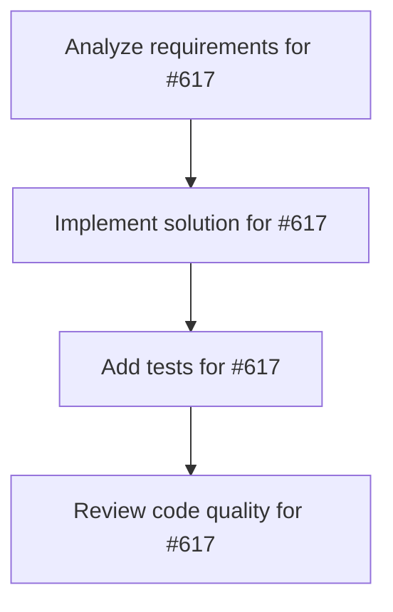

# Plans for Issue #617

**Title**: feat: Git履歴グラフ描画機能 - 複数ブランチの統合表示

**URL**: https://github.com/customer-cloud/miyabi-private/issues/617

---

## 📋 Summary

- **Total Tasks**: 4
- **Estimated Duration**: 60 minutes
- **Execution Levels**: 4
- **Has Cycles**: ✅ No

## 📝 Task Breakdown

### 1. Analyze requirements for #617

- **ID**: `task-617-analysis`
- **Type**: Docs
- **Assigned Agent**: IssueAgent
- **Priority**: 0
- **Estimated Duration**: 5 min

**Description**: Analyze issue requirements and create detailed specification

### 2. Implement solution for #617

- **ID**: `task-617-impl`
- **Type**: Feature
- **Assigned Agent**: CodeGenAgent
- **Priority**: 1
- **Estimated Duration**: 30 min
- **Dependencies**: task-617-analysis

**Description**: # Git履歴グラフ描画機能

**Parent Issue**: #612 (Epic: KAMUI 4D設計パターン統合)
**Phase**: Phase 2 - 可視化
**Priority**: 📊 P2-Medium
**Estimated Time**: 5-7 days

## 📋 概要

複数Worktreeのブランチを統合したGit履歴グラフをTUIで表示する。KAMUI 4Dの「Git履歴の統合表示」機能をCLI版として実装し、並列実行中の全ブランチのコミット履歴を視覚的に把握できるようにする。

## 🎯 目標

`miyabi git-graph` コマンドで以下を実現：

- 全Worktreeのブランチを統合した履歴グラフ
- コミット間の親子関係、マージポイントを可視化
- ブランチごとのレーン分け
- タイムスタンプ順ソート
- コミット詳細の表示

## 📊 要件

### 必須要件

- [ ] Git履歴データの取得
  - `git log --all --oneline --graph --pretty=format:...`
  - `git worktree list --porcelain`
  - 全ブランチのコミット情報
- [ ] グラフ描画アルゴリズム
  - レーン割り当て（branch lane algorithm）
  - コミット間のエッジ描画
  - マージポイントの表示
- [ ] TUI表示
  - コミットリスト（スクロール可能）
  - ブランチレーン（色分け）
  - コミット詳細パネル
- [ ] キーボード操作
  - `↑↓` - コミット選択
  - `Enter` - 詳細表示
  - `f` - ブランチフィルタ
  - `q` - 終了

### オプション要件

- [ ] ブランチフィルタ機能
- [ ] 作者フィルタ
- [ ] 日付範囲指定
- [ ] グラフエクスポート（PNG/SVG）

## 🛠️ 技術スタック

- **言語**: Rust 2021 Edition
- **依存**:
  - `git2` - Git操作
  - `ratatui` - TUI描画
  - `tui-graph` (optional) - グラフ描画
  - `petgraph` - グラフアルゴリズム

## 📐 設計

### TUIレイアウト

```
┌────────────────────────────────────────────────────────────┐
│ Miyabi Git History Graph                                   │
├────────────────────────────────────────────────────────────┤
│ * main (HEAD)                                              │
│ │                                                           │
│ │ * issue-270 (CoordinatorAgent)                           │
│ │ │                                                         │
│ │ │ * issue-271 (CodeGenAgent)                             │
│ │ │ │                                                       │
│ │ │ * fix: worktree state tracking                         │
│ │ * │ feat: add task metadata                              │
│ * │ │ docs: update README                                  │
│ │\│ │                                                       │
│ │ * │ feat: agent config CLI                               │
│ │  \│                                                       │
│ *   * Merge branch 'issue-269'                             │
│ │                                                           │
│ * feat: initial commit                                     │
│                                                            │
├────────────────────────────────────────────────────────────┤
│ Commit: abc1234                                            │
│ Author: miyabi-bot                                         │
│ Date:   2025-10-29 10:30:00                                │
│ Branch: issue-270                                          │
│                                                            │
│ feat: add task metadata persistence                        │
│                                                            │
│ - Implement TaskMetadata struct                            │
│ - Add JSON serialization                                   │
│ - Create .miyabi/tasks/ directory                          │
├────────────────────────────────────────────────────────────┤
│ [↑↓] Select | [Enter] Details | [f] Filter | [q] Quit     │
└────────────────────────────────────────────────────────────┘
```

### Git履歴データ構造

```rust
// crates/miyabi-git/src/graph.rs

#[derive(Debug, Clone)]
pub struct CommitNode {
    pub hash: String,
    pub short_hash: String,
    pub message: String,
    pub author: String,
    pub timestamp: DateTime<Utc>,
    pub parents: Vec<String>,
    pub refs: Vec<String>,  // ブランチ名、タグ
    pub lane: usize,        // 表示レーン（0, 1, 2, ...）
}

#[derive(Debug)]
pub struct GitGraph {
    pub commits: Vec<CommitNode>,
    pub branches: HashMap<String, String>,  // branch_name -> commit_hash
    pub worktrees: Vec<WorktreeInfo>,
}

impl GitGraph {
    pub fn new() -> Result<Self>;
    
    /// 全ブランチのコミット履歴を取得
    pub fn load_history(&mut self, project_root: &Path) -> Result<()>;
    
    /// Worktree情報を取得
    pub fn load_worktrees(&mut self, project_root: &Path) -> Result<()>;
    
    /// コミットにレーンを割り当て
    pub fn assign_lanes(&mut self);
    
    /// 特定ブランチでフィルタ
    pub fn filter_by_branch(&self, branch: &str) -> Vec<CommitNode>;
}
```

### レーン割り当てアルゴリズム

```rust
// crates/miyabi-git/src/lane_assignment.rs

pub struct LaneAssigner {
    lanes: Vec<Option<String>>,  // lane_index -> current_branch
}

impl LaneAssigner {
    pub fn new() -> Self;
    
    /// コミットに最適なレーンを割り当て
    pub fn assign_lane(&mut self, commit: &CommitNode) -> usize;
    
    /// マージコミットの処理
    pub fn handle_merge(&mut self, commit: &CommitNode, parent_lanes: Vec<usize>) -> usize;
}
```

### TUI実装

```rust
// crates/miyabi-cli/src/tui/git_graph.rs

pub struct GitGraphTui {
    graph: GitGraph,
    selected_index: usize,
    scroll_offset: usize,
}

impl GitGraphTui {
    pub async fn run(&mut self) -> Result<()> {
        enable_raw_mode()?;
        let mut terminal = Terminal::new(CrosstermBackend::new(io::stdout()))?;

        loop {
            terminal.draw(|f| self.ui(f))?;
            
            if self.handle_events().await? {
                break;
            }
        }

        Ok(())
    }

    fn ui(&self, f: &mut Frame) {
        let chunks = Layout::default()
            .direction(Direction::Vertical)
            .constraints([
                Constraint::Length(3),      // ヘッダー
                Constraint::Min(10),        // グラフ
                Constraint::Length(10),     // 詳細
                Constraint::Length(3),      // フッター
            ])
            .split(f.area());

        // グラフ描画
        let graph_items: Vec<ListItem> = self.graph.commits
            .iter()
            .skip(self.scroll_offset)
            .take(chunks[1].height as usize)
            .map(|commit| {
                let graph_line = self.render_commit_graph(commit);
                ListItem::new(graph_line)
            })
            .collect();

        let graph = List::new(graph_items)
            .block(Block::bordered().title("Git History"));
        f.render_widget(graph, chunks[1]);

        // 詳細パネル
        if let Some(selected) = self.graph.commits.get(self.selected_index) {
            let details = format!(
                "Commit: {}\nAuthor: {}\nDate:   {}\n\n{}",
                selected.short_hash,
                selected.author,
                selected.timestamp.format("%Y-%m-%d %H:%M:%S"),
                selected.message
            );
            let details_widget = Paragraph::new(details)
                .block(Block::bordered().title("Details"));
            f.render_widget(details_widget, chunks[2]);
        }
    }

    fn render_commit_graph(&self, commit: &CommitNode) -> String {
        let mut line = String::new();
        
        // レーンごとに描画
        for lane_idx in 0..=commit.lane {
            if lane_idx == commit.lane {
                line.push_str("* ");
            } else {
                line.push_str("│ ");
            }
        }
        
        // コミットメッセージ
        line.push_str(&commit.message);
        
        // ブランチ名
        if !commit.refs.is_empty() {
            line.push_str(&format!(" ({})", commit.refs.join(", ")));
        }
        
        line
    }
}
```

## 🧪 テストケース

```rust
#[cfg(test)]
mod tests {
    #[test]
    fn test_load_git_history() {
        // Git履歴読み込み
    }

    #[test]
    fn test_assign_lanes() {
        // レーン割り当て
    }

    #[test]
    fn test_render_graph() {
        // グラフ描画
    }
}
```

## 🔗 参考リソース

### KAMUI 4D実装

```javascript
// docs/git-worktree-task-system-design.md
git log --all --oneline --pretty=format:"%H|%s|%an|%ct|%P|%D" -n 100
git worktree list --porcelain
```

## 📊 成功条件

- [ ] `miyabi git-graph` でGit履歴グラフが表示される
- [ ] 複数ブランチが統合表示される
- [ ] レーン分けが正しく動作する
- [ ] コミット詳細が表示される
- [ ] ドキュメントが更新される

## 🔄 Dependencies

- **Depends on**: #616 (TUI基盤)

---

🤖 Generated with [Claude Code](https://claude.com/claude-code)

### 3. Add tests for #617

- **ID**: `task-617-test`
- **Type**: Test
- **Assigned Agent**: CodeGenAgent
- **Priority**: 2
- **Estimated Duration**: 15 min
- **Dependencies**: task-617-impl

**Description**: Create comprehensive test coverage

### 4. Review code quality for #617

- **ID**: `task-617-review`
- **Type**: Refactor
- **Assigned Agent**: ReviewAgent
- **Priority**: 3
- **Estimated Duration**: 10 min
- **Dependencies**: task-617-test

**Description**: Run quality checks and code review

## 🔄 Execution Plan (DAG Levels)

Tasks can be executed in parallel within each level:

### Level 0 (Parallel Execution)

- `task-617-analysis` - Analyze requirements for #617

### Level 1 (Parallel Execution)

- `task-617-impl` - Implement solution for #617

### Level 2 (Parallel Execution)

- `task-617-test` - Add tests for #617

### Level 3 (Parallel Execution)

- `task-617-review` - Review code quality for #617

## 📊 Dependency Graph



## ⏱️ Timeline Estimation

- **Sequential Execution**: 60 minutes (1.0 hours)
- **Parallel Execution (Critical Path)**: 10 minutes (0.2 hours)
- **Estimated Speedup**: 6.0x

---

*Generated by CoordinatorAgent on 2025-11-01 10:42:17 UTC*
