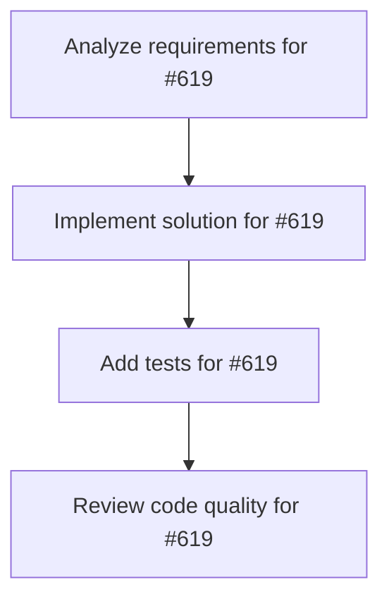

# Plans for Issue #619

**Title**: feat: miyabi-kamui-bridge crateの作成 - KAMUI 4D連携ブリッジ

**URL**: https://github.com/customer-cloud/miyabi-private/issues/619

---

## 📋 Summary

- **Total Tasks**: 4
- **Estimated Duration**: 60 minutes
- **Execution Levels**: 4
- **Has Cycles**: ✅ No

## 📝 Task Breakdown

### 1. Analyze requirements for #619

- **ID**: `task-619-analysis`
- **Type**: Docs
- **Assigned Agent**: IssueAgent
- **Priority**: 0
- **Estimated Duration**: 5 min

**Description**: Analyze issue requirements and create detailed specification

### 2. Implement solution for #619

- **ID**: `task-619-impl`
- **Type**: Feature
- **Assigned Agent**: CodeGenAgent
- **Priority**: 1
- **Estimated Duration**: 30 min
- **Dependencies**: task-619-analysis

**Description**: # miyabi-kamui-bridge crateの作成

**Parent Issue**: #612 (Epic: KAMUI 4D設計パターン統合)
**Phase**: Phase 3 - KAMUI 4D統合
**Priority**: 📝 P3-Low
**Estimated Time**: 7-10 days

## 📋 概要

MiyabiとKAMUI 4Dを連携するブリッジcrateを作成し、Miyabiの実行状況をKAMUI 4Dで3D可視化できるようにする。TaskMetadata、Worktree状態、Agent実行情報をKAMUI 4D APIへ送信する。

## 🎯 目標

以下の機能を提供するブリッジを実装：

- MiyabiタスクをKAMUI 4Dへ同期
- Worktree状態をリアルタイム送信
- Agent実行状況の共有
- KAMUI 4Dからのコマンド受信（双方向通信）

## 📊 要件

### 必須要件

- [ ] `miyabi-kamui-bridge` crate作成
- [ ] KAMUI 4D APIクライアント実装
  - タスク情報送信
  - Worktree状態送信
  - Agent状態送信
- [ ] 双方向通信
  - WebSocket接続
  - イベントストリーミング
- [ ] CLI統合
  - `miyabi work-on <issue> --visualize` でKAMUI 4D連携
  - `miyabi kamui connect` で接続確立

### オプション要件

- [ ] KAMUI 4Dからのコマンド実行
- [ ] 認証・セキュリティ
- [ ] 再接続ロジック

## 🛠️ 技術スタック

- **言語**: Rust 2021 Edition
- **Crate**: `miyabi-kamui-bridge` (新規)
- **依存**:
  - `reqwest` - HTTP client
  - `tokio-tungstenite` - WebSocket
  - `serde` - JSON serialization

## 📐 設計

### Crate構造

```
crates/miyabi-kamui-bridge/
├── Cargo.toml
├── src/
│   ├── lib.rs                  # Public API
│   ├── client.rs               # KAMUI 4D APIクライアント
│   ├── websocket.rs            # WebSocket通信
│   ├── sync.rs                 # データ同期
│   └── types.rs                # 型定義
└── tests/
    └── integration_test.rs
```

### API設計

```rust
// crates/miyabi-kamui-bridge/src/lib.rs

pub struct KamuiBridge {
    api_endpoint: String,
    ws_endpoint: String,
    client: reqwest::Client,
    ws_client: Option<WebSocketStream<MaybeTlsStream<TcpStream>>>,
}

impl KamuiBridge {
    pub async fn new(api_endpoint: String) -> Result<Self>;
    
    /// KAMUI 4Dへ接続
    pub async fn connect(&mut self) -> Result<()>;
    
    /// 接続を切断
    pub async fn disconnect(&mut self) -> Result<()>;
    
    /// タスク情報を送信
    pub async fn send_task_update(&self, task: &TaskMetadata) -> Result<()>;
    
    /// Worktree状態を送信
    pub async fn send_worktree_status(&self, status: &WorktreeState) -> Result<()>;
    
    /// Agent状態を送信
    pub async fn send_agent_status(&self, status: &AgentStatus) -> Result<()>;
    
    /// イベントストリーム開始
    pub async fn start_event_stream(&mut self) -> Result<()>;
    
    /// イベント受信（ブロッキング）
    pub async fn recv_event(&mut self) -> Result<KamuiEvent>;
}

#[derive(Debug, Clone, Serialize, Deserialize)]
pub struct KamuiTaskUpdate {
    pub id: String,
    pub issue_number: Option<u64>,
    pub title: String,
    pub status: String,
    pub worktree_path: Option<String>,
    pub branch_name: Option<String>,
    pub agent: Option<String>,
    pub progress: Option<f32>,
}

#[derive(Debug, Clone, Serialize, Deserialize)]
pub enum KamuiEvent {
    TaskCommand { task_id: String, command: String },
    RefreshRequest,
    Disconnect,
}
```

### KAMUI 4D APIエンドポイント

```
POST   /api/miyabi/tasks           # タスク作成・更新
GET    /api/miyabi/tasks           # タスク一覧取得
DELETE /api/miyabi/tasks/:id       # タスク削除

POST   /api/miyabi/worktrees       # Worktree状態送信
POST   /api/miyabi/agents          # Agent状態送信

WS     /ws/miyabi                  # WebSocketイベントストリーム
```

### CLI統合

```rust
// crates/miyabi-cli/src/commands/work_on.rs

#[derive(Debug, Parser)]
pub struct WorkOnCommand {
    issue_number: u64,
    
    #[arg(long)]
    visualize: bool,  // KAMUI 4D連携
}

impl WorkOnCommand {
    pub async fn execute(&self) -> Result<()> {
        // ... 既存のWorktree作成ロジック ...
        
        if self.visualize {
            let bridge = KamuiBridge::new("http://localhost:3000".to_string()).await?;
            bridge.connect().await?;
            
            // タスク情報送信
            bridge.send_task_update(&task_metadata).await?;
            
            // バックグラウンドで状態同期開始
            tokio::spawn(async move {
                let mut interval = tokio::time::interval(Duration::from_secs(5));
                loop {
                    interval.tick().await;
                    // Worktree/Agent状態を定期送信
                }
            });
        }
        
        Ok(())
    }
}
```

### 使用例

```bash
# KAMUI 4Dを起動
# /Applications/KAMUI-4D.app を開く

# Miyabiから接続
miyabi kamui connect

# Issue作業開始（KAMUI 4Dで可視化）
miyabi work-on 270 --visualize

# KAMUI 4D上でWorktree状態が3D表示される
# - 複数Worktreeの並列実行状況
# - Agent実行中のリアルタイムモニタリング
# - Gitグラフの統合表示
```

## 🧪 テストケース

```rust
#[cfg(test)]
mod tests {
    #[tokio::test]
    async fn test_kamui_connect() {
        // KAMUI 4D接続
    }

    #[tokio::test]
    async fn test_send_task_update() {
        // タスク更新送信
    }

    #[tokio::test]
    async fn test_websocket_event() {
        // WebSocketイベント受信
    }
}
```

## 🔗 参考リソース

### KAMUI 4D APIエンドポイント（拡張予定）

KAMUI 4Dの`src/main/api/`ディレクトリに新規エンドポイントを追加：

```javascript
// KAMUI 4D: src/main/api/miyabi-api.js

router.post('/api/miyabi/tasks', async (req, res) => {
  const task = req.body;
  // タスクをKAMUI 4Dのタスクリストに追加
  globalTaskStore.addMiyabiTask(task);
  res.json({ success: true });
});
```

## 📊 成功条件

- [ ] `miyabi kamui connect` で接続確立
- [ ] `miyabi work-on <issue> --visualize` で3D表示
- [ ] タスク情報がKAMUI 4Dに表示される
- [ ] リアルタイム更新が動作する
- [ ] ドキュメントが更新される

## 🔄 Dependencies

- **Depends on**: #613, #615 (Phase 1完了)
- **Related**: KAMUI 4D側のAPI実装が必要

---

🤖 Generated with [Claude Code](https://claude.com/claude-code)

### 3. Add tests for #619

- **ID**: `task-619-test`
- **Type**: Test
- **Assigned Agent**: CodeGenAgent
- **Priority**: 2
- **Estimated Duration**: 15 min
- **Dependencies**: task-619-impl

**Description**: Create comprehensive test coverage

### 4. Review code quality for #619

- **ID**: `task-619-review`
- **Type**: Refactor
- **Assigned Agent**: ReviewAgent
- **Priority**: 3
- **Estimated Duration**: 10 min
- **Dependencies**: task-619-test

**Description**: Run quality checks and code review

## 🔄 Execution Plan (DAG Levels)

Tasks can be executed in parallel within each level:

### Level 0 (Parallel Execution)

- `task-619-analysis` - Analyze requirements for #619

### Level 1 (Parallel Execution)

- `task-619-impl` - Implement solution for #619

### Level 2 (Parallel Execution)

- `task-619-test` - Add tests for #619

### Level 3 (Parallel Execution)

- `task-619-review` - Review code quality for #619

## 📊 Dependency Graph



## ⏱️ Timeline Estimation

- **Sequential Execution**: 60 minutes (1.0 hours)
- **Parallel Execution (Critical Path)**: 10 minutes (0.2 hours)
- **Estimated Speedup**: 6.0x

---

*Generated by CoordinatorAgent on 2025-10-30 17:47:30 UTC*
