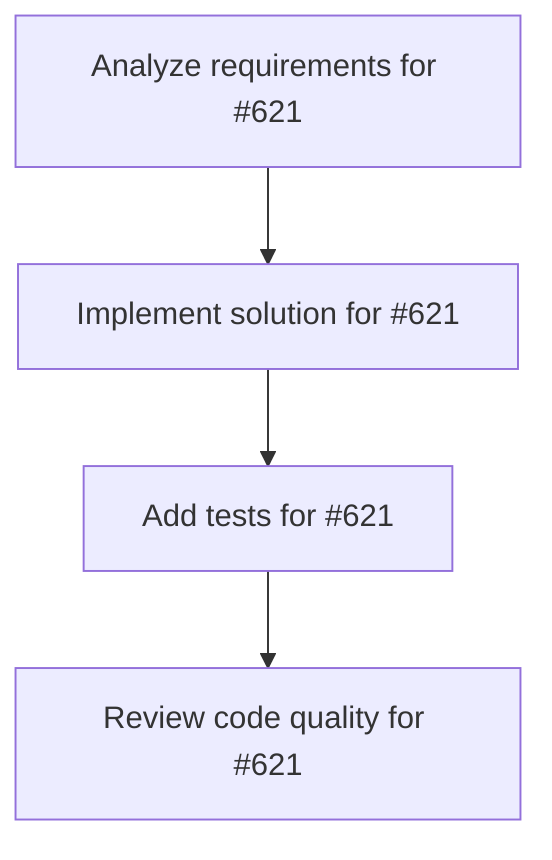

# Plans for Issue #621

**Title**: feat: Web Dashboard 3D可視化 - Three.js統合

**URL**: https://github.com/customer-cloud/miyabi-private/issues/621

---

## 📋 Summary

- **Total Tasks**: 4
- **Estimated Duration**: 60 minutes
- **Execution Levels**: 4
- **Has Cycles**: ✅ No

## 📝 Task Breakdown

### 1. Analyze requirements for #621

- **ID**: `task-621-analysis`
- **Type**: Docs
- **Assigned Agent**: IssueAgent
- **Priority**: 0
- **Estimated Duration**: 5 min

**Description**: Analyze issue requirements and create detailed specification

### 2. Implement solution for #621

- **ID**: `task-621-impl`
- **Type**: Feature
- **Assigned Agent**: CodeGenAgent
- **Priority**: 1
- **Estimated Duration**: 30 min
- **Dependencies**: task-621-analysis

**Description**: # Web Dashboard 3D可視化

**Parent Issue**: #612 (Epic: KAMUI 4D設計パターン統合)
**Phase**: Phase 3 - KAMUI 4D統合
**Priority**: 📝 P3-Low
**Estimated Time**: 10-14 days

## 📋 概要

Miyabi Web Dashboard (`miyabi-dashboard/`) にThree.jsベースの3D可視化機能を追加し、Entity-Relationモデル、Worktree状態、Agent実行状況を3D空間で表示する。KAMUI 4Dの3D Force Graphを参考に実装。

## 🎯 目標

`miyabi dashboard` コマンドでWebサーバーを起動し、ブラウザで以下を3D表示：

- Entity-Relationモデルの3Dグラフ（12 Entities, 27 Relations）
- Worktree状態の視覚化
- Agent実行状況のリアルタイムモニタリング
- Gitグラフの3D表示

## 📊 要件

### 必須要件

- [ ] Three.js + 3D Force Graphの統合
- [ ] Entity-Relationモデルの3D描画
  - 12個のEntityをノードとして表示
  - 27個のRelationをエッジとして表示
  - ノードクリックで詳細表示
- [ ] Worktree状態の可視化
  - Active/Idle/Orphaned状態を色分け
  - ディスク使用量でノードサイズを変更
- [ ] Agent実行状況
  - 実行中Agentをハイライト
  - 進捗をアニメーション表示
- [ ] インタラクティブ操作
  - ズーム、回転、パン
  - ノード選択、詳細パネル表示
- [ ] リアルタイム更新
  - WebSocketで状態同期
  - 1秒間隔で更新

### オプション要件

- [ ] 複数の描画モード（Entity/Worktree/Agent）
- [ ] VRモード対応
- [ ] スクリーンショット・録画機能
- [ ] カスタムテーマ

## 🛠️ 技術スタック

- **言語**: TypeScript
- **Framework**: React
- **3Dライブラリ**: Three.js + 3D Force Graph
- **Backend**: Rust (Axum) - WebSocketサーバー
- **依存**:
  - `three` - 3D描画エンジン
  - `3d-force-graph` - 力学的グラフ
  - `@react-three/fiber` - React Three.js統合

## 📐 設計

### プロジェクト構造

```
miyabi-dashboard/
├── package.json
├── vite.config.ts
├── src/
│   ├── main.tsx                  # エントリポイント
│   ├── App.tsx                   # メインコンポーネント
│   ├── components/
│   │   ├── EntityRelationGraph.tsx   # ER図3D表示
│   │   ├── WorktreeGraph.tsx         # Worktree可視化
│   │   ├── AgentMonitor.tsx          # Agent監視
│   │   └── ControlPanel.tsx          # 操作パネル
│   ├── hooks/
│   │   ├── useWebSocket.ts           # WebSocket hook
│   │   └── useGraphData.ts           # グラフデータ取得
│   └── types/
│       ├── entity.ts
│       ├── worktree.ts
│       └── agent.ts
└── backend/
    └── src/
        └── server.rs                 # WebSocketサーバー
```

### React + Three.js実装

```typescript
// miyabi-dashboard/src/components/EntityRelationGraph.tsx

import React, { useEffect, useRef } from 'react';
import ForceGraph3D from '3d-force-graph';
import * as THREE from 'three';

interface Node {
  id: string;
  name: string;
  type: 'entity' | 'worktree' | 'agent';
  status?: 'active' | 'idle' | 'running';
  size: number;
}

interface Link {
  source: string;
  target: string;
  relation: string;
}

const EntityRelationGraph: React.FC = () => {
  const containerRef = useRef<HTMLDivElement>(null);
  const graphRef = useRef<any>(null);

  useEffect(() => {
    if (!containerRef.current) return;

    // 3D Force Graphの初期化
    const graph = ForceGraph3D()(containerRef.current)
      .graphData({ nodes: [], links: [] })
      .nodeAutoColorBy('type')
      .nodeVal('size')
      .nodeLabel((node: any) => `${node.name} (${node.type})`)
      .nodeThreeObject((node: any) => {
        // カスタムノード描画
        const sprite = new THREE.Sprite(
          new THREE.SpriteMaterial({
            color: getNodeColor(node.status),
            map: new THREE.CanvasTexture(generateNodeTexture(node)),
          })
        );
        sprite.scale.set(12, 12, 1);
        return sprite;
      })
      .linkWidth(2)
      .linkDirectionalArrowLength(3.5)
      .linkDirectionalArrowRelPos(1)
      .linkCurvature(0.1)
      .onNodeClick((node: any) => {
        // ノードクリック時の処理
        console.log('Node clicked:', node);
        showNodeDetails(node);
      });

    graphRef.current = graph;

    // WebSocketでデータ取得
    const ws = new WebSocket('ws://localhost:8080/ws/graph');
    
    ws.onmessage = (event) => {
      const data = JSON.parse(event.data);
      graph.graphData(data);
    };

    // クリーンアップ
    return () => {
      ws.close();
      graph._destructor();
    };
  }, []);

  const getNodeColor = (status?: string) => {
    switch (status) {
      case 'active':
      case 'running':
        return 0x00ff00; // 緑
      case 'idle':
        return 0xffff00; // 黄
      default:
        return 0x0088ff; // 青
    }
  };

  const generateNodeTexture = (node: Node) => {
    const canvas = document.createElement('canvas');
    const ctx = canvas.getContext('2d');
    if (!ctx) return canvas;

    canvas.width = 128;
    canvas.height = 128;

    // ノードテキスト描画
    ctx.fillStyle = '#ffffff';
    ctx.font = 'bold 16px Arial';
    ctx.textAlign = 'center';
    ctx.fillText(node.name, 64, 70);

    return canvas;
  };

  return (
    <div className="graph-container">
      <div ref={containerRef} style={{ width: '100%', height: '100vh' }} />
    </div>
  );
};

export default EntityRelationGraph;
```

### WebSocketサーバー（Rust + Axum）

```rust
// miyabi-dashboard/backend/src/server.rs

use axum::{
    extract::{ws::WebSocket, WebSocketUpgrade},
    response::IntoResponse,
    routing::get,
    Router,
};
use tokio::time::{interval, Duration};

#[tokio::main]
async fn main() {
    let app = Router::new()
        .route("/ws/graph", get(ws_handler));

    axum::Server::bind(&"0.0.0.0:8080".parse().unwrap())
        .serve(app.into_make_service())
        .await
        .unwrap();
}

async fn ws_handler(ws: WebSocketUpgrade) -> impl IntoResponse {
    ws.on_upgrade(handle_socket)
}

async fn handle_socket(mut socket: WebSocket) {
    let mut interval = interval(Duration::from_secs(1));

    loop {
        interval.tick().await;

        // グラフデータ取得
        let graph_data = get_graph_data().await;

        // JSON送信
        if socket.send(axum::extract::ws::Message::Text(
            serde_json::to_string(&graph_data).unwrap()
        )).await.is_err() {
            break;
        }
    }
}

async fn get_graph_data() -> GraphData {
    // TaskMetadata, WorktreeState, AgentStatusを取得
    // GraphDataに変換して返す
    GraphData {
        nodes: vec![
            Node {
                id: "entity-1".to_string(),
                name: "Issue".to_string(),
                node_type: "entity".to_string(),
                status: Some("active".to_string()),
                size: 10.0,
            },
            // ...
        ],
        links: vec![
            Link {
                source: "entity-1".to_string(),
                target: "entity-2".to_string(),
                relation: "references".to_string(),
            },
            // ...
        ],
    }
}

#[derive(Debug, Serialize, Deserialize)]
struct GraphData {
    nodes: Vec<Node>,
    links: Vec<Link>,
}

#[derive(Debug, Serialize, Deserialize)]
struct Node {
    id: String,
    name: String,
    #[serde(rename = "type")]
    node_type: String,
    status: Option<String>,
    size: f32,
}

#[derive(Debug, Serialize, Deserialize)]
struct Link {
    source: String,
    target: String,
    relation: String,
}
```

### CLIコマンド

```bash
# Web Dashboardを起動
miyabi dashboard

# ブラウザが自動的に開く
# http://localhost:3000

# バックグラウンドで起動
miyabi dashboard --daemon

# ポート指定
miyabi dashboard --port 8888
```

## 🧪 テストケース

```typescript
// miyabi-dashboard/src/components/EntityRelationGraph.test.tsx

import { render } from '@testing-library/react';
import EntityRelationGraph from './EntityRelationGraph';

describe('EntityRelationGraph', () => {
  test('should render 3D graph', () => {
    const { container } = render(<EntityRelationGraph />);
    expect(container.querySelector('.graph-container')).toBeInTheDocument();
  });

  test('should update graph on WebSocket message', async () => {
    // WebSocketモックでテスト
  });
});
```

## 📊 成功条件

- [ ] `miyabi dashboard` でWebサーバーが起動する
- [ ] ブラウザでEntity-Relationモデルが3D表示される
- [ ] Worktree状態が可視化される
- [ ] Agent実行状況がリアルタイム表示される
- [ ] インタラクティブ操作が動作する
- [ ] ドキュメントが更新される

## 🔄 Dependencies

- **Depends on**: #613, #615, #616 (メタデータ、Worktree管理、TUI基盤)

---

🤖 Generated with [Claude Code](https://claude.com/claude-code)

### 3. Add tests for #621

- **ID**: `task-621-test`
- **Type**: Test
- **Assigned Agent**: CodeGenAgent
- **Priority**: 2
- **Estimated Duration**: 15 min
- **Dependencies**: task-621-impl

**Description**: Create comprehensive test coverage

### 4. Review code quality for #621

- **ID**: `task-621-review`
- **Type**: Refactor
- **Assigned Agent**: ReviewAgent
- **Priority**: 3
- **Estimated Duration**: 10 min
- **Dependencies**: task-621-test

**Description**: Run quality checks and code review

## 🔄 Execution Plan (DAG Levels)

Tasks can be executed in parallel within each level:

### Level 0 (Parallel Execution)

- `task-621-analysis` - Analyze requirements for #621

### Level 1 (Parallel Execution)

- `task-621-impl` - Implement solution for #621

### Level 2 (Parallel Execution)

- `task-621-test` - Add tests for #621

### Level 3 (Parallel Execution)

- `task-621-review` - Review code quality for #621

## 📊 Dependency Graph



## ⏱️ Timeline Estimation

- **Sequential Execution**: 60 minutes (1.0 hours)
- **Parallel Execution (Critical Path)**: 10 minutes (0.2 hours)
- **Estimated Speedup**: 6.0x

---

*Generated by CoordinatorAgent on 2025-10-30 17:47:32 UTC*
