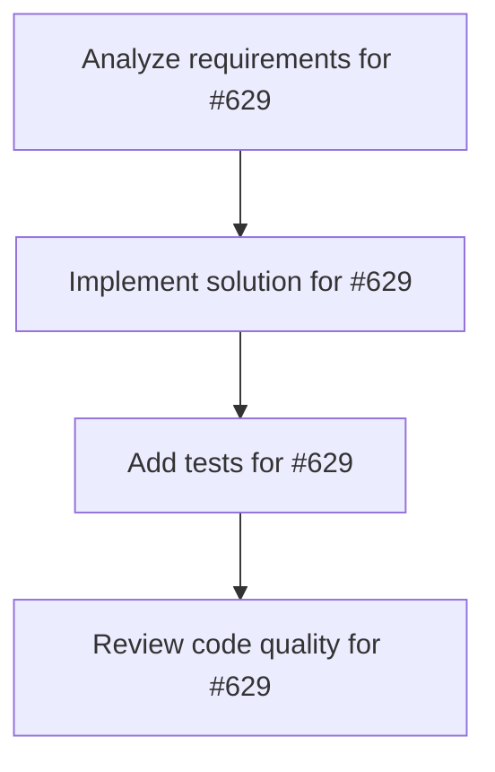

# Plans for Issue #629

**Title**: feat(design): Implement Dashboard Phase 1 Quick Wins (Jony Ive Design Principles)

**URL**: https://github.com/customer-cloud/miyabi-private/issues/629

---

## 📋 Summary

- **Total Tasks**: 4
- **Estimated Duration**: 60 minutes
- **Execution Levels**: 4
- **Has Cycles**: ✅ No

## 📝 Task Breakdown

### 1. Analyze requirements for #629

- **ID**: `task-629-analysis`
- **Type**: Docs
- **Assigned Agent**: IssueAgent
- **Priority**: 0
- **Estimated Duration**: 5 min

**Description**: Analyze issue requirements and create detailed specification

### 2. Implement solution for #629

- **ID**: `task-629-impl`
- **Type**: Feature
- **Assigned Agent**: CodeGenAgent
- **Priority**: 1
- **Estimated Duration**: 30 min
- **Dependencies**: task-629-analysis

**Description**: ## 🎨 Summary

Implement Phase 1 (Quick Wins) of the Jonathan Ive Design Agent review to improve Miyabi Dashboard UI/UX. This phase focuses on high-impact, low-effort improvements that can be completed in 1-2 hours.

**Design Review**: See `docs/DESIGN_REVIEW_REPORT.md` for full analysis.

**Current Score**: 72/100
**Phase 1 Target**: 82/100 (+10 points)

---

## 📋 Phase 1 Tasks

### Task 1: Remove 90% of Icons
- [ ] Remove decorative icons from headings (System Health, etc.)
- [ ] Remove icon from Status display (keep text only)
- [ ] Keep only status indicator dots (active/idle)
- [ ] Remove emojis from filter chips (🔧 💼)

**Files to modify**:
- `crates/miyabi-a2a/dashboard/src/components/dashboard.tsx`

**Before**:
```tsx
<h2 className="text-xl font-semibold mb-4 flex items-center gap-2">
  <Icon icon="lucide:activity" className="text-miyabi-primary" />
  System Health
</h2>
```

**After**:
```tsx
<h2 className="text-4xl font-extralight tracking-tight mb-8">
  System Health
</h2>
```

---

### Task 2: Convert All Colors to Grayscale + Blue-600

**Color Consolidation**:
- Remove: `miyabi-success`, `miyabi-primary`, `success`, `secondary`, `warning`
- Use only: `white`, `gray-50`, `gray-200`, `gray-500`, `gray-600`, `gray-900`, `blue-600`

**Changes**:
1. Status indicators: green → gray-900
2. Active states: success/primary → blue-600
3. Progress bars: primary/warning → gray-900
4. Agent border colors: Remove all (leader/executor/analyst/support)
5. Filter chips: Convert to grayscale

**Before**:
```tsx
<span className="text-miyabi-success">Healthy</span>
<Progress color="primary" />
<Progress color="warning" />
<Chip color="success">Active</Chip>
```

**After**:
```tsx
<span className="text-gray-900">Healthy</span>
<Progress className="bg-gray-900" />
<Progress className="bg-gray-900" />
<Chip className="bg-blue-600 text-white">Active</Chip>
```

---

### Task 3: Increase Heading Font Sizes by 2x

**Typography Scale**:
- `text-xl` (20px) → `text-4xl` (40px)
- `text-base` → `text-xl`
- `text-sm` → remain as metadata

**Changes**:
```tsx
// Before
<h2 className="text-xl font-semibold mb-4">

// After
<h2 className="text-4xl font-extralight tracking-tight mb-8">
```

---

### Task 4: Add font-extralight to Large Text

**Font Weight Changes**:
- Headings (>24px): `font-semibold` → `font-extralight`
- Body text: `font-medium` → `font-normal`
- Small text: remain `font-medium`

**Changes**:
```tsx
// Before
<h2 className="text-xl font-semibold">
<span className="font-medium">

// After
<h2 className="text-4xl font-extralight">
<span className="font-normal">
```

---

## 🎯 Success Criteria

- [ ] All decorative icons removed (keep only status dots)
- [ ] Maximum 3 colors in use: white, gray-900, blue-600
- [ ] All headings use `font-extralight` and increased sizes
- [ ] Dashboard still fully functional
- [ ] No TypeScript errors
- [ ] No visual regressions (all data still visible)

---

## 📊 Expected Impact

| Metric | Before | After | Improvement |
|--------|--------|-------|-------------|
| Visual Noise | High | Low | -70% |
| Color Count | 7+ | 3 | -57% |
| Heading Impact | Low | High | +100% |
| Overall Score | 72/100 | 82/100 | +10 |

---

## 🔧 Implementation Notes

### Component to Modify
- Primary file: `crates/miyabi-a2a/dashboard/src/components/dashboard.tsx`
- Lines to focus: 1-200 (System Health section + Filters)

### Testing
```bash
cd crates/miyabi-a2a/dashboard
npm run dev
# Visual inspection in browser
```

### CSS Variables
May need to update `src/index.css`:
```css
:root {
  --text-4xl: 2.5rem;   /* 40px - New heading size */
  --accent: #2563eb;     /* blue-600 */
}
```

---

## 📖 Related Documentation

- **Full Design Review**: `docs/DESIGN_REVIEW_REPORT.md`
- **Agent Spec**: `.claude/agents/specs/business/jonathan-ive-design-agent.md`
- **Phase 2-5**: Deferred to future Issues

---

## 🤖 Agent Assignment

**Recommended Agent**: CodeGenAgent (つくるん)

**Execution**:
```bash
miyabi agent run codegen --issue <this-issue-number>
```

---

**Review Score After Phase 1**: Expected 82/100 (+10 points)

🎨 Generated by Jonathan Ive Design Agent (いぶさん)
🤖 Created with [Claude Code](https://claude.com/claude-code)

### 3. Add tests for #629

- **ID**: `task-629-test`
- **Type**: Test
- **Assigned Agent**: CodeGenAgent
- **Priority**: 2
- **Estimated Duration**: 15 min
- **Dependencies**: task-629-impl

**Description**: Create comprehensive test coverage

### 4. Review code quality for #629

- **ID**: `task-629-review`
- **Type**: Refactor
- **Assigned Agent**: ReviewAgent
- **Priority**: 3
- **Estimated Duration**: 10 min
- **Dependencies**: task-629-test

**Description**: Run quality checks and code review

## 🔄 Execution Plan (DAG Levels)

Tasks can be executed in parallel within each level:

### Level 0 (Parallel Execution)

- `task-629-analysis` - Analyze requirements for #629

### Level 1 (Parallel Execution)

- `task-629-impl` - Implement solution for #629

### Level 2 (Parallel Execution)

- `task-629-test` - Add tests for #629

### Level 3 (Parallel Execution)

- `task-629-review` - Review code quality for #629

## 📊 Dependency Graph



## ⏱️ Timeline Estimation

- **Sequential Execution**: 60 minutes (1.0 hours)
- **Parallel Execution (Critical Path)**: 10 minutes (0.2 hours)
- **Estimated Speedup**: 6.0x

---

*Generated by CoordinatorAgent on 2025-10-30 17:47:32 UTC*
