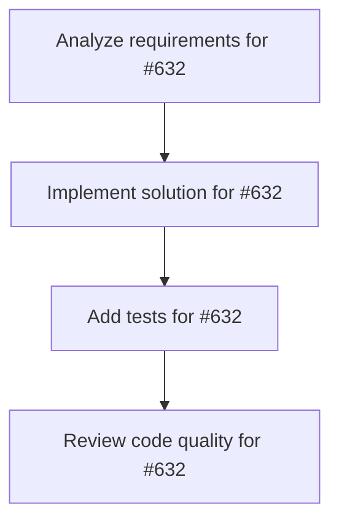

# Plans for Issue #632

**Title**: feat: Miyabi Desktop - VS Code-like Electron Application for macOS

**URL**: https://github.com/customer-cloud/miyabi-private/issues/632

---

## 📋 Summary

- **Total Tasks**: 4
- **Estimated Duration**: 60 minutes
- **Execution Levels**: 4
- **Has Cycles**: ✅ No

## 📝 Task Breakdown

### 1. Analyze requirements for #632

- **ID**: `task-632-analysis`
- **Type**: Docs
- **Assigned Agent**: IssueAgent
- **Priority**: 0
- **Estimated Duration**: 5 min

**Description**: Analyze issue requirements and create detailed specification

### 2. Implement solution for #632

- **ID**: `task-632-impl`
- **Type**: Feature
- **Assigned Agent**: CodeGenAgent
- **Priority**: 1
- **Estimated Duration**: 30 min
- **Dependencies**: task-632-analysis

**Description**: # 🖥️ Miyabi Desktop - VS Code-like Electron Application

**Type**: New Feature (Epic)
**Priority**: P2-Medium
**Platform**: macOS (initial), Windows/Linux (future)
**Timeline**: 8 weeks MVP + 8 weeks Phase 2

---

## 📋 Executive Summary

Create a VS Code-like Electron desktop application for Miyabi that provides a rich, native experience for managing autonomous development workflows. The app will integrate Worktree visualization, Agent execution monitoring, and Project management in a single unified interface.

**Value Propositions**:
- 🚀 **Unified Experience**: All Miyabi features in one native app (vs CLI + Web Dashboard)
- ⚡ **Real-time Monitoring**: Live Agent execution tracking with progress bars and logs
- 🎯 **Offline Capability**: Work without internet (unlike web dashboard)
- 💻 **Native Integration**: macOS notifications, menu bar, keyboard shortcuts
- 🔧 **Developer-Friendly**: Monaco Editor integration for code viewing/editing

---

## 📚 Documentation

Comprehensive specification documents created (220KB+, 165+ pages):

### 1. Main Specification
**File**: `docs/electron-app/ELECTRON_APP_SPECIFICATION.md` (93KB, 58 pages)

**Contents**:
- Market research & competitive analysis (VS Code, GitHub Desktop, Cursor AI, Tauri)
- 4 User personas with detailed use cases and success metrics
- 20 Feature specifications (6 MVP + 14 Phase 2+)
- Architecture design with technology stack decisions
- UI/UX design system (VS Code-inspired layouts)
- Integration strategy with existing Miyabi components
- Success metrics, KPIs, risk assessment
- Go-to-market strategy

### 2. MVP Roadmap
**File**: `docs/electron-app/ELECTRON_APP_MVP_ROADMAP.md` (39KB, 35 pages)

**Contents**:
- 8-week sprint-by-sprint breakdown (Sprint 0-8)
- Task dependencies (DAG) with critical path analysis
- Resource allocation (412.5 hours planned + 48% buffer = 610 total hours)
- Milestone definitions with go/no-go criteria
- Risk mitigation strategies
- Sprint checklists and daily standup templates

### 3. Technology Stack
**File**: `docs/electron-app/ELECTRON_APP_TECH_STACK.md` (38KB, 32 pages)

**Contents**:
- Detailed Electron vs Tauri comparison (18 criteria)
- **Final Decision**: Electron for MVP, Tauri migration path for Phase 3+
- Complete frontend stack (React 18, TypeScript 5.7, Tailwind CSS 4.1)
- Backend stack (Node.js 20, better-sqlite3, Octokit, chokidar)
- Build tools (Vite 6, electron-builder 25, electron-updater)
- CI/CD pipeline (GitHub Actions)
- Security stack (CSP, code signing, keytar)
- Tauri migration path (4-6 weeks effort estimate)

### 4. UI Mockups
**Directory**: `docs/electron-app/ELECTRON_APP_UI_MOCKUPS/` (50KB+, 40+ pages)

**Contents**:
- Design principles and component guidelines
- Main window layout mockup
- Worktree view mockup
- Agent monitor mockup
- Color palette and typography specifications

---

## 🎯 MVP Features (Week 1-8)

### F-1: Project Management
- Open/close Miyabi projects
- Recent projects list
- Project settings UI
- Auto-detect .miyabi/ directories

### F-2: Worktree Visualization ⭐
- Grid/list view of all worktrees
- Status indicators (Active/Idle/Stuck/Orphaned/Corrupted)
- Disk usage progress bars
- Last accessed timestamps
- Quick actions (open, cleanup, view logs)

### F-3: Agent Execution Monitoring ⭐
- Real-time Agent status display
- Progress bars with percentage completion
- Live log streaming (last 50 lines)
- Agent start/stop controls
- Execution history

### F-4: Issue Management
- GitHub Issues browser
- Filter by labels, status, assignee
- Create new issues from app
- Link issues to worktrees

### F-5: Task History Browser
- TaskMetadata visualization
- Success/failure statistics
- Execution timeline
- Filter by agent, issue, status

### F-6: System Health Dashboard
- CPU/Memory/Disk usage
- Worktree statistics
- Agent performance metrics
- Alert notifications

---

## 🚀 Phase 2 Features (Week 9-16)

### F-7: Monaco Editor Integration
- View/edit code in worktrees
- Syntax highlighting
- Git diff view
- Search/replace

### F-8: Integrated Terminal
- Embedded terminal emulator
- Run miyabi CLI commands
- Multiple terminal tabs
- Command history

### F-9: Git Visualization
- Branch graph display
- Commit history browser
- Worktree branch relationships
- Interactive rebase UI

### F-10: Agent Configuration UI
- Visual agent configuration editor
- Parameter tuning
- Prompt customization
- Test agent execution

### F-11: Native Notifications
- macOS notification center integration
- Agent completion alerts
- Error notifications
- Progress updates

### F-12 - F-20: Additional Features
(See specification document for full details)

---

## 🛠️ Technology Stack

### Frontend
- **Framework**: React 18.3 + TypeScript 5.7
- **UI Library**: HeroUI 2.8 (Tailwind CSS 4.1)
- **State Management**: Zustand 5.0
- **Editor**: Monaco Editor 0.52
- **Build Tool**: Vite 6.0

### Backend (Electron Main)
- **Runtime**: Node.js 20 LTS
- **Framework**: Electron 34.x
- **Database**: better-sqlite3 11.x
- **File Watching**: chokidar 4.0
- **GitHub API**: Octokit 21.x

### Build & Deploy
- **Builder**: electron-builder 25.x
- **Updater**: electron-updater 7.x
- **CI/CD**: GitHub Actions
- **Code Signing**: Apple Developer Certificate

### Testing
- **Unit Tests**: Vitest 3.x
- **E2E Tests**: Playwright 1.40
- **Coverage**: > 80% target

---

## 📐 Architecture

```
┌─────────────────────────────────────────────────┐
│   Electron Main Process (Node.js)               │
│   - Window management                           │
│   - IPC handlers (worktree, agent, issue CRUD)  │
│   - SQLite database (local cache)               │
│   - File system watcher (.ai/ directory)        │
│   - Native integrations (notifications, menus)  │
└─────────────────────────────────────────────────┘
                      │
                      │ IPC
                      ▼
┌─────────────────────────────────────────────────┐
│   Renderer Process (React + TypeScript)         │
│   ┌───────────────────────────────────────────┐ │
│   │ Sidebar (Project, Worktree, Agent, Issue)│ │
│   ├───────────────────────────────────────────┤ │
│   │ Main Content (Monaco, Dashboard, Logs)   │ │
│   ├───────────────────────────────────────────┤ │
│   │ Right Panel (Agent Status, Details)      │ │
│   ├───────────────────────────────────────────┤ │
│   │ Status Bar (Git branch, Agent status)    │ │
│   └───────────────────────────────────────────┘ │
└─────────────────────────────────────────────────┘
                      │
                      │ REST API / WebSocket
                      ▼
┌─────────────────────────────────────────────────┐
│   Miyabi Backend (Rust)                         │
│   - Web API (Axum, port 8080)                   │
│   - CLI commands (child_process spawn)          │
│   - WorktreeStateManager                        │
│   - TaskMetadataManager                         │
│   - Agent orchestrator                          │
└─────────────────────────────────────────────────┘
```

**Code Reuse Strategy**:
- 90% of existing React dashboard components
- 100% of Miyabi Web API (no changes needed)
- CLI commands via child_process
- Direct file system access for .miyabi/ and .worktrees/

---

## 📅 Timeline & Milestones

### Sprint 0: Setup (Week 0)
- Development environment setup
- Electron boilerplate creation
- Team onboarding
- **Deliverable**: Running "Hello World" Electron app

### Sprint 1-2: Foundation (Week 1-2)
- Project structure and routing
- IPC setup (main ↔ renderer)
- Window management
- Main UI layout (sidebar, content area, status bar)
- **Deliverable**: Empty shell with navigation

### Sprint 3-4: Worktree & Agent (Week 3-4)
- Worktree visualization (F-2)
- Agent execution monitoring (F-3)
- Real-time updates via WebSocket
- **Deliverable**: Core monitoring features working

### Sprint 5-6: Issue & History (Week 5-6)
- Project management (F-1)
- Issue management (F-4)
- Task history browser (F-5)
- **Deliverable**: Full CRUD operations

### Sprint 7-8: Dashboard & Polish (Week 7-8)
- System health dashboard (F-6)
- Performance optimization
- Error handling
- Auto-update mechanism
- **Deliverable**: MVP ready for beta testing

**Total MVP Effort**: 610 hours (412.5 planned + 48% buffer)

---

## 🎯 Success Metrics

### Development Metrics (Week 8)
- ✅ MVP completion on time
- ✅ Bundle size: < 200MB
- ✅ Startup time: < 3 seconds
- ✅ Memory usage: < 500MB
- ✅ Test coverage: > 80%
- ✅ Zero critical bugs

### User Metrics (3 months post-launch)
- 📊 Downloads: 500+ (GitHub Releases)
- 📊 DAU: 300+ (60% of 500 Miyabi users)
- 📊 Retention (D7): > 50%
- 📊 Retention (D30): > 30%
- 📊 NPS: > 70
- 📊 CSAT: > 85%
- 📊 Crash rate: < 5%

### Feature Adoption (3 months)
- Worktree View: > 90% of sessions
- Agent Monitor: > 70% of sessions
- Task History: > 50% of sessions
- Monaco Editor (Phase 2): > 40% of sessions

---

## 🔄 Integration with Existing Codebase

### Leverage Existing Assets
- ✅ React Dashboard (`crates/miyabi-a2a/dashboard/`) - 90% reuse
- ✅ Web API (`crates/miyabi-web-api/`) - 100% reuse
- ✅ CLI (`crates/miyabi-cli/`) - Execute via child_process
- ✅ TUI (`crates/miyabi-tui/`) - Design inspiration

### New Components Required
- Electron main process (IPC handlers, window management)
- SQLite cache layer (issues, task history)
- File watcher integration (chokidar)
- Native menu bar and notifications
- Auto-update mechanism

---

## 🚨 Risk Assessment

### Technical Risks
| Risk | Impact | Probability | Mitigation |
|------|--------|-------------|------------|
| Electron bundle size > 200MB | Medium | Medium | Code splitting, lazy loading, tree shaking |
| Memory usage > 500MB | High | Low | Virtualization, pagination, worker threads |
| Native integration issues | Medium | Medium | Fallback to web-based solutions, electron-builder |
| Monaco Editor performance | Medium | Low | Limit file size, lazy loading, web workers |

### Product Risks
| Risk | Impact | Probability | Mitigation |
|------|--------|-------------|------------|
| Overlap with web dashboard | Medium | High | Focus on native features (offline, notifications) |
| User adoption < 300 DAU | High | Medium | User interviews, beta testing, feature prioritization |
| Maintenance burden | High | Medium | Share code with web, automate builds, CI/CD |

---

## 👥 User Personas

### Alex - Solo Indie Developer (Primary)
**Background**: Full-stack developer, uses Miyabi for side projects
**Goals**: Quickly monitor Agent progress, manage multiple worktrees
**Pain Points**: CLI too verbose, web dashboard requires browser
**Key Features**: Worktree view, Agent monitor, Native notifications

### Jordan - Engineering Team Lead (Secondary)
**Background**: Manages 5-person team using Miyabi
**Goals**: Oversee team's progress, review code, manage issues
**Pain Points**: No team dashboard, difficult to track multiple projects
**Key Features**: Multi-project support, Team metrics, Issue management

### Morgan - DevOps Engineer (Tertiary)
**Background**: Responsible for CI/CD pipelines
**Goals**: Monitor build status, debug failed deployments
**Pain Points**: No centralized monitoring, CLI logs hard to parse
**Key Features**: System health dashboard, Log viewer, Agent execution history

### Riley - Business Stakeholder (Future)
**Background**: Product manager, non-technical
**Goals**: Understand project progress, business metrics
**Pain Points**: CLI inaccessible, web dashboard too technical
**Key Features**: Business dashboard, Progress reports, Simplified UI

---

## 🎨 UI/UX Design Principles

### Design Philosophy
- **Simplicity**: Clean, uncluttered interface (Jony Ive principles applied)
- **Consistency**: Follow VS Code conventions (familiar to developers)
- **Performance**: 60fps animations, instant feedback
- **Accessibility**: Keyboard shortcuts, screen reader support

### Color Palette
- **Primary**: Blue-600 (#2563eb) - Matches Miyabi brand
- **Background**: Gray-900 (#111827) - Dark mode default
- **Accent**: Green-500 (#10b981) - Success states
- **Error**: Red-500 (#ef4444) - Error states

### Typography
- **Headers**: Inter, font-extralight (200) - Elegant, readable
- **Body**: Inter, font-normal (400) - Clear, professional
- **Code**: JetBrains Mono - Monospace for logs/code

---

## 📦 Distribution & Deployment

### macOS Distribution
- **Format**: DMG installer (drag-and-drop)
- **Code Signing**: Apple Developer Certificate
- **Notarization**: Apple notary service
- **Auto-update**: electron-updater via GitHub Releases

### Future Platforms
- **Windows**: NSIS installer (Phase 3)
- **Linux**: AppImage / deb / rpm (Phase 3)

### CI/CD Pipeline
```yaml
# .github/workflows/release-electron.yml
on:
  push:
    tags:
      - 'v*'

jobs:
  build-macos:
    runs-on: macos-latest
    steps:
      - Build React app (Vite)
      - Build Electron app (electron-builder)
      - Sign with Apple certificate
      - Notarize with Apple
      - Upload DMG to GitHub Releases
      - Trigger auto-update
```

---

## 🔐 Security Considerations

### Content Security Policy (CSP)
```
default-src 'self';
script-src 'self' 'unsafe-inline';
style-src 'self' 'unsafe-inline';
connect-src 'self' http://localhost:8080 wss://localhost:8080;
```

### Code Signing
- Apple Developer Certificate (Production)
- Ad-hoc signing (Development)

### Secrets Management
- keytar library for secure credential storage
- macOS Keychain integration
- No plaintext tokens in config files

---

## 📝 Next Steps

1. **Review & Approve** (Week -1)
   - [ ] Team review of specification documents
   - [ ] User interviews (5-10 developers using Miyabi)
   - [ ] Technical feasibility review

2. **Sprint 0 Setup** (Week 0)
   - [ ] Create `crates/miyabi-desktop/` directory
   - [ ] Setup Electron + React boilerplate
   - [ ] Configure CI/CD pipeline
   - [ ] Onboard development team

3. **Sprint 1 Kickoff** (Week 1)
   - [ ] Project structure and routing
   - [ ] IPC setup
   - [ ] Main UI layout

---

## 📚 Related Documentation

- **Specification**: `docs/electron-app/ELECTRON_APP_SPECIFICATION.md`
- **Roadmap**: `docs/electron-app/ELECTRON_APP_MVP_ROADMAP.md`
- **Tech Stack**: `docs/electron-app/ELECTRON_APP_TECH_STACK.md`
- **UI Mockups**: `docs/electron-app/ELECTRON_APP_UI_MOCKUPS/`

---

## 🤝 Contributing

This is a major Epic spanning 8-16 weeks. Contributors needed for:
- Frontend development (React + TypeScript)
- Electron main process development (Node.js)
- UI/UX design (mockups, user testing)
- Documentation (user guides, API docs)
- Testing (unit, integration, E2E)

---

🖥️ Generated by Product Design Agent (いぶさん)
🤖 Created with [Claude Code](https://claude.com/claude-code)

**Estimated Effort**: 610 hours (8 weeks MVP)
**Priority**: P2-Medium
**Type**: Epic (Feature)
**Labels**: ✨ type:feature, 🏗️ type:architecture, 📱 platform:desktop, 🍎 platform:macos

### 3. Add tests for #632

- **ID**: `task-632-test`
- **Type**: Test
- **Assigned Agent**: CodeGenAgent
- **Priority**: 2
- **Estimated Duration**: 15 min
- **Dependencies**: task-632-impl

**Description**: Create comprehensive test coverage

### 4. Review code quality for #632

- **ID**: `task-632-review`
- **Type**: Refactor
- **Assigned Agent**: ReviewAgent
- **Priority**: 3
- **Estimated Duration**: 10 min
- **Dependencies**: task-632-test

**Description**: Run quality checks and code review

## 🔄 Execution Plan (DAG Levels)

Tasks can be executed in parallel within each level:

### Level 0 (Parallel Execution)

- `task-632-analysis` - Analyze requirements for #632

### Level 1 (Parallel Execution)

- `task-632-impl` - Implement solution for #632

### Level 2 (Parallel Execution)

- `task-632-test` - Add tests for #632

### Level 3 (Parallel Execution)

- `task-632-review` - Review code quality for #632

## 📊 Dependency Graph



## ⏱️ Timeline Estimation

- **Sequential Execution**: 60 minutes (1.0 hours)
- **Parallel Execution (Critical Path)**: 10 minutes (0.2 hours)
- **Estimated Speedup**: 6.0x

---

*Generated by CoordinatorAgent on 2025-10-30 17:47:38 UTC*
