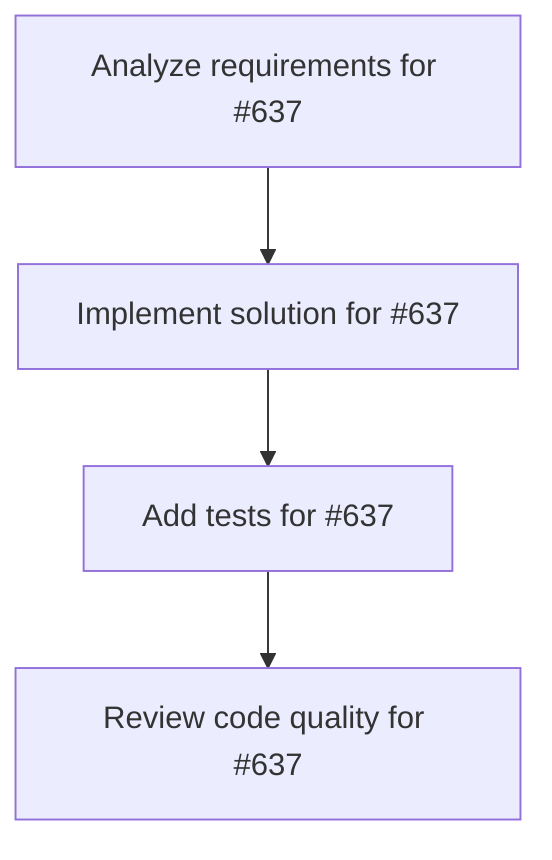

# Plans for Issue #637

**Title**: [Phase 1.2] リアルタイムログストリーミング - バグ修正

**URL**: https://github.com/customer-cloud/miyabi-private/issues/637

---

## 📋 Summary

- **Total Tasks**: 4
- **Estimated Duration**: 60 minutes
- **Execution Levels**: 4
- **Has Cycles**: ✅ No

## 📝 Task Breakdown

### 1. Analyze requirements for #637

- **ID**: `task-637-analysis`
- **Type**: Docs
- **Assigned Agent**: IssueAgent
- **Priority**: 0
- **Estimated Duration**: 5 min

**Description**: Analyze issue requirements and create detailed specification

### 2. Implement solution for #637

- **ID**: `task-637-impl`
- **Type**: Bug
- **Assigned Agent**: CodeGenAgent
- **Priority**: 1
- **Estimated Duration**: 30 min
- **Dependencies**: task-637-analysis

**Description**: ## 📋 タスク概要

Phase 1.1の手動テストで発見されたバグを修正する。

## 🎯 目的

リアルタイムログストリーミング機能を完全に動作させる。

## 🐛 想定される問題

### 問題1: Event Listenerの登録タイミング
**症状**: ログが全く表示されない、または一括表示される

**原因候補**:
```typescript
// AgentExecutionPanel.tsx L109-125
useEffect(() => {
  // executionId が存在しない場合の早期リターン
  if (!activeExecution?.executionId) return;
  
  // Event listener登録
  const setupOutputListener = async () => {
    unlisten = await listenToAgentOutput(...);
  };
}, [activeExecution?.executionId]);
```

**修正方針**:
- Event listener登録のタイミングを調整
- 依存配列を見直し
- エラーハンドリングを追加

### 問題2: Backend Event Emission
**症状**: バックエンドからイベントが発行されていない

**原因候補**:
```rust
// src-tauri/src/main.rs
app_handle.emit("agent_output", payload)?;
```

**修正方針**:
- `app_handle.emit()` の実行を確認
- イベント名の一致を確認
- エラーログを追加

## 📝 実装手順

1. **Phase 1.1のテスト結果を確認**
   - `docs/TEST_RESULTS_PHASE1.md` を読む
   - 発見されたバグをリストアップ

2. **デバッグログの追加**
   ```typescript
   console.log('[DEBUG] Setting up output listener for execution:', executionId);
   console.log('[DEBUG] Received agent output:', line);
   ```

3. **Event Listener修正**
   - 登録タイミングの最適化
   - エラーハンドリングの追加
   - クリーンアップ処理の確認

4. **Backend Event Emission修正**
   - Rustコードでのイベント発行を確認
   - イベントペイロードの検証

5. **再テスト**
   - 修正後、Phase 1.1のテストを再実行
   - 全てのシナリオで成功することを確認

## ✅ 成功基準

- [ ] リアルタイムログが1行ずつ表示される
- [ ] Chrome Consoleにデバッグログが正しく表示される
- [ ] Phase 1.1の全テストケースがPass

## 📊 成果物

- 修正されたコード (`AgentExecutionPanel.tsx`, `src-tauri/src/main.rs` など)
- 更新されたテスト結果 (`docs/TEST_RESULTS_PHASE1.md`)

## 🔗 関連ドキュメント

- 実装計画: `docs/IMPLEMENTATION_PLAN.md` (Phase 1, Task 1.2)

## ⏱️ 見積もり時間

**2-3日**

---

🤖 Generated with Claude Code

### 3. Add tests for #637

- **ID**: `task-637-test`
- **Type**: Test
- **Assigned Agent**: CodeGenAgent
- **Priority**: 2
- **Estimated Duration**: 15 min
- **Dependencies**: task-637-impl

**Description**: Create comprehensive test coverage

### 4. Review code quality for #637

- **ID**: `task-637-review`
- **Type**: Refactor
- **Assigned Agent**: ReviewAgent
- **Priority**: 3
- **Estimated Duration**: 10 min
- **Dependencies**: task-637-test

**Description**: Run quality checks and code review

## 🔄 Execution Plan (DAG Levels)

Tasks can be executed in parallel within each level:

### Level 0 (Parallel Execution)

- `task-637-analysis` - Analyze requirements for #637

### Level 1 (Parallel Execution)

- `task-637-impl` - Implement solution for #637

### Level 2 (Parallel Execution)

- `task-637-test` - Add tests for #637

### Level 3 (Parallel Execution)

- `task-637-review` - Review code quality for #637

## 📊 Dependency Graph



## ⏱️ Timeline Estimation

- **Sequential Execution**: 60 minutes (1.0 hours)
- **Parallel Execution (Critical Path)**: 10 minutes (0.2 hours)
- **Estimated Speedup**: 6.0x

---

*Generated by CoordinatorAgent on 2025-10-31 12:18:54 UTC*
